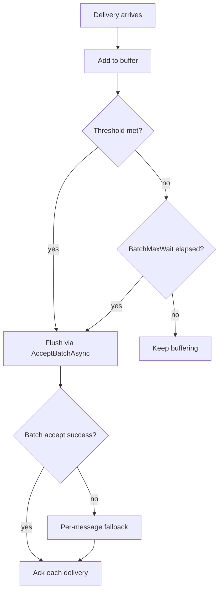

# Batch Inbox Accept Buffering

- **ID**: `ingress.batch-accept`
- **Name**: Batch inbox accept buffering
- **Maturity**: GA
- **Summary**: Buffers transport deliveries and flushes them through `IInbox.AcceptBatchAsync` to reduce store round trips while preserving per-delivery broker acknowledgement.

## Purpose and Scope

When `TransportInboxIngressOptions.EnableBatchAccept` is true, `TransportInboxIngressConsumer` buffers deliveries up to `PrefetchCount` (or 1 when prefetch is zero). It flushes when the buffer is full, when `BatchMaxWait` elapses on the first buffered message, or when the consumer loop stops.

On batch accept failure the consumer falls back to per-message accept so poison deliveries can be isolated. After a successful batch accept, each delivery is acknowledged individually. Batch admission uses a semaphore sized to the buffer capacity so prefetch limits remain enforced during flush.

## Flush and Fallback Flow

## Public Surface

| Property | Default | Role |
| --- | --- | --- |
| `TransportInboxIngressOptions.EnableBatchAccept` | false | Turn on delivery buffering |
| `TransportInboxIngressOptions.BatchMaxWait` | 200 ms | Flush partial batches on low traffic |
| `TransportInboxIngressOptions.PrefetchCount` | broker-specific | Buffer capacity and flush threshold |

Exposed on `TransportInboxIngressOptions` and `AmqpInboxIngressOptions`. Not exposed on Kafka, Azure, or AWS ingress option types (defaults remain false unless `TransportInboxIngressOptions` is customized elsewhere).

Consumer behavior: buffer until full prefetch, `BatchMaxWait` elapses on first buffered message, or loop stops; then `TransportInboxIngressHandler.AcceptBatchAsync`.

## Broker Parity

| Broker adapter | Builder exposes batch knobs | Current status |
| --- | --- | --- |
| AMQP | yes (`EnableBatchAccept`, `BatchMaxWait`) | Full documented ingress path |
| Kafka | no | Shared consumer supports batching, builder does not expose it |
| AWS SQS | no | Shared consumer supports batching, builder does not expose it |
| Azure Service Bus | no | Shared consumer supports batching, builder does not expose it |
| InMemory | no | Shared consumer supports batching, builder does not expose it |

AMQP is the only broker page with end-to-end batch acceptance tests today.

## Packages

- `LiteBus.Inbox.Ingress`
- `LiteBus.Inbox.Ingress.Amqp` (builder exposure)

## Requires

- `ingress.transport-consumer`
- `ingress.transport-handler`
- `durable-core.inbox.accept-batch` (store support for `AcceptBatchAsync`)

## Invariants

- Batch flush on shutdown runs in `finally` so buffered messages are not lost silently.
- Timer flush failures are logged; they do not crash the host.
- Broker acknowledgement remains per delivery after batch store success.
- Batch failure does not stop ingress loop, it degrades to per-message accept for that flush.

## Non-Goals

- Cross-broker batching.
- Atomic broker ack for the whole batch (each message acks separately).
- Batching at dispatch or processor stages.

## Observability

| Signal | When emitted |
| --- | --- |
| EventId 3003, Error, `BatchFlushFailed` | Timed partial-batch flush throws after `BatchMaxWait` |
| EventId 3006, Warning, `BatchAcceptFallback` | Batch accept fails and consumer switches to per-message fallback |
| Per-delivery `ingress.ack_failed_after_accept` | After batch store success, individual broker ack still runs per message |

No batch-specific counters. Batch flush reduces store round trips; inbox queue depth and processor metrics reflect accepted rows after flush. Failed batch accept falls back to per-message accept in the consumer (logged through standard discard/requeue paths).

## Test Coverage

### Covered

| Test method | Project |
| --- | --- |
| `BatchAccept_WhenBufferFull_ShouldBlockUntilFlushCompletes` | `LiteBus.Inbox.UnitTests` (`Ingress/`) |
| `BatchAccept_WhenOneDeliveryFails_ShouldAcknowledgeSuccessfulDeliveriesOnly` | `LiteBus.Inbox.UnitTests` (`Ingress/`) |
| `BatchAccept_ShouldFlushPartialBatchAfterBatchMaxWait` | `LiteBus.Inbox.UnitTests` (`Ingress/`) |
| `AcceptBatchAsync_WithSingleMessage_ShouldWriteEnvelopeToInboxStore` | `LiteBus.Inbox.UnitTests` (`Ingress/`) |
| `EnableBatchAccept_AtPrefetchThreshold_ShouldFlushAllMessages` | `LiteBus.Durable.IntegrationTests` (`Ingress/Amqp/`) |
| `EnableBatchAccept_BeforePrefetchThreshold_ShouldFlushAfterBatchMaxWait` | `LiteBus.Durable.IntegrationTests` (`Ingress/Amqp/`) |

### Untested

- Batch accept on Kafka, Azure Service Bus, or AWS SQS ingress (options not exposed on beta builders).
- Shutdown flush of a partial buffer in an integration test.
- Batch flush timer failure logging (`BatchFlushFailed`) under fault injection.
- Batch fallback log path (`BatchAcceptFallback`, EventId 3006) under live broker fault injection.

### Out-of-Scope

- Cross-broker batching.
- Atomic broker ack for the whole batch.
- Batching at dispatch or processor stages.

## Deep Docs

- [Inbox: EnableBatchAccept](../../reliable-messaging/inbox.md)
