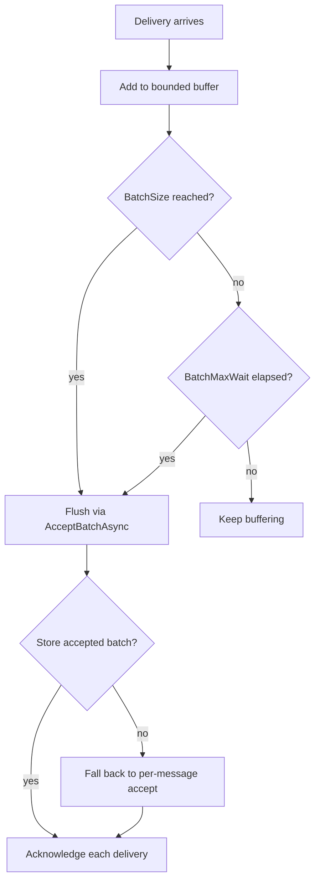

# Batch Inbox Accept Buffering

- **ID**: `ingress.batch-accept`
- **Name**: Batch inbox accept buffering
- **Maturity**: GA
- **Summary**: Buffers transport deliveries for `IInbox.AcceptBatchAsync` while keeping broker settlement per delivery.

## Purpose and Scope

When `TransportInboxIngressSafetyOptions.EnableBatchAccept` is true, `TransportInboxIngressConsumer` buffers `BatchSize` deliveries. It flushes when the buffer reaches that size, when `BatchMaxWait` elapses after the first buffered delivery, or when the consumer stops.

`BatchSize` is independent from native broker controls. For example, AMQP can prefetch 50 unacknowledged deliveries while each inbox store call accepts 10 rows:

```csharp
ingress.UseOptions(new AmqpInboxIngressOptions
{
    QueueName = "orders.commands",
    PrefetchCount = 50,
    Safety = new TransportInboxIngressSafetyOptions
    {
        EnableBatchAccept = true,
        BatchSize = 10,
        BatchMaxWait = TimeSpan.FromMilliseconds(200)
    }
});
```

On batch accept failure, the consumer falls back to per-message accept so one poison delivery does not reject unrelated messages. After a successful store call, each broker delivery is acknowledged separately. A semaphore bounded by `BatchSize` prevents another buffer from growing while the current batch flushes.

## Flush and Fallback Flow



## Public Surface

| Property | Default | Role |
| --- | --- | --- |
| `Safety.EnableBatchAccept` | false | Turn on delivery buffering |
| `Safety.BatchSize` | 10 | Buffer capacity and store flush threshold |
| `Safety.BatchMaxWait` | 200 ms | Flush a partial batch under low traffic |
| `Safety.MaxInFlightMessages` | 32 | Limit concurrent LiteBus handler work outside the batch buffer |

Every ingress adapter exposes the same `Safety` record. AMQP prefetch, SQS receive size, and Azure callback concurrency do not change the inbox batch threshold.

## Packages

- `LiteBus.Inbox.Ingress`
- The selected `LiteBus.Inbox.Ingress.*` adapter

## Requires

- `ingress.transport-consumer`
- `ingress.transport-handler`
- A store that implements `IInbox.AcceptBatchAsync`

## Invariants

- Shutdown flushes a partial buffer before the transport consumer stops.
- Broker acknowledgement remains per delivery after batch store success.
- A failed batch store call falls back to per-message acceptance.
- `BatchSize` must be greater than zero and fails at module composition when invalid.

## Observability

| Signal | When emitted |
| --- | --- |
| EventId 3003, Error, `BatchFlushFailed` | A timed partial-batch flush throws |
| EventId 3006, Warning, `BatchAcceptFallback` | Batch accept fails and per-message fallback begins |
| `ingress.ack_failed_after_accept` | One broker acknowledgement fails after store acceptance |

## Test Coverage

| Test method | Project |
| --- | --- |
| `BatchAccept_WhenBufferFull_ShouldBlockUntilFlushCompletes` | `LiteBus.Inbox.UnitTests` (`Ingress/`) |
| `BatchAccept_WhenOneDeliveryFails_ShouldAcknowledgeSuccessfulDeliveriesOnly` | `LiteBus.Inbox.UnitTests` (`Ingress/`) |
| `BatchAccept_ShouldFlushPartialBatchAfterBatchMaxWait` | `LiteBus.Inbox.UnitTests` (`Ingress/`) |
| `EnableBatchAccept_AtBatchSize_ShouldFlushAllMessages` | `LiteBus.Durable.IntegrationTests` (`Ingress/Amqp/`) |
| `EnableBatchAccept_BeforeBatchSize_ShouldFlushAfterBatchMaxWait` | `LiteBus.Durable.IntegrationTests` (`Ingress/Amqp/`) |

Live Kafka, Azure Service Bus, and SQS batch acceptance is not covered by provider integration suites. Their builders use the same tested safety record and shared consumer.

## Deep Docs

- [Ingress safety options](safety-options.md)
- [Inbox](../../reliable-messaging/inbox.md)
