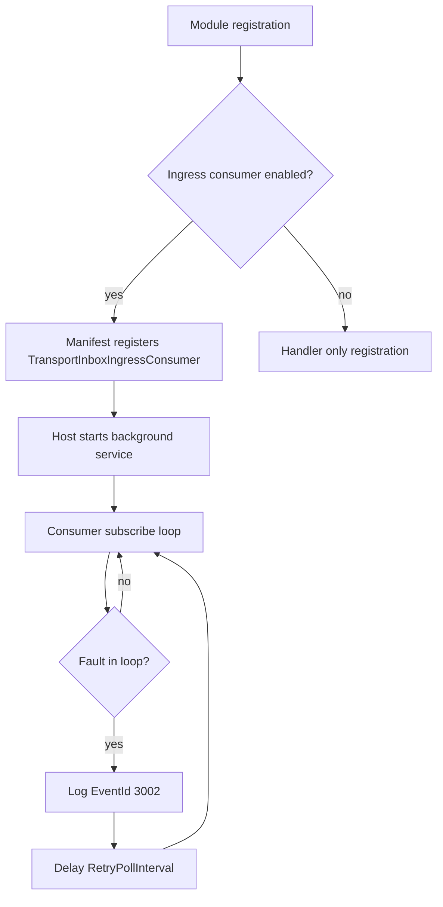

# Host Loop and Consumer Enablement

- **ID**: `ingress.host-loop`
- **Name**: Host loop and consumer enablement
- **Maturity**: GA
- **Summary**: Controls whether the ingress consumer runs as manifest background work and how it restarts after faults.

## Purpose and Scope

Ingress modules register `TransportInboxIngressConsumer` through `IModuleConfiguration.RegisterBackgroundService` when the module builder leaves `EnableIngressConsumer` true (default). `TransportInboxIngressHostOptions` controls runtime behavior:

| Property | Default | Role |
| --- | --- | --- |
| `Enabled` | true | Skip the consumer loop when false |
| `RetryPollInterval` | 5 seconds | Delay before restarting after transport faults |

Module builders expose `DisableIngressConsumer()` to register handler services without starting the subscription loop (custom consume paths or tests). Kafka builder also exposes `ConfigureHost(Action<TransportInboxIngressHostOptions>)`.

## Lifecycle Flow

## Public Surface

| API | Role |
| --- | --- |
| `*InboxIngressModuleBuilder.DisableIngressConsumer()` | Register handler without subscription loop |
| `TransportInboxIngressHostOptions.Enabled` | Skip consumer loop when false (default true) |
| `TransportInboxIngressHostOptions.RetryPollInterval` | Delay before restarting after transport faults (default 5 s) |
| `AmqpInboxIngressModuleBuilder.HostOptions` | AMQP host tuning |
| `KafkaInboxIngressModuleBuilder.ConfigureHost(Action<TransportInboxIngressHostOptions>)` | Kafka host tuning |
| `IModuleConfiguration.RegisterBackgroundService(Type)` | Registers `TransportInboxIngressConsumer` when consumer enabled |

## Packages

- `LiteBus.Inbox.Ingress`
- All `LiteBus.Inbox.Ingress.*` module builders

## Requires

- `hosting.manifest-background-services` (generic host orchestrator)
- `ingress.transport-consumer`

## Invariants

- Background services start after startup tasks complete (host orchestrator ordering).
- Disabling the consumer still registers `TransportInboxIngressHandler` for manual accept scenarios.
- Ingress does not register `IHostedService` directly; it uses manifest indirection.
- Retry behavior is infinite until cancellation, with delay controlled by `RetryPollInterval`.

## Broker Parity

| Broker adapter | `DisableIngressConsumer()` | Host options customization |
| --- | --- | --- |
| AMQP | yes | `HostOptions` property |
| Kafka | yes | `ConfigureHost(...)` API |
| AWS SQS | yes | `HostOptions` property |
| Azure Service Bus | yes | `HostOptions` property |
| InMemory | yes | `HostOptions` property |

All adapters register the same `TransportInboxIngressConsumer` type when enabled.

## Non-Goals

- Separate ingress scheduler or cron host.
- Dynamic hot reload of destination names without rebuild.
- Health probes for broker connectivity (application registers `IDiagnosticCheck`).

## Observability

| Signal | When emitted |
| --- | --- |
| EventId 3002, Warning, `IngressRestarting` | Consumer loop fault; restart scheduled after `RetryPollInterval` |
| Manifest `BackgroundServices` | `typeof(TransportInboxIngressConsumer)` when consumer enabled |

No host-loop-specific metrics. Background services start after startup tasks complete (host orchestrator). Disabling the consumer (`DisableIngressConsumer`) removes the manifest entry but leaves handler services for manual accept.

## Test Coverage

### Covered

| Test method | Project |
| --- | --- |
| `DisableIngressConsumer_ShouldNotRegisterIngressHostedService` | `LiteBus.Storage.IntegrationTests (`PostgreSql/`)` |
| `InboxIngressExtensions_ShouldRegisterIngressServices` | `LiteBus.Durable.IntegrationTests` (`Registration/`) |
| `UseInMemoryIngress_ShouldAcceptProcessAndDispatchCommand` | `LiteBus.Durable.IntegrationTests` (`Ingress/InMemory/`) |

End-to-end tests assert `TransportInboxIngressConsumer` on the host manifest when the consumer is enabled (`PublishThroughRabbitMq_ShouldAcceptProcessAndDispatchCommand`, `PublishThroughKafka_ShouldAcceptProcessAndDispatchCommand`, `PublishThroughServiceBus_ShouldAcceptProcessAndDispatchCommand`, `PublishThroughSqs_ShouldAcceptProcessAndDispatchCommand`).

### Untested

- `TransportInboxIngressHostOptions.RetryPollInterval` restart after transport fault (EventId 3002 path).
- `TransportInboxIngressHostOptions.Enabled = false` at registration time.
- `KafkaInboxIngressModuleBuilder.ConfigureHost` host tuning.
- Kafka ingress host start/stop without hanging under rapid broker recycle.
- Explicit restart timing assertions for SQS and Service Bus adapters.

### Out-of-Scope

- Separate ingress scheduler or cron host.
- Dynamic hot reload of destination names without rebuild.
- Broker connectivity health probes (`IDiagnosticCheck`).

## Deep Docs

- [Hosted services: AMQP inbox ingress](../../architecture/hosted-services.md)
- [Hosted services: Manual execution](../../architecture/hosted-services.md)
