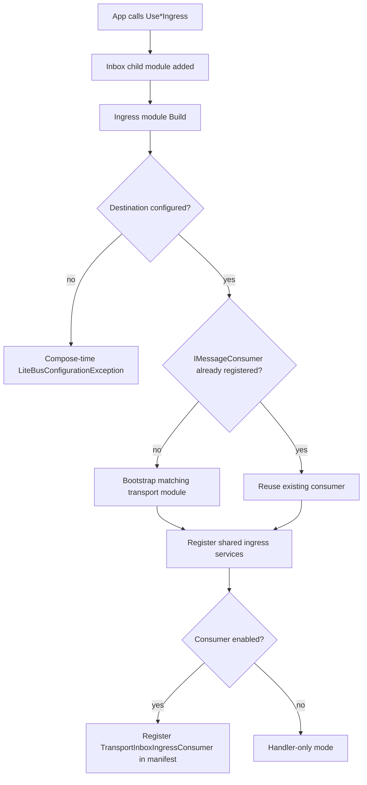

# Inbox Ingress Registration

- **ID**: `ingress.registration`
- **Name**: Inbox ingress registration
- **Maturity**: GA
- **Summary**: Registers broker-specific ingress as an inbox child module through `Use*Ingress` extensions on `InboxModuleBuilder`.

## Purpose and Scope

Ingress adapters implement `IInboxIngressModule` and register through `InboxModuleBuilder.RegisterIngress`. Each `Use*Ingress` extension wraps a broker module that runs during inbox composite `Build()`, after the parent inbox module declares children. Modules map broker-specific options into shared `TransportInboxIngressOptions`, register `TransportInboxIngressHandler`, and optionally register `TransportInboxIngressConsumer` as a manifest background service.

When `IMessageConsumer` is not already registered, ingress modules bootstrap the matching `LiteBus.Transport.*` module from connection options supplied on the ingress builder (AMQP, Kafka, Azure Service Bus, AWS SQS). In-memory ingress bootstraps `InMemoryTransportModule` without connection options.

## Registration Flow

## Public Surface

| API | Package |
| --- | --- |
| `InboxModuleBuilder.RegisterIngress(IInboxIngressModule)` | `LiteBus.Inbox.Abstractions` |
| `IInboxIngressModule` | Marker for ingress child modules |
| `UseAmqpIngress(Action<AmqpInboxIngressModuleBuilder>)` | `LiteBus.Inbox.Ingress.Amqp` |
| `UseKafkaIngress(Action<KafkaInboxIngressModuleBuilder>)` | `LiteBus.Inbox.Ingress.Kafka` |
| `UseAzureServiceBusIngress(Action<AzureServiceBusInboxIngressModuleBuilder>)` | `LiteBus.Inbox.Ingress.AzureServiceBus` |
| `UseAwsSqsIngress(Action<AwsSqsInboxIngressModuleBuilder>)` | `LiteBus.Inbox.Ingress.AwsSqs` |
| `UseInMemoryIngress(Action<InMemoryInboxIngressModuleBuilder>)` | `LiteBus.Inbox.Ingress.InMemory` |

Broker module builders expose `UseOptions`, `DisableIngressConsumer()`, and `HostOptions` / `ConfigureHost` where applicable. Shared services registered by every ingress module: `TransportInboxIngressHandler`, `TransportInboxIngressOptions`, optional `TransportInboxIngressConsumer` as manifest background service.

## Broker Registration Matrix

| Broker | Required option members | Bootstraps transport when absent | Additional ingress options mapped |
| --- | --- | --- | --- |
| AMQP | `QueueName`, `Connection` | `AmqpTransportModule` | Declare queue, durable queue, trust headers, batch accept |
| Kafka | `Destination`, `Connection` | `KafkaTransportModule` | Prefetch, requeue |
| AWS SQS | `Destination`, `Connection` | `AwsSqsTransportModule` | Prefetch, requeue |
| Azure Service Bus | `Destination`, `Connection` | `AzureServiceBusTransportModule` | Prefetch, requeue |
| InMemory | `Destination` | `InMemoryTransportModule` | Prefetch, requeue |

## Packages

- `LiteBus.Inbox.Abstractions`
- `LiteBus.Inbox.Ingress.*` (one broker package per integration)

## Requires

- `durable-core.inbox.accept` (inbox core and storage; documented in durable-core catalog)
- Matching `transport.*` consumer when transport is not pre-registered
- Registered message contracts for payloads ingress deserializes (`runtime.contract-registry` or explicit `Contracts.Register`)

## Invariants

- Ingress registers inside `AddInboxModule`, not as a top-level module shortcut.
- Duplicate registration of the same module type throws at compose time (composite module rules).
- One `IMessageConsumer` registration per process; ingress bootstraps transport only when none exists.
- Ingress accepts through `IInbox`, not `ITransactionalInbox` (no ambient transaction at the broker edge).
- Compose-time destination validation happens before any background service registration.

## Non-Goals

- Registering ingress without inbox storage (accept has nowhere to persist).
- Kitchen-sink transport registration that pulls every broker SDK.
- Outbox or event ingress (outbox uses dispatch, not ingress).

## Observability

Ingress registration does not define new instruments. Each ingress module `Build()` calls `TransportMetricsRegistration.RegisterIfNeeded` when it bootstraps or shares a transport module.

| Kind | Name | When emitted | Registration |
| --- | --- | --- | --- |
| Gauge | `litebus.transport.circuit_breaker.open` | Breaker open on publish or connection paths | `AddLiteBusTransportMetrics()` or broker OpenTelemetry package |
| Gauge | `litebus.transport.circuit_breaker.failure_count` | Consecutive broker connectivity failures | same |
| Tag | `litebus.transport.broker` | `amqp`, `kafka`, `sqs`, `azure_service_bus`, `inmemory` | on breaker gauges |

Ingress-specific counter `ingress.ack_failed_after_accept` is recorded at runtime by `ingress.transport-consumer`, not at registration. See `ingress.telemetry`.

No ingress registration activities or log events. Consumer restart and ack-failure logs emit from `TransportInboxIngressConsumer` at runtime.

## Test Coverage

### Covered

| Test method | Project |
| --- | --- |
| `UseAmqpIngress_WithTransportModule_ShouldRegisterIngressHandler` | `LiteBus.Inbox.UnitTests` (`Ingress/Amqp/`) |
| `UseAmqpIngress_WithConnectionOptions_ShouldBootstrapAmqpTransport` | `LiteBus.Inbox.UnitTests` (`Ingress/Amqp/`) |
| `InboxIngressExtensions_ShouldRegisterIngressServices` | `LiteBus.Durable.IntegrationTests` (`Registration/`) |
| `DisableIngressConsumer_ShouldNotRegisterIngressHostedService` | `LiteBus.Storage.IntegrationTests (`PostgreSql/`)` |
| `UseInMemoryIngress_ShouldAcceptProcessAndDispatchCommand` | `LiteBus.Durable.IntegrationTests` (`Ingress/InMemory/`) |

### Untested

- Duplicate registration of the same ingress module type throws at compose time.
- Compose-time validation when `QueueName` or `Destination` is empty.
- Reusing a pre-registered `IMessageConsumer` without bootstrapping transport (only covered indirectly through AMQP with-transport registration).
- Registration conflict behavior when more than one broker module is configured in the same inbox module.

### Out-of-Scope

- Top-level `IModuleRegistry` shortcuts that bypass `InboxModuleBuilder`.
- Registering ingress without inbox storage.
- Kitchen-sink transport registration across every broker SDK.

## Deep Docs

- [Inbox: Ingress](../../reliable-messaging/inbox.md)
- [Dependency graph](../../architecture/dependency-graph.md)
- [Cookbook: AMQP inbox ingress](../../getting-started/cookbook.md)
