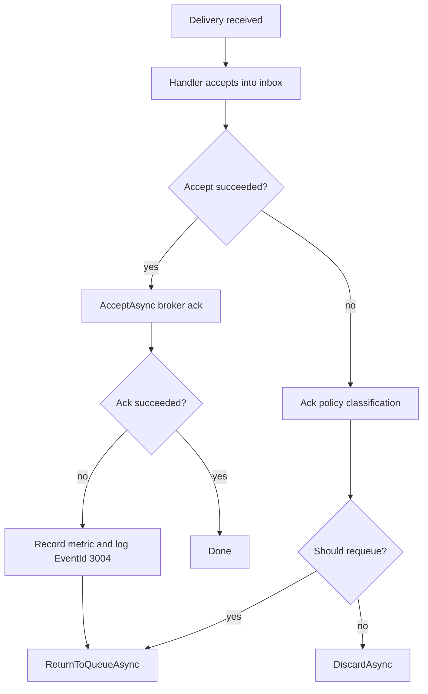

# Ingress Background Consumer Loop

- **ID**: `ingress.transport-consumer`
- **Name**: Ingress Background Consumer Loop
- **Maturity**: GA
- **Summary**: Subscribes to a transport destination, accepts deliveries into the inbox, and acknowledges or requeues broker messages.

## Purpose and Scope

`TransportInboxIngressConsumer` implements `IBackgroundService`. It starts `IMessageConsumer` with destination, prefetch, and declare settings from `TransportInboxIngressOptions`, invokes the handler for each delivery, then acknowledges successful accepts through `TransportMessage.AcceptAsync`.

On accept failure it applies `IngressAckPolicy`: requeue through `ReturnToQueueAsync` when policy allows, otherwise discard through `DiscardAsync`. When store accept succeeds but broker ack fails, it records telemetry, logs, and requeues so idempotent redelivery absorbs into the existing inbox row.

The consumer restarts after transport faults using `TransportInboxIngressHostOptions.RetryPollInterval` and respects `ITransportCircuitBreaker` when registered.

## Delivery Lifecycle

## Public Surface

| API | Role |
| --- | --- |
| `TransportInboxIngressConsumer` | `IBackgroundService` manifest loop |
| `TransportInboxIngressConsumer.ExecuteAsync(CancellationToken)` | Subscribe, accept, ack or requeue until shutdown |
| `IMessageConsumer.StartAsync(TransportConsumerOptions, handler, CancellationToken)` | Injected transport subscription |
| `TransportInboxIngressHostOptions` | `Enabled`, `RetryPollInterval` |
| `IngressAckPolicy.ShouldRequeue(Exception, bool)` | Requeue vs discard classification |

## Batch Mode Behavior

When `EnableBatchAccept=true`, the consumer:

- Buffers messages up to prefetch capacity.
- Flushes on threshold, timer (`BatchMaxWait`), or shutdown.
- Falls back to per-message accept on batch failure (`BatchAcceptFallback`, EventId 3006).
- Acknowledges each message separately after successful batch accept.

## Packages

- `LiteBus.Inbox.Ingress`

## Requires

- `ingress.transport-handler`
- `ingress.ack-policy`
- `ingress.host-loop`
- `transport.message-consumer` (broker adapter)

## Invariants

- Ack follows successful inbox accept (accept-then-ack ordering).
- Ack failure after accept requeues; duplicate rows are prevented by broker-scoped idempotency when stable delivery ids exist.
- Consumer loop exits immediately when `TransportInboxIngressHostOptions.Enabled` is false.
- Partial batch buffers flush on stop, timer, or prefetch threshold when batch accept is enabled.
- Consumer restart loop treats transport faults as retryable host-loop failures and logs EventId 3002.

## Non-Goals

- Competing consumer load balancing policy (broker-defined).
- Exactly-once broker semantics (at-least-once with idempotent accept).
- Inbox processor leasing or dispatch.

## Observability

### Metrics (Inbox Meter)

| Instrument | Type | Constant | When incremented |
| --- | --- | --- | --- |
| `ingress.ack_failed_after_accept` | Counter | `LiteBusInboxIngressTelemetry.AckFailedAfterAcceptInstrumentName` | `TransportMessage.AcceptAsync` throws after `IInbox` accept succeeded |

Meter: `LiteBus.Inbox` (`LiteBusInboxIngressTelemetry.MeterName`). Recording: `TransportInboxIngressTelemetry.RecordAckFailedAfterAccept()`. Register with `AddLiteBusInboxMetrics()`.

On ack failure after accept, the consumer also calls `ReturnToQueueAsync` so idempotent redelivery absorbs into the existing inbox row.

### Tracing

One `process {destination}` activity per delivery starts in `TransportConsumerHandlerInvoker` and covers the ingress handler plus its requeue policy.

### Structured Logs

| EventId | Level | Delegate | When logged |
| --- | --- | --- | --- |
| 3002 | Warning | `TransportInboxIngressLogMessages.IngressRestarting` | Transport fault; loop restarts after `RetryPollInterval` |
| 3003 | Error | `TransportInboxIngressLogMessages.BatchFlushFailed` | Timed batch flush throws (`ingress.batch-accept`) |
| 3004 | Error | `TransportInboxIngressLogMessages.AckFailedAfterAccept` | Broker ack fails after store accept |

### Transport Circuit Breaker

When `ITransportCircuitBreaker` is registered, the consumer records success and failure on connection and consume paths. Observable gauges: `litebus.transport.circuit_breaker.open`, `litebus.transport.circuit_breaker.failure_count` tagged by `litebus.transport.broker`.

## Test Coverage

### Covered

| Test method | Project |
| --- | --- |
| `HandleDeliveryAsync_WhenAcceptSucceeds_ShouldAcknowledge` | `LiteBus.Inbox.UnitTests` (`Ingress/`) |
| `HandleDeliveryAsync_WhenStorageFull_ShouldDiscardWithoutRequeue` | `LiteBus.Inbox.UnitTests` (`Ingress/`) |
| `HandleDeliveryAsync_WhenTransientFailureAndRequeueEnabled_ShouldReturnToQueue` | `LiteBus.Inbox.UnitTests` (`Ingress/`) |
| `HandleDeliveryAsync_WhenAuthorizationRejects_ShouldDiscardWithoutAccept` | `LiteBus.Inbox.UnitTests` (`Ingress/`) |
| `HandleDeliveryAsync_WhenAckFailsAfterAccept_ShouldNotDiscard` (includes counter assertion) | `LiteBus.Inbox.UnitTests` (`Ingress/`) |
| `BatchAccept_WhenBufferFull_ShouldBlockUntilFlushCompletes` | `LiteBus.Inbox.UnitTests` (`Ingress/`) |
| `BatchAccept_WhenOneDeliveryFails_ShouldAcknowledgeSuccessfulDeliveriesOnly` | `LiteBus.Inbox.UnitTests` (`Ingress/`) |
| `BatchAccept_ShouldFlushPartialBatchAfterBatchMaxWait` | `LiteBus.Inbox.UnitTests` (`Ingress/`) |
| `EnableBatchAccept_AtPrefetchThreshold_ShouldFlushAllMessages` | `LiteBus.Durable.IntegrationTests` (`Ingress/Amqp/`) |
| `EnableBatchAccept_BeforePrefetchThreshold_ShouldFlushAfterBatchMaxWait` | `LiteBus.Durable.IntegrationTests` (`Ingress/Amqp/`) |
| `UnknownContract_ShouldNackWithoutRequeueAndSkipStore` | `LiteBus.Durable.IntegrationTests` (`Ingress/Amqp/`) |
| `InvalidJson_ShouldNackWithoutRequeueAndSkipStore` | `LiteBus.Durable.IntegrationTests` (`Ingress/Amqp/`) |
| `StoreFull_ShouldNackWithoutRequeueWhenCapacityExceeded` | `LiteBus.Durable.IntegrationTests` (`Ingress/Amqp/`) |
| `RequeueEnabled_WithTransientStoreFailure_ShouldEventuallyAccept` | `LiteBus.Durable.IntegrationTests` (`Ingress/Amqp/`, `Ingress/AzureServiceBus/`, `Ingress/AwsSqs/`, `Ingress/InMemory/`) |
| `RequeueDisabled_WithPoisonMessage_ShouldDrainQueue` | `LiteBus.Durable.IntegrationTests` (`Ingress/AwsSqs/`, `Ingress/InMemory/`) |
| `TransientAcceptFailure_ShouldRedeliverSameOffsetWithoutRestart` | `LiteBus.Durable.IntegrationTests` (`Ingress/Kafka/`) |
| `UseInMemoryIngress_ShouldAcceptProcessAndDispatchCommand` | `LiteBus.Durable.IntegrationTests` (`Ingress/InMemory/`) |

Manifest registration of `TransportInboxIngressConsumer` is asserted inside end-to-end tests (`PublishThroughRabbitMq_ShouldAcceptProcessAndDispatchCommand`, `PublishThroughKafka_ShouldAcceptProcessAndDispatchCommand`, `PublishThroughServiceBus_ShouldAcceptProcessAndDispatchCommand`, `PublishThroughSqs_ShouldAcceptProcessAndDispatchCommand`, `PublishThroughRabbitMq_ShouldStoreInPostgreSqlAndDispatchCommand`).

### Untested

- `ITransportCircuitBreaker` open and half-open behavior during the consumer loop.
- Consumer restart after transport fault using `RetryPollInterval`.
- `TransportInboxIngressHostOptions.Enabled = false` skipping the loop at runtime.
- EventId 3005 (`DeliveryDiscardedAfterAcceptFailure`) assertion in broker integration suites.
- EventId 3006 (`BatchAcceptFallback`) assertion under batch fault injection.

### Out-of-Scope

- Competing consumer load balancing policy (broker-defined).
- Exactly-once broker semantics.
- Inbox processor leasing or dispatch.

## Deep Docs

- [Inbox: Ingress](../../reliable-messaging/inbox.md)
- [Reliable messaging semantics](../../reliable-messaging/semantics.md)
- [Hosted services](../../architecture/hosted-services.md)
