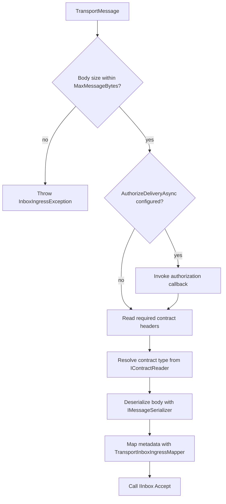

# Transport-to-Inbox Accept Handler

- **ID**: `ingress.transport-handler`
- **Name**: Transport-to-Inbox Accept Handler
- **Maturity**: GA
- **Summary**: Maps one `TransportMessage` delivery into `IInbox.AcceptAsync` or `AcceptBatchAsync`.

## Purpose and Scope

`TransportInboxIngressHandler` is the broker-neutral accept path. For each delivery it validates body size and optional authorization, reads contract name and version from LiteBus transport headers, resolves the CLR type through `IContractReader`, deserializes the JSON body, maps headers to `InboxAcceptMetadata`, and calls `IInbox.AcceptAsync(InboxAcceptItem)`.

Batch mode delegates to `IInbox.AcceptBatchAsync` after building an `InboxAcceptItem` per message. Header mapping failures wrap `TransportHeaderMappingException` as `InboxIngressException`.

## Accept Pipeline

## Public Surface

| API | Role |
| --- | --- |
| `TransportInboxIngressHandler.AcceptAsync(TransportMessage, CancellationToken)` | Single delivery accept |
| `TransportInboxIngressHandler.AcceptBatchAsync(IReadOnlyList<TransportMessage>, CancellationToken)` | Batch store round trip |
| `AmqpInboxIngressHandler.AcceptAsync(TransportMessage, CancellationToken)` | AMQP-shaped manual or test accept (delegates to inner handler) |
| `TransportInboxIngressMapper` | Internal; maps wire headers to `InboxAcceptMetadata` |
| `TransportInboxIngressMappingOptions` | `RequireStableIdentity`, `TrustApplicationHeaders` mapping policy |

## Validation Behavior

| Check | Failure type | Policy impact |
| --- | --- | --- |
| Missing `litebus-contract-name` | `InboxIngressException` (wrapped mapping exception) | Non-requeue class by default policy |
| Invalid or non-positive `litebus-contract-version` | `InboxIngressException` (wrapped mapping exception) | Non-requeue class by default policy |
| Body exceeds `MaxMessageBytes` | `InboxIngressException` | Non-requeue class by default policy |
| Unknown registered contract | `MessageContractNotRegisteredException` | Non-requeue class by default policy |
| Invalid JSON payload | `JsonException` | Non-requeue class by default policy |
| Authorization callback throws | Callback exception type | Requeue or discard based on `IngressAckPolicy` |

## Packages

- `LiteBus.Inbox.Ingress`
- `LiteBus.Inbox.Ingress.Amqp` (`AmqpInboxIngressHandler` only)

## Requires

- `ingress.header-mapping`
- `ingress.safety-options`
- `durable-core.inbox.accept`
- `runtime.contract-registry`
- `runtime.message-serialization` ( `IMessageSerializer` )

## Invariants

- Required wire headers: `litebus-contract-name`, `litebus-contract-version` (positive integer).
- Accept commits through the singleton inbox writer unless the host replaces store behavior.
- Deserialization uses UTF-8 body text from `TransportMessage.Body`.
- The transport consumer invoker owns process tracing; the mapping handler does not create a second activity.
- Handler does not perform broker ack, ack remains owned by the consumer loop.

## Non-Goals

- Broker acknowledgement (owned by `ingress.transport-consumer`).
- Handler execution or dispatch (inbox processor).
- Transactional accept in the same database connection as domain writes at the ingress edge.

## Observability

### Tracing

| Activity | Activity source | Kind | Started by | Tags |
| --- | --- | --- | --- | --- |
| `process {destination}` | `LiteBus.Transport` | Consumer | `TransportConsumerHandlerInvoker` around the delivery handler | Required messaging operation tags plus destination and message metadata |

Operation constant: `LiteBusTransportTelemetry.ConsumeOperationName`. Register with `TracerProviderBuilder.AddLiteBusTransportInstrumentation()` from `LiteBus.Transport.Extensions.OpenTelemetry`.

### Metrics

The handler does not increment ingress counters. Store accept outcomes surface through inbox processor metrics after the processor leases the row. Ack failure after accept is recorded in `ingress.transport-consumer` (`ingress.ack_failed_after_accept`).

### Logs

Mapping and contract validation failures throw before accept; the consumer logs discard or requeue decisions. No handler-specific structured log event IDs.

## Test Coverage

### Covered

| Test method | Project |
| --- | --- |
| `AcceptAsync_ShouldWriteEnvelopeToInboxStore` | `LiteBus.Inbox.UnitTests` (`Ingress/`) |
| `AcceptAsync_WhenBrokerRedelivers_ShouldNotCreateDuplicateRows` | `LiteBus.Inbox.UnitTests` (`Ingress/`) |
| `AcceptAsync_WhenBodyExceedsMaxMessageBytes_ShouldThrow` | `LiteBus.Inbox.UnitTests` (`Ingress/`) |
| `AcceptAsync_WithAuthorizationCallback_ShouldAuthorizeBeforeStoreWrite` | `LiteBus.Inbox.UnitTests` (`Ingress/`) |
| `AcceptBatchAsync_WithSingleMessage_ShouldWriteEnvelopeToInboxStore` | `LiteBus.Inbox.UnitTests` (`Ingress/`) |
| `AcceptAsync_ShouldDeserializeAndWriteToInboxWithMappedHeaders` | `LiteBus.Inbox.UnitTests` (`Ingress/Amqp/`) |
| `AcceptAsync_WhenContractHeaderMissing_ShouldThrow` | `LiteBus.Inbox.UnitTests` (`Ingress/Amqp/`) |
| `AcceptAsync_WhenContractVersionIsInvalid_ShouldThrow` | `LiteBus.Inbox.UnitTests` (`Ingress/Amqp/`) |
| `AcceptAsync_WhenContractVersionIsZero_ShouldThrow` | `LiteBus.Inbox.UnitTests` (`Ingress/Amqp/`) |
| `AcceptAsync_WhenMessageIsNull_ShouldThrow` | `LiteBus.Inbox.UnitTests` (`Ingress/Amqp/`) |
| `AcceptAsync_ShouldConvertByteArrayAndMemoryHeaders` | `LiteBus.Inbox.UnitTests` (`Ingress/Amqp/`) |
| `AcceptAsync_WhenMessageIdHeaderInvalid_ShouldLeaveInboxIdUnset` | `LiteBus.Inbox.UnitTests` (`Ingress/Amqp/`) |
| `AcceptAsync_WhenVisibleAfterHeaderInvalid_ShouldIgnoreVisibleAfter` | `LiteBus.Inbox.UnitTests` (`Ingress/Amqp/`) |
| `PublishThroughRabbitMq_ShouldAcceptProcessAndDispatchCommand` | `LiteBus.Durable.IntegrationTests` (`Ingress/Amqp/`) |
| `PublishThroughLavinMq_ShouldAcceptProcessAndDispatchCommand` | `LiteBus.Durable.IntegrationTests` (`Ingress/Amqp/`) |
| `PublishThroughKafka_ShouldAcceptProcessAndDispatchCommand` | `LiteBus.Durable.IntegrationTests` (`Ingress/Kafka/`) |
| `PublishThroughServiceBus_ShouldAcceptProcessAndDispatchCommand` | `LiteBus.Durable.IntegrationTests` (`Ingress/AzureServiceBus/`) |
| `PublishThroughSqs_ShouldAcceptProcessAndDispatchCommand` | `LiteBus.Durable.IntegrationTests` (`Ingress/AwsSqs/`) |
| `UseInMemoryIngress_ShouldAcceptProcessAndDispatchCommand` | `LiteBus.Durable.IntegrationTests` (`Ingress/InMemory/`) |
| `PublishThroughInMemoryTransport_ShouldAcceptProcessAndDispatchCommand` | `LiteBus.Durable.IntegrationTests` (`Ingress/InMemory/`) |
| `PublishThroughRabbitMq_ShouldStoreInPostgreSqlAndDispatchCommand` | `LiteBus.Storage.IntegrationTests (`PostgreSql/`)` |

### Untested

- `TransportHeaderMappingException` surfaced through the full consumer loop on live brokers.
- Multi-message `AcceptBatchAsync` through the handler alone (batch path exercised via consumer and AMQP integration).
- Header edge-case matrices on Kafka and Azure broker integration suites (InMemory suite carries the full matrix).

### Out-of-Scope

- Broker acknowledgement (owned by `ingress.transport-consumer`).
- Handler execution or inbox processor dispatch.
- Transactional accept coupled to domain database connections at the ingress edge.

## Deep Docs

- [Inbox](../../reliable-messaging/inbox.md)
- [AMQP transport: Wire headers](../../integrations/amqp.md)
