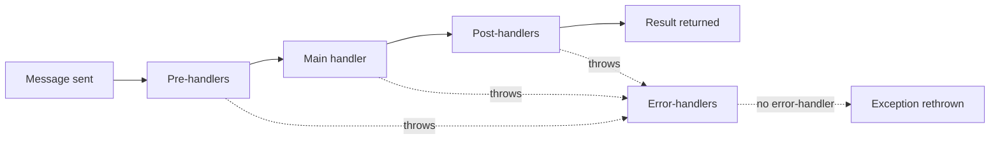

# The Handler Pipeline

Every message LiteBus mediates passes through the same four-stage pipeline: pre-handlers, one or more main handlers, post-handlers, and error-handlers on failure. This page explains the exact order each stage runs in, how global and specific handlers interleave, how errors propagate, how cancellation flows, and how a handler can short-circuit the pipeline. It is the reference behind the per-module pages and assumes you have read at least the [Command Module](commands.md).

The pipeline is the same shape for commands, queries, and events. The difference is the main stage: a command or query has exactly one main handler, while an event has zero to many. Everything around the main stage behaves identically.

## The Four Stages

For a single message, mediation runs:

1. **Pre-handlers** validate, authorize, or prepare. Throwing here stops the pipeline before the main handler runs.
2. **Main handler** does the work. One handler for commands and queries; all matching handlers for events.
3. **Post-handlers** react to success. They receive the message and the result.
4. **Error-handlers** run only if any earlier stage threw. They receive the message, any partial result, and the exception.



## Global, Specific, and the Execution Order

A handler can be registered against the concrete message type or against a base type or interface the message implements. LiteBus calls the first kind **direct** (specific) and the second **indirect** (global or polymorphic). Polymorphic dispatch is what makes a handler for `IEvent` or a base command run for every concrete message; see [Polymorphic Dispatch](polymorphic-dispatch.md).

The two kinds run in a deliberate order that forms an onion around the main handler:

| Stage | Order |
| --- | --- |
| Pre-handlers | Global (indirect) first, then specific (direct) |
| Main handler | The handler(s) for the message |
| Post-handlers | Specific (direct) first, then global (indirect) |
| Error-handlers | Global (indirect) first, then specific (direct) |

Within each group, handlers run in ascending `[HandlerPriority]` order (default priority is `0`). The pre/post asymmetry is intentional: a global pre-handler such as authentication runs before any message-specific check, and a global post-handler such as audit logging runs after the message-specific reactions have completed. Cross-cutting concerns wrap message-specific ones on both sides.

This ordering is implemented in `MessageContextExtensions`: pre-handlers iterate indirect then direct, post-handlers iterate direct then indirect, and error-handlers iterate indirect then direct.

## Commands and Queries: The Single-Handler Pipeline

A command or query must resolve to exactly one main handler. If more than one is registered, mediation throws `MultipleHandlerFoundException` before running anything. The flow for a result-returning message is:

```
RunAsyncPreHandlers(message)        // indirect pre, then direct pre
result = handler.HandleAsync(...)   // the one main handler
RunAsyncPostHandlers(message, result) // direct post, then indirect post
return result
```

A post-handler can replace the value the caller receives by setting `MessageResult` on the execution context. When a post-handler writes a non-null `MessageResult`, that value is returned instead of the handler's own result. This is how a post-handler can wrap or transform a result without the main handler knowing.

```csharp
public sealed class WrapInEnvelope : IQueryPostHandler<GetProductByIdQuery, ProductDto>
{
    public Task PostHandleAsync(GetProductByIdQuery query, ProductDto? result, CancellationToken ct = default)
    {
        AmbientExecutionContext.Current.MessageResult = new Envelope<ProductDto>(result);
        return Task.CompletedTask;
    }
}
```

## Events: The Broadcast Pipeline

An event runs pre-handlers, then all matching main handlers, then post-handlers, then error-handlers on failure. Main handlers are grouped by priority and executed according to the two concurrency switches on `EventMediationSettings.Execution`, covered on [Handler Priority](handler-priority.md) and the [Event Module](events.md).

If no main handler matches, event publish still runs global and message-specific pre-handlers, then returns without post-handlers. Set `EventMediationSettings.ThrowIfNoHandlerFound = true` to throw `NoHandlerFoundException` after pre-handlers complete, which is useful in tests that assert a handler exists.

## Error Propagation

When any stage throws an exception other than an abort, the main flow stops and error-handlers run. The rule for what happens next is simple:

- If at least one error-handler is registered for the message (direct or indirect), the error-handlers run. If none of them rethrows, the exception is considered handled and mediation completes. For result-returning commands and queries, the caller then receives whatever result was produced before the failure, which may be `null`.
- If no error-handler is registered, LiteBus rethrows the original exception with its stack trace preserved through `ExceptionDispatchInfo`.

This means an error-handler that observes a failure must rethrow, or it silently swallows the exception:

```csharp
public sealed class AuditFailure : ICommandErrorHandler<ProcessPaymentCommand>
{
    public Task HandleErrorAsync(ProcessPaymentCommand command, object? result, Exception exception, CancellationToken ct = default)
    {
        // record the failure...
        throw exception; // rethrow, or the caller sees success
    }
}
```

## Short-Circuiting with Abort

Any handler in a command or query pipeline can stop mediation by calling `Abort` on the execution context. `Abort` throws an internal `LiteBusExecutionAbortedException` that the single-handler strategy catches and treats as a clean stop, not an error, so error-handlers do not run.

```csharp
// In a query pre-handler: return a cached value and skip the main handler.
AmbientExecutionContext.Current.Abort(cachedProduct);
```

The result rules for abort are:

- For a void command (`ICommand`), `Abort()` ends the pipeline with no result.
- For a result command or query, you must pass a value: `Abort(result)`. Aborting a result-returning message without a value throws `LiteBusConfigurationException`, because the caller is owed a result.

Abort is a single-handler concept. In an event broadcast, the abort exception is treated like any other exception and routed to error-handlers, so do not use `Abort` to skip event handlers; filter them instead with [Handler Filtering](handler-filtering.md).

## Cancellation

Each handler method receives a `CancellationToken`. The token the caller passes to `SendAsync`, `QueryAsync`, or `PublishAsync` is the same token exposed on the execution context as `AmbientExecutionContext.Current.CancellationToken`, so a handler that does not take the token as a parameter can still observe it. Honor the token in any I/O or loop; LiteBus does not forcibly interrupt a running handler.

## Sharing State Across Stages

Handlers in one mediation share an execution context. Use `AmbientExecutionContext.Current.Items` to pass data from a pre-handler to the main handler or a post-handler, for example a timer started in a pre-handler and stopped in a post-handler. The context is covered in full on [Execution Context](execution-context.md).

## Next

Read [Execution Context](execution-context.md) to share state and override results, then [Handler Priority](handler-priority.md) to order handlers within a stage.
