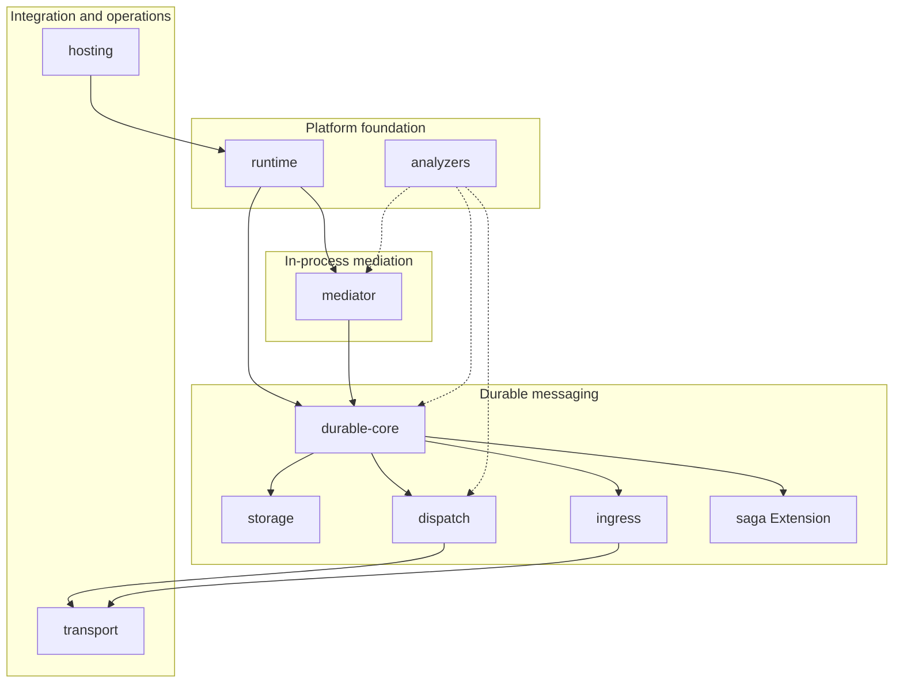

# LiteBus Capability Catalog

This document is the root index for LiteBus capabilities across all feature axes. It consolidates the per-axis catalogs under `docs/catalog/` without duplicating their full content. Use it for expansion planning, gap analysis, test coverage review, and discovering which packages and docs apply to a use case.

**Total capabilities indexed:** 158 across 10 axes (15 analyzers, 16 dispatch, 20 durable core, 16 hosting, 14 ingress, 12 mediator, 18 runtime, 11 saga, 21 storage, 15 transport).

---

## Purpose

LiteBus ships as granular NuGet packages along concern boundaries. The capability catalog names each shipped (or explicitly planned) behavior with a stable ID, maturity tier, package mapping, and link to a deep doc page.

Use this catalog when you need to:

- Compare what LiteBus covers today versus what your application must build
- Plan a new adapter, analyzer rule, or axis extension without re-reading every feature guide
- Trace dependencies between axes (for example ingress requires transport and durable storage)
- Prioritize roadmap work from documented coverage gaps

Each axis maintains its own folder with standalone capability files and a README index. Test coverage (covered, untested, and out-of-scope use cases) lives in each capability file. This root page synthesizes those folders; detail lives in the linked axis pages.

---

## How to Read

### Capability ID Schema

Every capability has an ID of the form **`axis.slug`**:

| Part | Meaning | Example |
| --- | --- | --- |
| `axis` | Feature area | `mediator`, `storage`, `dispatch` |
| `slug` | Kebab-case behavior name | `inbox-acceptance`, `role.lease` |

Storage role capabilities use dotted slugs (`storage.role.append`). Broker adapters often suffix `-adapter` (`transport.amqp-adapter`). Dispatch inbox/outbox pairs share broker names (`dispatch.inbox.amqp`, `dispatch.outbox.amqp`).

### Maturity Legend

| Tier | Meaning |
| --- | --- |
| **GA** | Production-ready; stable public contract |
| **Beta** | Shipped; validate in non-critical paths before enterprise reliance |
| **Extension** | Optional package on top of core axes (for example saga) |
| **Planned** | Documented on [Roadmap](../roadmap/README.md); not shipped |
| **Deprecated** | Still present but superseded; see migration guides |

When a capability spans tiers (for example AMQP ingress GA, Kafka ingress Beta), the master table notes the split.

### Deep Docs

Each capability links to a file under `docs/catalog/<axis>/`. Axis README pages list the same IDs with local context. Broader narrative guides remain in `docs/` (Architecture, Inbox, Outbox, transport guides, and similar).

---

## Capability Map

```text
LiteBus capability axes
|
+-- Platform foundation
|     runtime (module graph, registry, mediator engine, contracts, serialization)
|     analyzers (compile-time LB1001-LB1017 rules)
|
+-- In-process mediation
|     mediator (commands, queries, events, pipeline, registration)
|
+-- Durable messaging
|     durable-core (accept/enqueue, processors, semantics, operations)
|     storage (store roles, PostgreSQL/EF/InMemory adapters)
|     dispatch (in-process and broker dispatchers)
|     ingress (broker intake into inbox)
|     saga (correlated inbox state; Extension tier)
|
+-- Integration and operations
      transport (broker-neutral publish/consume)
      hosting (AddLiteBus, manifest, health, management, OpenTelemetry)
```



---

## Master Capability Table

One row per capability. Packages list primary install targets; transitive abstractions omitted unless they are the main surface.

### Analyzers (15)

| ID | Name | Axis | Maturity | Summary | Packages | Deep doc |
| --- | --- | --- | --- | --- | --- | --- |
| `analyzers.cross-assembly-handler-name` | Cross-assembly handler name collision | analyzers | GA | Warns when handler simple names collide across assemblies | `LiteBus.Analyzers` | [cross-assembly-handlers.md](../catalog/analyzers/cross-assembly-handlers.md) |
| `analyzers.duplicate-command-handler` | Duplicate command handler detection | analyzers | GA | Errors when more than one main command handler exists | `LiteBus.Analyzers` | [handler-duplicates.md](../catalog/analyzers/handler-duplicates.md) |
| `analyzers.duplicate-query-handler` | Duplicate query handler detection | analyzers | GA | Errors when more than one main query handler exists | `LiteBus.Analyzers` | [handler-duplicates.md](../catalog/analyzers/handler-duplicates.md) |
| `analyzers.explicit-contract-registration` | Explicit contract registration recommendation | analyzers | GA | Recommends module `Register` for attributed durable types | `LiteBus.Analyzers` | [contract-registration.md](../catalog/analyzers/contract-registration.md) |
| `analyzers.inbox-result-command-guard` | Inbox accept rejects result commands | analyzers | GA | Errors when result commands are scheduled to inbox | `LiteBus.Analyzers` | [inbox-accept-rules.md](../catalog/analyzers/inbox-accept-rules.md) |
| `analyzers.missing-command-handler` | Missing command handler detection | analyzers | GA | Errors when a command type has no handler | `LiteBus.Analyzers` | [handler-coverage.md](../catalog/analyzers/handler-coverage.md) |
| `analyzers.missing-contract-on-handled-type` | Missing contract on handled durable type | analyzers | GA | Warns when handled types lack contract registration | `LiteBus.Analyzers` | [contract-registration.md](../catalog/analyzers/contract-registration.md) |
| `analyzers.missing-query-handler` | Missing query handler detection | analyzers | GA | Errors when a query type has no handler | `LiteBus.Analyzers` | [handler-coverage.md](../catalog/analyzers/handler-coverage.md) |
| `analyzers.open-generic-handler-shape` | Open generic handler arity check | analyzers | GA | Errors on unsupported open generic handler shapes | `LiteBus.Analyzers` | [open-generic-handlers.md](../catalog/analyzers/open-generic-handlers.md) |
| `analyzers.orphan-handler-tag` | Orphan handler tag detection | analyzers | GA | Warns when handler tags are never referenced | `LiteBus.Analyzers` | [handler-tags.md](../catalog/analyzers/handler-tags.md) |
| `analyzers.processor-dispatcher-coupling` | Processor requires dispatcher registration | analyzers | GA | Errors when processor is enabled without dispatch | `LiteBus.Analyzers` | [processor-dispatcher-coupling.md](../catalog/analyzers/processor-dispatcher-coupling.md) |
| `analyzers.query-handler-purity` | Query handler side-effect guard | analyzers | GA | Warns when query handlers take event mediator dependencies | `LiteBus.Analyzers` | [query-handler-purity.md](../catalog/analyzers/query-handler-purity.md) |
| `analyzers.transactional-ef-interceptor` | Transactional EF requires save interceptor | analyzers | GA | Warns when EF transactional storage lacks interceptor | `LiteBus.Analyzers` | [transactional-ef-interceptor.md](../catalog/analyzers/transactional-ef-interceptor.md) |
| `analyzers.transactional-inbox-dbcontext` | Transactional inbox requires DbContext | analyzers | GA | Warns when transactional inbox store lacks DbContext | `LiteBus.Analyzers` | [transactional-inbox-wiring.md](../catalog/analyzers/transactional-inbox-wiring.md) |
| `analyzers.transactional-outbox-dbcontext` | Transactional outbox requires DbContext | analyzers | GA | Warns when transactional outbox store lacks DbContext | `LiteBus.Analyzers` | [transactional-outbox-wiring.md](../catalog/analyzers/transactional-outbox-wiring.md) |

### Dispatch (16)

| ID | Name | Axis | Maturity | Summary | Packages | Deep doc |
| --- | --- | --- | --- | --- | --- | --- |
| `dispatch.inbox.amqp` | Inbox AMQP dispatch | dispatch | GA | Publish leased inbox envelopes to RabbitMQ | `LiteBus.Inbox.Dispatch.Amqp` | [inbox-amqp.md](../catalog/dispatch/inbox-amqp.md) |
| `dispatch.inbox.aws-sqs` | Inbox AWS SQS dispatch | dispatch | GA | Publish leased inbox envelopes to SQS | `LiteBus.Inbox.Dispatch.AwsSqs` | [inbox-aws-sqs.md](../catalog/dispatch/inbox-aws-sqs.md) |
| `dispatch.inbox.azure-service-bus` | Inbox Azure Service Bus dispatch | dispatch | GA | Publish leased inbox envelopes to Azure Service Bus | `LiteBus.Inbox.Dispatch.AzureServiceBus` | [inbox-azure-service-bus.md](../catalog/dispatch/inbox-azure-service-bus.md) |
| `dispatch.inbox.in-process` | Inbox in-process command dispatch | dispatch | GA | Run leased inbox commands through local command mediator | `LiteBus.Inbox.Dispatch.InProcess` | [inbox-in-process.md](../catalog/dispatch/inbox-in-process.md) |
| `dispatch.inbox.inmemory` | Inbox InMemory transport dispatch | dispatch | GA | Publish leased inbox envelopes to in-memory transport | `LiteBus.Inbox.Dispatch.InMemory` | [inbox-inmemory.md](../catalog/dispatch/inbox-inmemory.md) |
| `dispatch.inbox.kafka` | Inbox Kafka dispatch | dispatch | GA | Publish leased inbox envelopes to Kafka | `LiteBus.Inbox.Dispatch.Kafka` | [inbox-kafka.md](../catalog/dispatch/inbox-kafka.md) |
| `dispatch.outbox.amqp` | Outbox AMQP dispatch | dispatch | GA | Publish leased outbox events to RabbitMQ | `LiteBus.Outbox.Dispatch.Amqp` | [outbox-amqp.md](../catalog/dispatch/outbox-amqp.md) |
| `dispatch.outbox.aws-sqs` | Outbox AWS SQS dispatch | dispatch | GA | Publish leased outbox events to SQS | `LiteBus.Outbox.Dispatch.AwsSqs` | [outbox-aws-sqs.md](../catalog/dispatch/outbox-aws-sqs.md) |
| `dispatch.outbox.azure-service-bus` | Outbox Azure Service Bus dispatch | dispatch | GA | Publish leased outbox events to Azure Service Bus | `LiteBus.Outbox.Dispatch.AzureServiceBus` | [outbox-azure-service-bus.md](../catalog/dispatch/outbox-azure-service-bus.md) |
| `dispatch.outbox.in-process` | Outbox in-process event dispatch | dispatch | GA | Replay leased outbox events to local event mediator | `LiteBus.Outbox.Dispatch.InProcess` | [outbox-in-process.md](../catalog/dispatch/outbox-in-process.md) |
| `dispatch.outbox.inmemory` | Outbox InMemory transport dispatch | dispatch | GA | Publish leased outbox events to in-memory transport | `LiteBus.Outbox.Dispatch.InMemory` | [outbox-inmemory.md](../catalog/dispatch/outbox-inmemory.md) |
| `dispatch.outbox.kafka` | Outbox Kafka dispatch | dispatch | GA | Publish leased outbox events to Kafka | `LiteBus.Outbox.Dispatch.Kafka` | [outbox-kafka.md](../catalog/dispatch/outbox-kafka.md) |
| `dispatch.processor-coupling` | Processor pipeline coupling | dispatch | GA | Processor success/failure driven by dispatcher exceptions | `LiteBus.Inbox`, `LiteBus.Outbox` | [processor-coupling.md](../catalog/dispatch/processor-coupling.md) |
| `dispatch.registration` | Dispatcher registration | dispatch | GA | Exactly one dispatcher per inbox or outbox module | `LiteBus.Inbox.Dispatch`, `LiteBus.Outbox.Dispatch` | [registration.md](../catalog/dispatch/registration.md) |
| `dispatch.transport-core` | Shared transport dispatchers | dispatch | GA | Broker-neutral inbox/outbox transport dispatch implementations | `LiteBus.Inbox.Dispatch`, `LiteBus.Outbox.Dispatch` | [transport-core.md](../catalog/dispatch/transport-core.md) |
| `dispatch.transport-envelope-mapping` | Envelope-to-wire header mapping | dispatch | GA | Copy durable metadata to canonical transport headers on publish | `LiteBus.Inbox.Dispatch`, `LiteBus.Outbox.Dispatch` | [transport-envelope-mapping.md](../catalog/dispatch/transport-envelope-mapping.md) |

### Durable Core (20)

| ID | Name | Axis | Maturity | Summary | Packages | Deep doc |
| --- | --- | --- | --- | --- | --- | --- |
| `durable-core.command-inbox-patterns` | Command-inbox patterns | durable-core | GA | Explicit accept-at-edge patterns replacing v5 command inbox | `LiteBus.Inbox` | [command-inbox-patterns.md](../catalog/durable-core/command-inbox-patterns.md) |
| `durable-core.domain-events-unit-of-work` | Domain events and unit of work | durable-core | GA | Collect domain events and enqueue outbox in one UoW | `LiteBus.Outbox` | [domain-events-unit-of-work.md](../catalog/durable-core/domain-events-unit-of-work.md) |
| `durable-core.durable-dispatch` | Durable dispatch | durable-core | GA | Processor-driven side effects through registered dispatchers | `LiteBus.Inbox`, `LiteBus.Outbox` | [durable-dispatch.md](../catalog/durable-core/durable-dispatch.md) |
| `durable-core.durable-storage` | Durable storage | durable-core | GA | Persisted inbox and outbox envelope model | `LiteBus.Inbox`, `LiteBus.Outbox` | [durable-storage.md](../catalog/durable-core/durable-storage.md) |
| `durable-core.envelope-lifecycle` | Envelope lifecycle | durable-core | GA | Pending, processing, completed, failed, dead-letter states | `LiteBus.Inbox.Abstractions`, `LiteBus.Outbox.Abstractions` | [envelope-lifecycle.md](../catalog/durable-core/envelope-lifecycle.md) |
| `durable-core.idempotency` | Acceptance idempotency | durable-core | GA | Dedup at accept/enqueue using idempotency keys | `LiteBus.Inbox`, `LiteBus.Outbox` | [idempotency.md](../catalog/durable-core/idempotency.md) |
| `durable-core.inbox-acceptance` | Inbox acceptance | durable-core | GA | Accept commands into durable storage without handler results | `LiteBus.Inbox` | [inbox-acceptance.md](../catalog/durable-core/inbox-acceptance.md) |
| `durable-core.inbox-ingress` | Inbox ingress | durable-core | GA / Beta | Broker intake into inbox (AMQP GA; Kafka, SQS, Azure Beta) | `LiteBus.Inbox.Ingress.*` | [inbox-ingress.md](../catalog/durable-core/inbox-ingress.md) |
| `durable-core.inbox-processor` | Inbox processor | durable-core | GA | Background lease, dispatch, and terminal persistence for inbox | `LiteBus.Inbox` | [inbox-processor.md](../catalog/durable-core/inbox-processor.md) |
| `durable-core.lease-retry-dead-letter` | Lease, retry, and dead letter | durable-core | GA | Visibility delays, lease reclaim, operator requeue | `LiteBus.Inbox`, `LiteBus.Outbox` | [lease-retry-dead-letter.md](../catalog/durable-core/lease-retry-dead-letter.md) |
| `durable-core.message-contracts` | Durable message contracts | durable-core | GA | Stable contract name and version on persisted payloads | `LiteBus.Messaging.Abstractions` | [message-contracts.md](../catalog/durable-core/message-contracts.md) |
| `durable-core.operations-management` | Operations and management | durable-core | GA | Query, purge, requeue, processor control APIs | `LiteBus.Inbox`, `LiteBus.Outbox` | [operations-management.md](../catalog/durable-core/operations-management.md) |
| `durable-core.outbox-enqueue` | Outbox enqueue | durable-core | GA | Enqueue integration events for later publication | `LiteBus.Outbox` | [outbox-enqueue.md](../catalog/durable-core/outbox-enqueue.md) |
| `durable-core.outbox-processor` | Outbox processor | durable-core | GA | Background lease, dispatch, and terminal persistence for outbox | `LiteBus.Outbox` | [outbox-processor.md](../catalog/durable-core/outbox-processor.md) |
| `durable-core.payload-encryption` | Payload encryption at rest | durable-core | GA | Optional encryptor for stored message bodies | `LiteBus.Inbox`, `LiteBus.Outbox` | [payload-encryption.md](../catalog/durable-core/payload-encryption.md) |
| `durable-core.processor-hooks` | Processor envelope hooks | durable-core | GA / Extension | Before/after dispatch hooks (saga uses Extension path) | `LiteBus.DurableMessaging.Abstractions`, `LiteBus.Saga` | [processor-hooks.md](../catalog/durable-core/processor-hooks.md) |
| `durable-core.reliable-messaging-semantics` | Reliable messaging semantics | durable-core | GA | At-least-once delivery guarantees and crash windows | `LiteBus.Inbox`, `LiteBus.Outbox` | [reliable-messaging-semantics.md](../catalog/durable-core/reliable-messaging-semantics.md) |
| `durable-core.scheduling-metadata` | Scheduling and visibility metadata | durable-core | GA | Delayed visibility and scheduled execution on accept/enqueue | `LiteBus.Inbox.Abstractions`, `LiteBus.Outbox.Abstractions` | [scheduling-metadata.md](../catalog/durable-core/scheduling-metadata.md) |
| `durable-core.tenant-scoping` | Tenant scoping | durable-core | GA | Tenant metadata on envelopes and processor isolation | `LiteBus.Inbox`, `LiteBus.Outbox` | [tenant-scoping.md](../catalog/durable-core/tenant-scoping.md) |
| `durable-core.transactional-writes` | Transactional inbox/outbox writes | durable-core | GA | Atomic domain and messaging rows in one transaction | `LiteBus.Inbox`, `LiteBus.Outbox` | [transactional-writes.md](../catalog/durable-core/transactional-writes.md) |

### Hosting (16)

| ID | Name | Axis | Maturity | Summary | Packages | Deep doc |
| --- | --- | --- | --- | --- | --- | --- |
| `hosting.add-lite-bus-autofac` | AddLiteBus (Autofac) | hosting | GA | Compose LiteBus modules through Autofac container builder | `LiteBus.Runtime.Extensions.Autofac` | [add-lite-bus-autofac.md](../catalog/hosting/add-lite-bus-autofac.md) |
| `hosting.add-lite-bus-microsoft-di` | AddLiteBus (Microsoft DI) | hosting | GA | Compose LiteBus modules through `IServiceCollection` | `LiteBus.Runtime.Extensions.Microsoft.DependencyInjection` | [add-lite-bus-microsoft-di.md](../catalog/hosting/add-lite-bus-microsoft-di.md) |
| `hosting.aspnet-health-checks` | ASP.NET Core health checks | hosting | GA | Map manifest diagnostic probes to health checks | `LiteBus.Extensions.Diagnostics.HealthChecks` | [aspnet-health-checks.md](../catalog/hosting/aspnet-health-checks.md) |
| `hosting.aspnet-management-endpoints` | ASP.NET Core management endpoints | hosting | GA | Operator HTTP APIs for messages and processor control | `LiteBus.Extensions.AspNetCore` | [aspnet-management-endpoints.md](../catalog/hosting/aspnet-management-endpoints.md) |
| `hosting.autofac-hosting-bridge` | Autofac hosting bridge | hosting | GA | Register orchestrator and probes for Autofac hosts | `LiteBus.Runtime.Extensions.Autofac.Hosting` | [autofac-hosting-bridge.md](../catalog/hosting/autofac-hosting-bridge.md) |
| `hosting.background-services` | Long-running background services | hosting | GA | Manifest registration for processor and ingress loops | `LiteBus.Runtime.Abstractions` | [background-services.md](../catalog/hosting/background-services.md) |
| `hosting.diagnostic-probes` | Framework-neutral diagnostic probes | hosting | GA | `IDiagnosticCheck` contract for readiness probes | `LiteBus.Runtime.Abstractions` | [diagnostic-probes.md](../catalog/hosting/diagnostic-probes.md) |
| `hosting.generic-host-orchestrator` | Generic host orchestrator | hosting | GA | Single orchestrator runs startup tasks then background loops | `LiteBus.Runtime.Extensions.Hosting` | [generic-host-orchestrator.md](../catalog/hosting/generic-host-orchestrator.md) |
| `hosting.host-manifest` | Host manifest snapshot | hosting | GA | Frozen manifest of tasks, services, and probes after compose | `LiteBus.Runtime.Abstractions` | [host-manifest.md](../catalog/hosting/host-manifest.md) |
| `hosting.manual-host-execution` | Manual startup and loop execution | hosting | GA | Run startup tasks or background services without full host | `LiteBus.Runtime.Extensions.Hosting` | [manual-host-execution.md](../catalog/hosting/manual-host-execution.md) |
| `hosting.microsoft-hosting-bridge` | Microsoft DI hosting bridge | hosting | GA | Register orchestrator and probes for generic host | `LiteBus.Runtime.Extensions.Microsoft.Hosting` | [microsoft-hosting-bridge.md](../catalog/hosting/microsoft-hosting-bridge.md) |
| `hosting.module-registry` | Module registry and build order | hosting | GA | Topological module build and duplicate detection | `LiteBus.Runtime` | [module-registry.md](../catalog/hosting/module-registry.md) |
| `hosting.opentelemetry-inbox` | Inbox OpenTelemetry registration | hosting | GA | Register inbox meters and trace sources for OTLP export | `LiteBus.Inbox.Extensions.OpenTelemetry` | [opentelemetry-inbox.md](../catalog/hosting/opentelemetry-inbox.md) |
| `hosting.opentelemetry-outbox` | Outbox OpenTelemetry registration | hosting | GA | Register outbox meters and trace sources for OTLP export | `LiteBus.Outbox.Extensions.OpenTelemetry` | [opentelemetry-outbox.md](../catalog/hosting/opentelemetry-outbox.md) |
| `hosting.opentelemetry-transport` | Transport OpenTelemetry registration | hosting | GA | Register transport meters and trace sources | `LiteBus.Transport.Extensions.OpenTelemetry` | [opentelemetry-transport.md](../catalog/hosting/opentelemetry-transport.md) |
| `hosting.startup-tasks` | One-shot startup tasks | hosting | GA | Sequential tasks before background services start | `LiteBus.Runtime.Abstractions` | [startup-tasks.md](../catalog/hosting/startup-tasks.md) |

### Ingress (14)

| ID | Name | Axis | Maturity | Summary | Packages | Deep doc |
| --- | --- | --- | --- | --- | --- | --- |
| `ingress.ack-policy` | Requeue and discard policy | ingress | GA | Map store failures to broker requeue or discard | `LiteBus.Inbox.Ingress` | [ack-policy.md](../catalog/ingress/ack-policy.md) |
| `ingress.amqp` | AMQP inbox ingress | ingress | GA | Consume RabbitMQ deliveries into inbox accept | `LiteBus.Inbox.Ingress.Amqp` | [amqp.md](../catalog/ingress/amqp.md) |
| `ingress.aws-sqs` | AWS SQS inbox ingress | ingress | Beta | Consume SQS messages into inbox accept | `LiteBus.Inbox.Ingress.AwsSqs` | [aws-sqs.md](../catalog/ingress/aws-sqs.md) |
| `ingress.azure-service-bus` | Azure Service Bus inbox ingress | ingress | Beta | Consume Service Bus messages into inbox accept | `LiteBus.Inbox.Ingress.AzureServiceBus` | [azure-service-bus.md](../catalog/ingress/azure-service-bus.md) |
| `ingress.batch-accept` | Batch inbox accept buffering | ingress | GA | Buffer deliveries and flush through `AcceptBatchAsync` | `LiteBus.Inbox.Ingress` | [batch-accept.md](../catalog/ingress/batch-accept.md) |
| `ingress.header-mapping` | Wire header to accept metadata | ingress | GA | Map broker headers to idempotency, tenant, trace | `LiteBus.Inbox.Ingress` | [header-mapping.md](../catalog/ingress/header-mapping.md) |
| `ingress.host-loop` | Host loop and consumer enablement | ingress | GA | Enable or disable background consume loop | `LiteBus.Inbox.Ingress` | [host-loop.md](../catalog/ingress/host-loop.md) |
| `ingress.inmemory` | In-memory inbox ingress | ingress | GA | Test ingress without external broker | `LiteBus.Inbox.Ingress.InMemory` | [inmemory.md](../catalog/ingress/inmemory.md) |
| `ingress.kafka` | Kafka inbox ingress | ingress | Beta | Consume Kafka records into inbox accept | `LiteBus.Inbox.Ingress.Kafka` | [kafka.md](../catalog/ingress/kafka.md) |
| `ingress.registration` | Inbox ingress registration | ingress | GA | Register ingress as inbox composite child module | `LiteBus.Inbox.Ingress` | [registration.md](../catalog/ingress/registration.md) |
| `ingress.safety-options` | Ingress safety and authorization options | ingress | GA | Trusted headers and pre-accept authorization hook | `LiteBus.Inbox.Ingress` | [safety-options.md](../catalog/ingress/safety-options.md) |
| `ingress.telemetry` | Ingress OpenTelemetry metrics | ingress | GA | Ingress-specific meters including ack-after-accept failures | `LiteBus.Inbox.Ingress` | [telemetry.md](../catalog/ingress/telemetry.md) |
| `ingress.transport-consumer` | Ingress background consumer loop | ingress | GA | Long-running broker subscription into accept handler | `LiteBus.Inbox.Ingress` | [transport-consumer.md](../catalog/ingress/transport-consumer.md) |
| `ingress.transport-handler` | Transport-to-inbox accept handler | ingress | GA | Deserialize delivery and call `IInbox.AcceptAsync` | `LiteBus.Inbox.Ingress` | [transport-handler.md](../catalog/ingress/transport-handler.md) |

### Mediator (12)

| ID | Name | Axis | Maturity | Summary | Packages | Deep doc |
| --- | --- | --- | --- | --- | --- | --- |
| `mediator.commands` | Commands | mediator | GA | State-changing messages with exactly one main handler | `LiteBus.Commands` | [commands.md](../catalog/mediator/commands.md) |
| `mediator.events` | Events | mediator | GA | Publish facts to zero or many handlers | `LiteBus.Events` | [events.md](../catalog/mediator/events.md) |
| `mediator.execution-context` | Execution context | mediator | GA | Share state, abort, and override results within one call | `LiteBus.Messaging.Abstractions` | [execution-context.md](../catalog/mediator/execution-context.md) |
| `mediator.generic-messages` | Generic messages | mediator | GA | Parameterized messages and handlers by entity type | `LiteBus.Commands`, `LiteBus.Queries` | [generic-messages-and-handlers.md](../catalog/mediator/generic-messages-and-handlers.md) |
| `mediator.handler-filtering` | Handler filtering | mediator | GA | Select handlers per call with tags and predicates | `LiteBus.Messaging` | [handler-filtering.md](../catalog/mediator/handler-filtering.md) |
| `mediator.handler-pipeline` | Handler pipeline | mediator | GA | Pre, main, post, and error stages shared by all kinds | `LiteBus.Messaging` | [handler-pipeline.md](../catalog/mediator/handler-pipeline.md) |
| `mediator.handler-priority` | Handler priority | mediator | GA | Order handlers within a pipeline stage | `LiteBus.Messaging` | [handler-priority.md](../catalog/mediator/handler-priority.md) |
| `mediator.mediation-settings` | Mediation settings | mediator | GA | Per-invocation routing, execution, and context items | `LiteBus.Commands.Abstractions`, `LiteBus.Queries.Abstractions`, `LiteBus.Events.Abstractions` | [mediation-settings.md](../catalog/mediator/mediation-settings.md) |
| `mediator.module-registration` | Module registration | mediator | GA | Register messages and handlers through module builders | `LiteBus.Messaging`, semantic modules | [module-registration.md](../catalog/mediator/module-registration.md) |
| `mediator.open-generic-handlers` | Open generic handlers | mediator | GA | One handler class closed for every matching message | `LiteBus.Messaging` | [open-generic-handlers.md](../catalog/mediator/open-generic-handlers.md) |
| `mediator.polymorphic-dispatch` | Polymorphic dispatch | mediator | GA | Target base types or interfaces for pipeline handlers | `LiteBus.Messaging` | [polymorphic-dispatch.md](../catalog/mediator/polymorphic-dispatch.md) |
| `mediator.queries` | Queries | mediator | GA | Read state with one handler; stream large sets | `LiteBus.Queries` | [queries.md](../catalog/mediator/queries.md) |

### Runtime (18)

| ID | Name | Axis | Maturity | Summary | Packages | Deep doc |
| --- | --- | --- | --- | --- | --- | --- |
| `runtime.composite-modules` | Composite parent/child modules | runtime | GA | Expand child modules during parent `Register()` | `LiteBus.Runtime` | [composite-modules.md](../catalog/runtime/composite-modules.md) |
| `runtime.contract-registry` | Message contract registry | runtime | GA | Stable contract name and version for persisted payloads | `LiteBus.Messaging` | [contract-registry.md](../catalog/runtime/contract-registry.md) |
| `runtime.dependency-registry` | Container-neutral dependency registry | runtime | GA | Register services without host framework references | `LiteBus.Runtime` | [dependency-registry.md](../catalog/runtime/dependency-registry.md) |
| `runtime.dispatch-scopes` | Per-mediation DI scopes | runtime | GA | Isolated scoped services per mediation call | `LiteBus.Messaging` | [dispatch-scopes.md](../catalog/runtime/dispatch-scopes.md) |
| `runtime.handler-descriptors` | Handler descriptor model | runtime | GA | Metadata for handler type, stage, priority, and tags | `LiteBus.Messaging` | [handler-descriptors.md](../catalog/runtime/handler-descriptors.md) |
| `runtime.litebus-builder` | Composition builder surface | runtime | GA | Package-neutral `ILiteBusBuilder.Modules` plus package-owned feature extensions | `LiteBus.Runtime.Abstractions`, `LiteBus.Runtime` | [litebus-builder.md](../catalog/runtime/litebus-builder.md) |
| `runtime.mediation-strategies` | Pluggable mediation strategies | runtime | GA | Single-handler vs broadcast execution strategies | `LiteBus.Messaging` | [mediation-strategies.md](../catalog/runtime/mediation-strategies.md) |
| `runtime.message-mediator` | Core message mediator | runtime | GA | Engine behind semantic command/query/event mediators | `LiteBus.Messaging` | [message-mediator.md](../catalog/runtime/message-mediator.md) |
| `runtime.message-module` | Foundational messaging module | runtime | GA | Creates shared message registry at compose time | `LiteBus.Messaging` | [message-module.md](../catalog/runtime/message-module.md) |
| `runtime.message-registry` | Message and handler type registry | runtime | GA | Register and resolve message and handler types | `LiteBus.Messaging` | [message-registry.md](../catalog/runtime/message-registry.md) |
| `runtime.message-resolution` | Message resolve strategies | runtime | GA | Polymorphic and assignable-type handler lookup | `LiteBus.Messaging` | [message-resolution.md](../catalog/runtime/message-resolution.md) |
| `runtime.message-serialization` | Message serialization | runtime | GA | JSON serialization for envelopes and wire payloads | `LiteBus.Messaging` | [message-serialization.md](../catalog/runtime/message-serialization.md) |
| `runtime.module-configuration` | Module configuration and shared context | runtime | GA | Per-build context bag and manifest registration hooks | `LiteBus.Runtime` | [module-configuration.md](../catalog/runtime/module-configuration.md) |
| `runtime.module-dependencies` | Module dependency ordering | runtime | GA | `IRequires<T>` topological ordering | `LiteBus.Runtime` | [module-dependencies.md](../catalog/runtime/module-dependencies.md) |
| `runtime.module-registry` | Module registry and build order | runtime | GA | Register modules and compute build order | `LiteBus.Runtime` | [module-registry.md](../catalog/runtime/module-registry.md) |
| `runtime.modules` | Module contract | runtime | GA | `IModule` lifecycle for compose-time registration | `LiteBus.Runtime.Abstractions` | [modules.md](../catalog/runtime/modules.md) |
| `runtime.payload-protection` | Payload encryption at rest | runtime | GA | `IPayloadEncryptor` hook for stored message bodies | `LiteBus.Messaging` | [payload-protection.md](../catalog/runtime/payload-protection.md) |
| `runtime.trace-metadata` | Trace metadata and propagation | runtime | GA | W3C trace context and correlation on envelopes | `LiteBus.Messaging.Abstractions` | [trace-metadata.md](../catalog/runtime/trace-metadata.md) |

### Saga (11)

| ID | Name | Axis | Maturity | Summary | Packages | Deep doc |
| --- | --- | --- | --- | --- | --- | --- |
| `saga.correlation-and-tenancy` | Correlation and tenancy | saga | Extension | Scope saga state by correlation id and tenant | `LiteBus.Saga.Abstractions` | [correlation-and-tenancy.md](../catalog/saga/correlation-and-tenancy.md) |
| `saga.handler-context` | Handler saga context | saga | Extension | `ISagaContext` for load, mutate, and complete state | `LiteBus.Saga` | [handler-context.md](../catalog/saga/handler-context.md) |
| `saga.in-memory-store` | In-memory saga store | saga | Extension | Process-lifetime saga persistence for dev and tests | `LiteBus.Saga` | [in-memory-store.md](../catalog/saga/in-memory-store.md) |
| `saga.inbox-command-scope` | Inbox command scope re-attach | saga | Extension | Re-attach saga scope in nested DI during inbox dispatch | `LiteBus.Saga.InboxIntegration` | [inbox-command-scope.md](../catalog/saga/inbox-command-scope.md) |
| `saga.inbox-integration` | Inbox saga integration | saga | Extension | `EnableSaga()` on inbox module builder | `LiteBus.Saga.InboxIntegration` | [inbox-integration.md](../catalog/saga/inbox-integration.md) |
| `saga.optimistic-concurrency` | Optimistic concurrency | saga | Extension | Version checks on concurrent saga saves | `LiteBus.Saga` | [optimistic-concurrency.md](../catalog/saga/optimistic-concurrency.md) |
| `saga.postgresql-storage` | PostgreSQL saga storage | saga | Extension | Durable `ISagaStore` on PostgreSQL | `LiteBus.Saga.Storage.PostgreSql` | [postgresql-storage.md](../catalog/saga/postgresql-storage.md) |
| `saga.processor-envelope-hooks` | Processor envelope hooks | saga | GA | Hook contract for before/after dispatch (platform) | `LiteBus.DurableMessaging.Abstractions` | [processor-envelope-hooks.md](../catalog/saga/processor-envelope-hooks.md) |
| `saga.processor-hook` | Saga processor hook | saga | Extension | Load/save saga state around inbox dispatch | `LiteBus.Saga` | [processor-hook.md](../catalog/saga/processor-hook.md) |
| `saga.state-registration` | Saga state type registration | saga | Extension | Map command contracts to saga state types | `LiteBus.Saga.InboxIntegration` | [state-registration.md](../catalog/saga/state-registration.md) |
| `saga.store` | Saga store contract | saga | Extension | `ISagaStore` persistence abstraction | `LiteBus.Saga.Abstractions` | [store.md](../catalog/saga/store.md) |

### Storage (21)

| ID | Name | Axis | Maturity | Summary | Packages | Deep doc |
| --- | --- | --- | --- | --- | --- | --- |
| `storage.composite.operations-store` | Operations composite store | storage | GA | Dead-letter, retention, diagnostics, query, purge roles | `LiteBus.Inbox.Storage.*`, `LiteBus.Outbox.Storage.*` | [storage.composite.operations-store.md](../catalog/storage/storage.composite.operations-store.md) |
| `storage.composite.processing-store` | Processing composite store | storage | GA | Lease and state-writer roles for processors | `LiteBus.Inbox.Storage.*`, `LiteBus.Outbox.Storage.*` | [storage.composite.processing-store.md](../catalog/storage/storage.composite.processing-store.md) |
| `storage.efcore.schema-ownership` | EF Core schema ownership | storage | GA | App-owned migrations; LiteBus mapping helpers only | `LiteBus.Storage.EntityFrameworkCore` | [storage.efcore.schema-ownership.md](../catalog/storage/storage.efcore.schema-ownership.md) |
| `storage.efcore.shared-infra` | EF Core shared infrastructure | storage | GA | Provider-specific lease SQL and bulk updates | `LiteBus.Storage.EntityFrameworkCore` | [storage.efcore.shared-infra.md](../catalog/storage/storage.efcore.shared-infra.md) |
| `storage.inbox.adapter.efcore` | Inbox EF Core adapter | storage | GA | DbContext-backed inbox store with all roles | `LiteBus.Inbox.Storage.EntityFrameworkCore` | [storage.inbox.adapter.efcore.md](../catalog/storage/storage.inbox.adapter.efcore.md) |
| `storage.inbox.adapter.inmemory` | Inbox InMemory adapter | storage | GA | Thread-safe in-process inbox store for tests | `LiteBus.Inbox.Storage.InMemory` | [storage.inbox.adapter.inmemory.md](../catalog/storage/storage.inbox.adapter.inmemory.md) |
| `storage.inbox.adapter.postgresql` | Inbox PostgreSQL adapter | storage | GA | Npgsql inbox store with all roles on one singleton | `LiteBus.Inbox.Storage.PostgreSql` | [storage.inbox.adapter.postgresql.md](../catalog/storage/storage.inbox.adapter.postgresql.md) |
| `storage.outbox.adapter.efcore` | Outbox EF Core adapter | storage | GA | DbContext-backed outbox store with all roles | `LiteBus.Outbox.Storage.EntityFrameworkCore` | [storage.outbox.adapter.efcore.md](../catalog/storage/storage.outbox.adapter.efcore.md) |
| `storage.outbox.adapter.inmemory` | Outbox InMemory adapter | storage | GA | Thread-safe in-process outbox store for tests | `LiteBus.Outbox.Storage.InMemory` | [storage.outbox.adapter.inmemory.md](../catalog/storage/storage.outbox.adapter.inmemory.md) |
| `storage.outbox.adapter.postgresql` | Outbox PostgreSQL adapter | storage | GA | Npgsql outbox store with all roles on one singleton | `LiteBus.Outbox.Storage.PostgreSql` | [storage.outbox.adapter.postgresql.md](../catalog/storage/storage.outbox.adapter.postgresql.md) |
| `storage.postgresql.schema-management` | PostgreSQL schema management | storage | GA | DDL templates, ensure/validate, drift detection | `LiteBus.Storage.PostgreSql` | [storage.postgresql.schema-management.md](../catalog/storage/storage.postgresql.schema-management.md) |
| `storage.postgresql.shared-infra` | PostgreSQL shared infrastructure | storage | GA | Quoting, advisory locks, idempotency helpers | `LiteBus.Storage.PostgreSql` | [storage.postgresql.shared-infra.md](../catalog/storage/storage.postgresql.shared-infra.md) |
| `storage.postgresql.work-signal` | PostgreSQL work signal | storage | GA | NOTIFY-driven processor wake with poll fallback | `LiteBus.Storage.PostgreSql` | [storage.postgresql.work-signal.md](../catalog/storage/storage.postgresql.work-signal.md) |
| `storage.role.append` | Append store role | storage | GA | Accept inbox commands and enqueue outbox events | `LiteBus.Inbox.Storage.*`, `LiteBus.Outbox.Storage.*` | [storage.role.append.md](../catalog/storage/storage.role.append.md) |
| `storage.role.dead-letter` | Dead-letter store role | storage | GA | Manual replay of dead-lettered rows | `LiteBus.Inbox.Storage.*`, `LiteBus.Outbox.Storage.*` | [storage.role.dead-letter.md](../catalog/storage/storage.role.dead-letter.md) |
| `storage.role.diagnostics` | Diagnostics store role | storage | GA | Status counts and schema version for operators | `LiteBus.Inbox.Storage.*`, `LiteBus.Outbox.Storage.*` | [storage.role.diagnostics.md](../catalog/storage/storage.role.diagnostics.md) |
| `storage.role.lease` | Lease store role | storage | GA | Atomic claim of due rows for processor passes | `LiteBus.Inbox.Storage.*`, `LiteBus.Outbox.Storage.*` | [storage.role.lease.md](../catalog/storage/storage.role.lease.md) |
| `storage.role.query-purge` | Query and purge store roles | storage | GA | Filtered message queries and destructive purge | `LiteBus.Inbox.Storage.*`, `LiteBus.Outbox.Storage.*` | [storage.role.query-purge.md](../catalog/storage/storage.role.query-purge.md) |
| `storage.role.retention` | Retention store role | storage | GA | Delete aged terminal rows by completion time | `LiteBus.Inbox.Storage.*`, `LiteBus.Outbox.Storage.*` | [storage.role.retention.md](../catalog/storage/storage.role.retention.md) |
| `storage.role.state-writer` | State writer store role | storage | GA | Persist completed, retry, and dead-letter outcomes | `LiteBus.Inbox.Storage.*`, `LiteBus.Outbox.Storage.*` | [storage.role.state-writer.md](../catalog/storage/storage.role.state-writer.md) |
| `storage.transactional.writes` | Transactional store bindings | storage | GA | Domain and messaging rows in one database transaction | `LiteBus.Inbox.Storage.*`, `LiteBus.Outbox.Storage.*` | [storage.transactional.writes.md](../catalog/storage/storage.transactional.writes.md) |

### Transport (15)

| ID | Name | Axis | Maturity | Summary | Packages | Deep doc |
| --- | --- | --- | --- | --- | --- | --- |
| `transport.amqp-adapter` | AMQP (RabbitMQ) adapter | transport | GA | RabbitMQ publish and consume with manual ack | `LiteBus.Transport.Amqp` | [amqp.md](../catalog/transport/amqp.md) |
| `transport.aws-sqs-adapter` | AWS SQS adapter | transport | Beta | SQS publish and long-poll consume | `LiteBus.Transport.AwsSqs` | [aws-sqs.md](../catalog/transport/aws-sqs.md) |
| `transport.azure-service-bus-adapter` | Azure Service Bus adapter | transport | Beta | Service Bus publish and peek-lock consume | `LiteBus.Transport.AzureServiceBus` | [azure-service-bus.md](../catalog/transport/azure-service-bus.md) |
| `transport.canonical-headers` | Canonical wire headers | transport | GA | Stable header names for contract, idempotency, trace | `LiteBus.Transport.Abstractions` | [canonical-headers.md](../catalog/transport/canonical-headers.md) |
| `transport.circuit-breaker` | Transport circuit breaker | transport | GA | Fail-fast publish when broker is unhealthy | `LiteBus.Transport` | [circuit-breaker.md](../catalog/transport/circuit-breaker.md) |
| `transport.consumer-handler-invoker` | Consumer handler invoker | transport | GA | Deserialize and invoke handlers without inbox ingress | `LiteBus.Transport` | [consumer-handler-invoker.md](../catalog/transport/consumer-handler-invoker.md) |
| `transport.envelope-header-mapping` | Envelope-to-header mapping | transport | GA | Map durable metadata to wire headers on publish | `LiteBus.Transport` | [envelope-header-mapping.md](../catalog/transport/envelope-header-mapping.md) |
| `transport.inmemory-adapter` | In-memory adapter | transport | GA | Channel-based in-process broker for tests | `LiteBus.Transport.InMemory` | [inmemory.md](../catalog/transport/inmemory.md) |
| `transport.kafka-adapter` | Kafka adapter | transport | GA | Kafka produce and consume via Confluent client | `LiteBus.Transport.Kafka` | [kafka.md](../catalog/transport/kafka.md) |
| `transport.manual-acknowledgement` | Manual acknowledgement model | transport | GA | Explicit accept, requeue, and discard on consume | `LiteBus.Transport.Abstractions` | [manual-acknowledgement.md](../catalog/transport/manual-acknowledgement.md) |
| `transport.metrics` | Circuit breaker metrics | transport | GA | OpenTelemetry gauges for breaker state | `LiteBus.Transport` | [metrics.md](../catalog/transport/metrics.md) |
| `transport.publish-consume-contracts` | Publish and consume contracts | transport | GA | `ITransportPublisher` and `IMessageConsumer` surface | `LiteBus.Transport.Abstractions` | [publish-consume-contracts.md](../catalog/transport/publish-consume-contracts.md) |
| `transport.single-broker-registration` | Single broker per process | transport | GA | One transport module allowed per host | `LiteBus.Transport` | [single-broker-registration.md](../catalog/transport/single-broker-registration.md) |
| `transport.tenant-routing` | Tenant routing strategy | transport | GA | Route publish/consume by tenant metadata | `LiteBus.Transport` | [tenant-routing.md](../catalog/transport/tenant-routing.md) |
| `transport.tracing` | Publish and consume tracing | transport | GA | Distributed trace propagation on wire | `LiteBus.Transport` | [tracing.md](../catalog/transport/tracing.md) |

---

## Axis Index

### [Analyzers](../catalog/analyzers/README.md) (15 capabilities)

Compile-time Roslyn rules (LB1001 through LB1017) that guard handler registration, durable contracts, inbox accept semantics, EF transactional wiring, and processor/dispatcher coupling. No runtime dependency on LiteBus libraries.

**Key requires:** application projects reference `LiteBus.Analyzers`; protected axes (mediator, durable core, dispatch, storage) must be composed for rules to apply meaningfully.

### [Dispatch](../catalog/dispatch/README.md) (16 capabilities)

Turns leased durable envelopes into side effects through in-process mediators or broker transports. Exactly one dispatcher per inbox or outbox module.

**Key requires:** `durable-core.inbox-processor` or `durable-core.outbox-processor`, matching storage adapter, and for broker paths `transport.*` plus ingress on consuming services.

### [Durable Core](../catalog/durable-core/README.md) (20 capabilities)

Accept/enqueue, processors, lease/retry/dead-letter, idempotency, transactional writes, operations, and semantic guarantees for reliable messaging.

**Key requires:** `runtime.contract-registry`, `runtime.message-serialization`, storage adapter (via `storage.*`), dispatch adapter (via `dispatch.*`), optional `ingress.*` for broker intake.

### [Hosting](../catalog/hosting/README.md) (16 capabilities)

`AddLiteBus`, module registry, manifest model, generic host orchestration, ASP.NET health and management, OpenTelemetry registration bridges.

**Key requires:** `runtime.modules`, `runtime.litebus-builder`; consumes manifest entries registered by durable, ingress, and storage modules.

### [Ingress](../catalog/ingress/README.md) (14 capabilities)

Broker intake into inbox accept. Commands only; pairs with transport consume and inbox storage.

**Key requires:** `LiteBus.Inbox.Ingress`, matching `LiteBus.Transport.*`, inbox storage, `durable-core.inbox-acceptance`.

### [Mediator](../catalog/mediator/README.md) (12 capabilities)

In-process commands, queries, and events with shared pipeline, priority, filtering, and registration.

**Key requires:** `runtime.message-module`, `runtime.message-mediator`; semantic packages (`LiteBus.Commands`, `LiteBus.Queries`, `LiteBus.Events`).

### [Runtime](../catalog/runtime/README.md) (18 capabilities)

Module graph, message registry, contract registry, core mediator engine, serialization, and trace metadata. Foundation for all other axes.

**Key requires:** none beyond platform contracts; hosting bridges consume its output.

### [Saga](../catalog/saga/README.md) (11 capabilities)

Extension-tier correlated state around inbox command dispatch. Not a full workflow engine.

**Key requires:** `durable-core.inbox-processor`, `durable-core.processor-hooks`, inbox in-process or remote dispatch with shared store for multi-step workflows.

### [Storage](../catalog/storage/README.md) (21 capabilities)

Store roles, PostgreSQL/EF/InMemory adapters, schema management, transactional bindings, work signals.

**Key requires:** `durable-core.durable-storage`; registered inside `AddInbox` / `AddOutbox` builders.

### [Transport](../catalog/transport/README.md) (15 capabilities)

Broker-neutral publish and consume platform. One broker adapter per process.

**Key requires:** `runtime.message-serialization`, `runtime.contract-registry` for wire contract headers; consumed by `dispatch.*` and `ingress.*`.

---

## Capability Page Template

Each standalone file under `docs/catalog/<axis>/` follows this layout. Axis folders contain only capability pages and `README.md` (no axis-level test or scenario files).

| Section | Purpose |
| --- | --- |
| **Header** | ID, name, maturity, summary |
| **What it does** | Behavior and boundaries in prose |
| **Public surface** | How consumers use the capability (replaces a single vague Entry APIs table) |
| **Packages** | Installable NuGet IDs |
| **Requires** | Other capability IDs |
| **Invariants** | Must-always-hold rules |
| **Non-goals** | Technical limits of the implementation |
| **Observability** | Telemetry, logs, health signals (see below) |
| **Deep docs** | Links to narrative guides |
| **Test coverage** | Proof and gaps (see below) |

### Public Surface Subsections

Use only subsections that apply:

| Subsection | Documents |
| --- | --- |
| **Consumer contracts** | Interfaces and types the application implements or registers |
| **Invocation** | Runtime entry points (`SendAsync`, `AcceptAsync`, store methods): parameters, returns, typical call site |
| **Registration** | Module builders, `Use*` extensions, DI wiring at compose time |
| **Configuration** | Options and settings: compose-time vs per-call |
| **Extension points** | Hooks, pipeline stages, open generics, strategies |

### Observability

When instruments exist, document each with: **name** (public constant when shipped), **kind** (counter, gauge, histogram, Activity, log EventId), **when emitted**, **tags**, **how to enable** (package or `AddOpenTelemetry` extension), and **operational note** (what to alert on). When none exist, state that explicitly and name practical alternatives (application logging, cross-axis meters, analyzers).

### Test Coverage Model

Each capability file ends with **Test coverage**:

| Subsection | Purpose |
| --- | --- |
| **Covered use cases** | One `#### \`ClassName.MethodName\`` block per test method |
| **Untested use cases** | Supported behavior without automated proof (table with priority) |
| **Out-of-scope use cases** | Deliberate product limits; not confused with missing tests |

**Covered use case block** (one per test method):

```markdown
#### `ClassName.MethodName`

- **Use case**: plain-English situation (DDD term)
- **Test kind**: Unit | Integration | Component | Analyzer | Manual/CI-only
- **Description**: fixture and setup
- **Behavior**: action under test
- **Expected outcome**: assertion target
- **Remarks**: project path, inherited contract suite, CI fixture notes
```

### Test Kind Vocabulary

| Kind | Typical LiteBus usage |
| --- | --- |
| **Unit** | InMemory stores, single-class mediator or registry tests |
| **Integration** | PostgreSQL fixtures, broker emulators, end-to-end processor paths |
| **Component** | Multi-module hosts (`*ComponentHost`, composition smoke tests) |
| **Analyzer** | Roslyn driver tests in `LiteBus.Analyzers.Tests` |
| **Manual/CI-only** | Documented runs outside default CI (live cloud soak) |

### Axis Test Coverage Pointers

| Axis | README | Notable test projects |
| --- | --- | --- |
| Mediator | [catalog/mediator/README.md](../catalog/mediator/README.md) | `CommandModule`, `QueryModule`, `EventModule`, `MessageModule` unit tests |
| Durable core | [catalog/durable-core/README.md](../catalog/durable-core/README.md) | `LiteBus.Inbox*`, `LiteBus.Outbox*` unit and integration tests |
| Storage | [catalog/storage/README.md](../catalog/storage/README.md) | `LiteBus.Storage.*`, `*.Storage.*` unit and PostgreSQL integration tests |
| Dispatch | [catalog/dispatch/README.md](../catalog/dispatch/README.md) | `LiteBus.Durable.IntegrationTests`, `LiteBus.Runtime.UnitTests` |
| Ingress | [catalog/ingress/README.md](../catalog/ingress/README.md) | `LiteBus.Durable.IntegrationTests` (`Ingress/`) |
| Transport | [catalog/transport/README.md](../catalog/transport/README.md) | `LiteBus.Transport.*`, `LiteBus.Transport.Testing`, `LiteBus.Transport.IntegrationTesting` |
| Hosting | [catalog/hosting/README.md](../catalog/hosting/README.md) | `Runtime`, `Extensions`, OpenTelemetry integration tests |
| Saga | [catalog/saga/README.md](../catalog/saga/README.md) | `LiteBus.Saga.UnitTests`, `LiteBus.Saga.Storage.PostgreSql.UnitTests`, `LiteBus.Storage.IntegrationTests`, `LiteBus.Runtime.UnitTests` |
| Runtime | [catalog/runtime/README.md](../catalog/runtime/README.md) | `LiteBus.Runtime*`, `Messaging` unit tests |
| Analyzers | [catalog/analyzers/README.md](../catalog/analyzers/README.md) | `LiteBus.Analyzers.UnitTests` (LB1001-LB1017) |

---

## Cross-Axis Gaps

Synthesis from per-capability **Untested use cases** and **Out-of-scope use cases** sections. "Expansion candidate" indicates whether a first-class LiteBus capability is a natural fit (Yes), partial or roadmap (Partial), or intentional non-goal (No).

| Priority | Gap | Affected axes | Workaround today | Expansion candidate? |
| --- | --- | --- | --- | --- |
| 1 | HTTP/webhook ingress and outbox dispatch | ingress, durable-core, dispatch, transport | Controller calls `IInbox.AcceptAsync`; custom `IOutboxDispatcher` for HTTP callbacks | Yes ([Roadmap](../roadmap/README.md)) |
| 2 | Exactly-once end-to-end delivery | durable-core, dispatch, transport, ingress, mediator | At-least-once with accept dedup; handler-side idempotency tables | Partial (handler dedup store on roadmap) |
| 3 | Dedicated SQL Server / non-relational durable storage | storage, durable-core | EF Core adapter with SQL Server provider; custom store implementation | Yes (SQL Server adapter on roadmap) |
| 4 | Beta broker production maturity (Kafka, SQS, Azure) | transport, ingress, dispatch, durable-core | Emulator/LocalStack CI; soak testing before critical loads | Partial (tier promotion) |
| 5 | No in-process mediation OpenTelemetry | mediator, hosting | Application logging; durable and transport metrics only | Yes |
| 6 | Inbox in-process event replay | dispatch, durable-core, mediator | Route through command handlers or outbox event path | Yes (roadmap extension) |
| 7 | Transactional inbox + saga single commit | saga, durable-core, storage | Separate connections; design idempotent handlers | Yes (future store seam) |
| 8 | Multi-broker fan-out in one host | transport, dispatch | Multiple hosts or custom dispatcher | No (granular opt-in by design) |
| 9 | Distributed / network mediator | mediator, transport | API edge invokes local mediator; durable axes for cross-service | No (by design) |
| 10 | Compile-time guards for storage/ingress pairing | analyzers, dispatch, ingress | Manual review; runtime compose exceptions | Yes (LB-style rules) |
| 11 | Contract version migration and schema registry | durable-core, runtime, analyzers | Dual registration; drain old version | Partial (CLI on roadmap) |
| 12 | Built-in Grafana/dashboard bundles | hosting, transport, ingress | Documented metric names; app-owned dashboards | Partial (docs/recipes) |
| 13 | Saga outbox integration and remote scope propagation | saga, dispatch | Inbox-only hooks; consumer host enables saga with shared store | Partial |
| 14 | Deep storage dedup (`RelationalMessageStore`) | storage | Duplicated inbox/outbox SQL today | Yes ([Roadmap-Deep-Storage-Dedup](../roadmap/storage-deduplication.md)) |
| 15 | Flat convenience registration (`UsePostgreSqlInbox`) | hosting, durable-core, dispatch | Nested `AddInbox` builders | Partial (deferred ergonomics) |

---

## Expansion Guide

To add a new LiteBus capability:

1. **Choose the axis.** Match dependency role rules in [Dependency graph](../architecture/dependency-graph.md). New broker glue belongs in transport plus dispatch and/or ingress, not in durable core.

2. **Add catalog files under `docs/catalog/<axis>/`.**
   - One standalone capability markdown file using the [capability page template](#capability-page-template) (`axis.slug`, maturity, summary, **Public surface**, packages, requires, invariants, non-goals, **Observability**, **Test coverage** with one block per covered test method).
   - Update the axis `README.md` capability table only.
   - Add or extend tests; add one covered use case block per new test method.

3. **Update this root catalog.** Add a row to the master capability table, adjust axis counts, and revisit cross-axis gaps if the new capability closes a documented gap.

4. **Update sibling docs when shipping code:**
   - [Architecture.md](../architecture/README.md) for invariants and feature sections
   - [Dependency-Graph.md](../architecture/dependency-graph.md) for new packages and dependency-role placement
   - [Roadmap.md](../roadmap/README.md) when moving from Planned to GA or closing deferred items
   - Feature guides (`Inbox.md`, transport guides, and similar) for narrative registration recipes
   - [Analyzers.md](analyzers.md) and `LiteBus.Analyzers` tests if compile-time rules apply
   - [v6-Feature-Index.md](feature-index-v6.md) when the capability is v6-shipped (optional cross-link)

5. **Preserve granular packaging.** Do not merge orthogonal adapters into kitchen-sink packages unless an explicit breaking packaging change is approved.

---

## Related Documentation

- [Architecture](../architecture/README.md)
- [Dependency graph](../architecture/dependency-graph.md)
- [Extensibility](../extending/README.md)
- [Roadmap](../roadmap/README.md)
- [Glossary](glossary.md)
- Per-axis catalogs: [analyzers](../catalog/analyzers/README.md), [dispatch](../catalog/dispatch/README.md), [durable-core](../catalog/durable-core/README.md), [hosting](../catalog/hosting/README.md), [ingress](../catalog/ingress/README.md), [mediator](../catalog/mediator/README.md), [runtime](../catalog/runtime/README.md), [saga](../catalog/saga/README.md), [storage](../catalog/storage/README.md), [transport](../catalog/transport/README.md)
