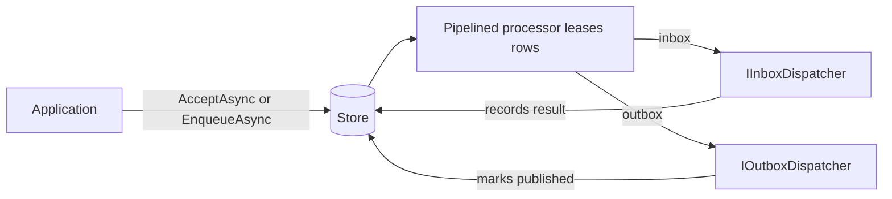

# Reliable Messaging

Read the [Event Module](../concepts/events.md) for publish-subscribe, then [The Handler Pipeline](../concepts/handler-pipeline.md) to understand the stages all three message types share.

In-process mediation runs handlers in the current call. If the process crashes mid-handler, that work is lost. The inbox and outbox add durability: they persist a message to a store first, then a background processor executes or publishes it with at-least-once delivery, leases, retries, and idempotency.

See [Reliable messaging semantics](semantics.md) for delivery guarantees and broker comparison.

> Note: Inbox and outbox behavior is opt-in. Plain `SendAsync`, `QueryAsync`, and `PublishAsync` calls remain in process and do not access a durable store.

## In-Process Versus Durable

| Path | API | Execution | Survives a crash |
| --- | --- | --- | --- |
| In-process command | `ICommandMediator.SendAsync` | Now, in the caller | No |
| Durable message (inbox) | `IInbox.AcceptAsync` | Later, by `PipelinedInboxProcessor` | Yes |
| In-process event | `IEventMediator.PublishAsync` | Now, in the caller | No |
| Durable message (outbox) | `IOutbox.EnqueueAsync` | Later, by `PipelinedOutboxProcessor` | Yes |

Durable APIs return a receipt that confirms storage, not a business result.

Commands with results (`ICommand<TResult>`) cannot be stored in the inbox; analyzer LB1004 reports that at compile time.

## The Inbox: Deferred Execution

The inbox stores registered message types and replays them through `PipelinedInboxProcessor` and `IInboxDispatcher`. See [Inbox](inbox.md).

| Concern | Package examples | Role |
| --- | --- | --- |
| Core | `LiteBus.Inbox` | `IInbox`, `IInboxProcessor`, contracts |
| Storage | `LiteBus.Inbox.Storage.PostgreSql`, `*.InMemory`, `*.EntityFrameworkCore` | Store roles |
| Dispatch | `LiteBus.Inbox.Dispatch.InProcess`, `LiteBus.Inbox.Dispatch.Amqp`, `LiteBus.Inbox.Dispatch.InMemory` | `UseInProcessDispatch`, `UseAmqpDispatch`, `UseInMemoryDispatch` |
| Ingress | `LiteBus.Inbox.Ingress.Amqp` | Broker to `IInbox.AcceptAsync` |

## The Outbox: Reliable Publication

The outbox stores a message after a state change commits, then `PipelinedOutboxProcessor` publishes through `IOutboxDispatcher`. See [Outbox](outbox.md).

| Concern | Package examples | Role |
| --- | --- | --- |
| Core | `LiteBus.Outbox` | `IOutbox`, `IOutboxProcessor` |
| Storage | `LiteBus.Outbox.Storage.PostgreSql`, `*.InMemory`, `*.EntityFrameworkCore` | Store roles |
| Dispatch | `LiteBus.Outbox.Dispatch.InProcess`, `LiteBus.Outbox.Dispatch.Amqp`, `LiteBus.Outbox.Dispatch.InMemory` | `UseInProcessDispatch`, `UseAmqpDispatch`, `UseInMemoryDispatch` |

## Transactional Writes (Domain + Store)

`IInbox.AcceptAsync` and `IOutbox.EnqueueAsync` commit immediately. That suits ingress and standalone storage.

When a command handler must persist domain state and inbox/outbox rows in **one database transaction**, use `ITransactionalInbox` / `ITransactionalOutbox` (PostgreSQL) or `ITransactionalInbox<TContext>` / `ITransactionalOutbox<TContext>` (EF Core). Registration, Marten enlistment, and API choice: [Transactional messaging writes](transactional-writes.md).

## Delivery Semantics

LiteBus durable messaging provides **at-least-once** execution and publication, not exactly-once side effects.

| Scenario | Risk | Mitigation |
| --- | --- | --- |
| Worker crash after handler runs, before terminal persist | Duplicate execution on lease reclaim | Idempotent handlers; `IdempotencyKey` on accept |
| Worker crash after broker publish, before outbox persist | Duplicate publication | Consumer deduplication; outbox idempotency key |
| Lease expiry during slow handler | Second worker dispatches same row | Heartbeat renewal; handler idempotency |
| Shutdown with `HonorShutdownTokenOnPersist = true` | Canceled terminal persist | Default `false`; document operator drain policy |
| In-memory stores | Process-wide only | Not cross-process; tests and single-node dev |
| In-memory transport consumer | Requeue on handler throw | Documented in [Architecture](../architecture/README.md); not broker DLQ |

Processor pipelines are not atomic with external side effects by design. Combine inbox/outbox with application idempotency and broker deduplication headers where needed. Built-in idempotency middleware is deferred to [Roadmap](../roadmap/README.md).

## Durable Contracts

Every durable message needs a stable contract name and version. Register it on the matching message or durable module builder, or use `[MessageContract]` with analyzer enforcement for production code.

## Composition Checklist

A working durable path needs:

1. `AddInbox` / `AddOutbox` with contracts
2. `Use*Storage` inside the same builder
3. `UseInProcessDispatch`, `UseAmqpDispatch`, or `UseInMemoryDispatch` on the matching module builder
4. `EnableInboxProcessor` / `EnableOutboxProcessor` when the generic host should run loops

See [Dependency Graph](../architecture/dependency-graph.md) for package boundaries.

## Next

- Contracts and registration: [Inbox](inbox.md), [Outbox](outbox.md)
- Atomic domain + messaging: [Transactional messaging writes](transactional-writes.md)
