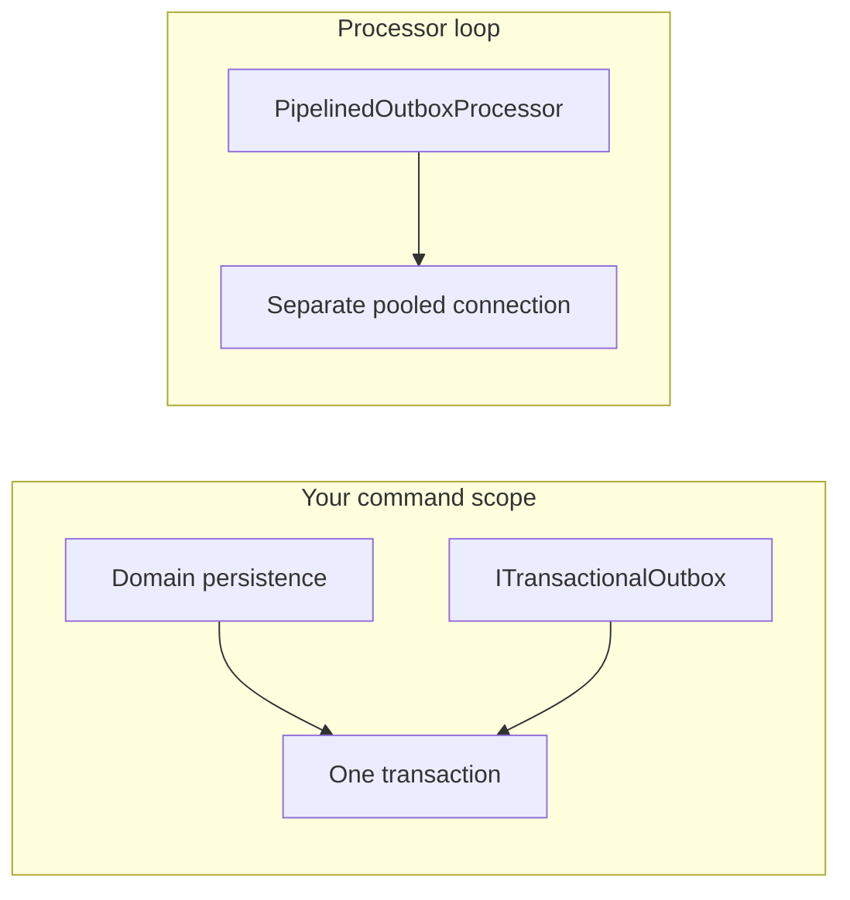

# Transactional Messaging Writes

For developers who must persist domain state and durable inbox/outbox rows in **one database transaction** so they commit or roll back together. Read [Reliable messaging](README.md) first if you are new to inbox and outbox.

**You will leave with:** which writer API to inject, how LiteBus participates in your transaction (without owning it), and a registration pattern for EF Core, PostgreSQL + Marten, or raw ADO.NET.

## What This Page Covers

| Topic | Covered here |
| --- | --- |
| `IInbox` / `IOutbox` vs `ITransactionalInbox` / `ITransactionalOutbox` | Yes |
| EF Core with shared `DbContext` | Yes |
| PostgreSQL with ambient `IPostgreSqlTransactionProvider` | Yes |
| Manual PostgreSQL bind (`CreateTransactionalStore`) | Yes |
| Ingress, processors, connection pooling | Yes (brief) |
| Custom database adapters | Pointer only: see [Custom stores and dispatchers](../extending/custom-stores-and-dispatchers.md) |

## What This Does Not Cover

- Broker ingress wiring (AMQP, Kafka, and similar): see [Inbox](inbox.md) and transport guides.
- Processor lease, retry, and dead-letter tuning: see [Inbox](inbox.md) and [Outbox](outbox.md).
- Marten or EF configuration beyond transaction enlistment: see those libraries' docs.

## The Problem

A command handler saves an aggregate and enqueues an integration event. If those writes use **different transactions**, you can get:

- Outbox row committed, domain change rolled back (event published for state that never existed).
- Domain change committed, outbox missing (state saved, notification lost).

LiteBus solves this by letting the **writer store participate** in a transaction you already opened. LiteBus does not open or commit your domain transaction.

## Two Writer APIs

LiteBus keeps both APIs. They are not interchangeable inside a command handler that already holds an open transaction.

| API | Use when | What happens on `AcceptAsync` / `EnqueueAsync` |
| --- | --- | --- |
| `IInbox` / `IOutbox` | Ingress, operator tools, tests without shared domain work | Singleton store opens its own connection and **commits immediately** |
| `ITransactionalInbox` / `ITransactionalOutbox` | Command handler + domain persistence in the same PostgreSQL or EF unit of work | Bound store **inserts inside your transaction**; you call `SaveChangesAsync` or `CommitAsync` |
| `ITransactionalInbox<TContext>` / `ITransactionalOutbox<TContext>` | EF Core apps with a shared `DbContext` | Envelopes **staged** on your context until `SaveChangesAsync` |

Background **processors** always use `IInbox` / `IOutbox` against the singleton store. They intentionally use their own pooled connections, not your HTTP request connection.



## Connection Sharing

Register **one** `NpgsqlDataSource` per database and pass it to inbox, outbox, and your application (Marten, Dapper, or similar):

```csharp
var dataSource = NpgsqlDataSource.Create(configuration.GetConnectionString("Orders")!);
services.AddSingleton(dataSource);
```

Call `UseDataSource(dataSource)` on both `UsePostgreSqlStorage` builders. Calling `UseConnectionString` separately on inbox and outbox creates duplicate data sources against the same database (redundant, harder to reason about).

Per **request**, use one connection and one transaction for atomic domain + messaging writes. Multiple connections from the **same pool** across the process (request + inbox processor + outbox processor) is normal and correct.

## How Participation Works

1. **You** open the transaction (or own the `DbContext` that will call `SaveChanges`).
2. **You** bind LiteBus to that boundary: EF interceptor, `IPostgreSqlTransactionProvider`, or `CreateTransactionalStore`.
3. Handler calls `ITransactionalOutbox.EnqueueAsync` (or inbox accept).
4. LiteBus serializes the message and runs `INSERT` on your connection (or stages on your `DbContext`).
5. **You** commit once. LiteBus does not commit your domain work.

## Choose a Path

| Your stack | Start here |
| --- | --- |
| EF Core `DbContext` for domain + outbox table | [EF Core](#ef-core-shared-dbcontext) |
| PostgreSQL + Marten, Dapper, or raw SQL | [Ambient provider](#postgresql-ambient-provider) (recommended) or [Manual bind](#postgresql-manual-bind) |
| AMQP/Kafka ingress only storing commands | [Ingress](#ingress-auto-commit): use `IInbox`, not transactional writers |
| Unit tests with `UseInMemoryStorage` | [Tests](#tests-and-in-memory) |

---

## EF Core (Shared DbContext)

**Packages:** `LiteBus.Outbox.Storage.EntityFrameworkCore` and/or `LiteBus.Inbox.Storage.EntityFrameworkCore`

**Writer API:** `ITransactionalOutbox<TContext>` / `ITransactionalInbox<TContext>`

**Registration:**

```csharp
services.AddDbContext<OrdersDbContext>(options =>
    options.UseNpgsql(connectionString)
        .AddLiteBusOutboxInterceptor());

builder.Modules.AddOutboxModule(outbox =>
{
    outbox.UseEntityFrameworkCoreStorage(ef =>
    {
        ef.UseDbContext<OrdersDbContext>();
        ef.EnableSaveChangesInterceptor();
    });
    outbox.UseInProcessDispatch();
    outbox.EnableOutboxProcessor();
});
```

`OrdersDbContext` must implement `IOutboxDbContext` and expose `DbSet<OutboxMessageEntity>`. Full schema steps: [Outbox Entity Framework Core storage](../integrations/outbox-ef-core-storage.md).

**Handler:**

```csharp
await domainRepository.SaveOrderAsync(order, cancellationToken);
await transactionalOutbox.EnqueueAsync(
    new OrderSubmittedIntegrationEvent { OrderId = order.Id },
    cancellationToken);
await dbContext.SaveChangesAsync(cancellationToken);
```

**Commit owner:** `SaveChangesAsync` (and optional explicit `BeginTransactionAsync` on the context).

Duplicate `message_id` or `idempotency_key` on the transactional EF path fails `SaveChanges` and rolls back the whole unit of work.

---

## PostgreSQL (Ambient Provider)

**Packages:** `LiteBus.Outbox.Storage.PostgreSql`, `LiteBus.Inbox.Storage.PostgreSql`, `LiteBus.Storage.PostgreSql` (for `IPostgreSqlTransactionProvider`)

**Writer API:** `ITransactionalOutbox` / `ITransactionalInbox` (non-generic)

Use this path when domain persistence is Marten, Dapper, or ADO.NET and you want handlers to inject transactional writers without manual store binding.

### 1. LiteBus Registration

```csharp
services.AddSingleton(dataSource);

builder.Modules.AddOutboxModule(outbox =>
{
    outbox.UsePostgreSqlStorage(pg =>
    {
        pg.UseDataSource(dataSource);
        pg.EnableAmbientTransactionProvider(); // default: RequireActiveTransaction
    });
    outbox.UseInProcessDispatch();
    outbox.EnableOutboxProcessor();
});
```

Register the same `dataSource` on inbox if you use both axes.

### 2. Application Transaction Provider

Implement scoped `IPostgreSqlTransactionProvider`. Activate it when your unit of work starts (middleware, command pre-handler, or scoped service):

```csharp
public sealed class OrderUnitOfWork : IPostgreSqlTransactionProvider, IAsyncDisposable
{
    private NpgsqlConnection? _connection;
    private NpgsqlTransaction? _transaction;

    public async Task BeginAsync(NpgsqlDataSource dataSource, CancellationToken cancellationToken)
    {
        _connection = await dataSource.OpenConnectionAsync(cancellationToken);
        _transaction = await _connection.BeginTransactionAsync(cancellationToken);
    }

    public bool TryGetCurrent(
        [NotNullWhen(true)] out NpgsqlConnection? connection,
        [NotNullWhen(true)] out NpgsqlTransaction? transaction)
    {
        connection = _connection;
        transaction = _transaction;
        return _connection is not null && _transaction is not null;
    }

    public async Task CommitAsync(CancellationToken cancellationToken)
    {
        if (_transaction is not null)
        {
            await _transaction.CommitAsync(cancellationToken);
        }
    }

    public async ValueTask DisposeAsync()
    {
        if (_transaction is not null) await _transaction.DisposeAsync();
        if (_connection is not null) await _connection.DisposeAsync();
    }
}
```

Register: `services.AddScoped<IPostgreSqlTransactionProvider>(sp => sp.GetRequiredService<OrderUnitOfWork>());`

Integration tests use the same pattern in `PostgreSqlTransactionalWritersIntegrationTests.ScopedTransactionProvider`.

### 3. Enlist Marten on the Same Transaction

Your unit of work implements `IPostgreSqlTransactionProvider`. After `BeginAsync`, pass the same connection and transaction to Marten and to LiteBus (via `TryGetCurrent` when the handler calls `ITransactionalOutbox`):

```csharp
await unitOfWork.BeginAsync(dataSource, cancellationToken);

if (!unitOfWork.TryGetCurrent(out var connection, out var transaction))
{
    throw new InvalidOperationException("Unit of work did not activate a transaction.");
}

await using var session = documentStore.LightweightSession(
    new SessionOptions { Connection = connection, Transaction = transaction });

session.Store(order);
await transactionalOutbox.EnqueueAsync(
    new OrderSubmittedIntegrationEvent { OrderId = order.Id },
    cancellationToken);
await session.SaveChangesAsync(cancellationToken);
await unitOfWork.CommitAsync(cancellationToken);
```

### `TransactionalWriteMode`

| Mode | Behavior |
| --- | --- |
| `RequireActiveTransaction` (default) | Throws if `TryGetCurrent` is false: use in production handlers |
| `AllowImmediateCommit` | Falls back to singleton auto-commit store when no transaction is active: dev/tests only; can break atomicity silently |

---

## PostgreSQL (Manual Bind)

**Writer API:** construct `StoreBoundTransactionalOutbox` (or inject `ITransactionalOutbox` only if you wrap this in your own scoped factory)

Use when you prefer explicit control and do not enable `EnableAmbientTransactionProvider()`.

```csharp
var registration = serviceProvider.GetRequiredService<PostgreSqlOutboxStoreRegistration>();

await using var connection = await dataSource.OpenConnectionAsync(cancellationToken);
await using var transaction = await connection.BeginTransactionAsync(cancellationToken);

var store = registration.CreateTransactionalStore(connection, transaction);
var writer = new StoreBoundTransactionalOutbox(
    store,
    envelopeFactory,
    TimeProvider.System);

// Domain SQL or enlisted ORM on the same connection/transaction
await writer.EnqueueAsync(integrationEvent, cancellationToken);
await transaction.CommitAsync(cancellationToken);
```

`IInboxEnvelopeFactory` / `IOutboxEnvelopeFactory` handle contract resolution and serialization so you do not build `InboxEnvelope` / `OutboxEnvelope` by hand.

---

## Ingress (Auto-Commit)

Broker ingress calls `IInbox.AcceptAsync`. That path **auto-commits** to the singleton store. There is no shared domain transaction at the edge.

If a later command handler must accept into inbox **and** mutate domain state atomically (uncommon), use `ITransactionalInbox` with the same PostgreSQL patterns above inside that handler: not at ingress.

---

## Tests and InMemory

`UseInMemoryStorage` has no database transaction. Use `IInbox` / `IOutbox` for immediate commits. Cross-store atomicity with a real database is not available on the in-memory path.

PostgreSQL transactional tests: `PostgreSqlInboxTransactionalIntegrationTests`, `PostgreSqlOutboxTransactionalIntegrationTests`, `PostgreSqlTransactionalWritersIntegrationTests`. Run with Docker or `LITEBUS_TEST_POSTGRES_CONNECTION_STRING`. See [Integration tests](../testing/integration-tests.md).

---

## Anti-Patterns

| Mistake | Why it fails |
| --- | --- |
| Inject `IOutbox` inside a handler that already opened a domain transaction | Outbox commits in a separate transaction |
| `UseConnectionString` on inbox and outbox separately when both use one database | Duplicate `NpgsqlDataSource` instances |
| Expect the processor to reuse the request connection | Processors lease on their own connections by design |
| `EnableAmbientTransactionProvider()` without registering `IPostgreSqlTransactionProvider` | `RequireActiveTransaction` throws at enqueue time |

---

## Troubleshooting

**Outbox row exists but domain change rolled back**

- Handler used `IOutbox` instead of `ITransactionalOutbox`.
- Ambient provider was not active (`TryGetCurrent` returned false).
- Manual bind used a different connection than domain SQL.

**`requires an active PostgreSQL transaction`**

- `EnableAmbientTransactionProvider()` with default mode, but no provider activation before enqueue. Open and expose the transaction at UoW start. See [Troubleshooting](../operations/troubleshooting.md).

---

## Next

- Registration reference: [Outbox](outbox.md), [Inbox](inbox.md)
- Domain events to integration events: [Domain events and unit of work](../concepts/domain-events-and-unit-of-work.md)
- Custom databases: [Custom stores and dispatchers](../extending/custom-stores-and-dispatchers.md)
- Cookbook recipes: [Cookbook and scenarios](../getting-started/cookbook.md): transactional outbox with PostgreSQL
