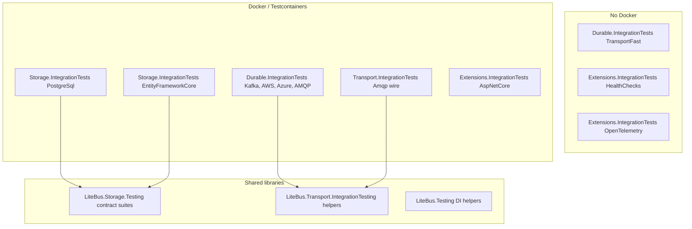

# Integration Tests

This page is the reference for LiteBus integration tests: which projects exist, what infrastructure each one uses, and which behavioral scenarios they prove. It is written for maintainers adding broker or storage coverage and for contributors running the suite locally or in CI.

For handler-level and in-memory processor recipes, see [Testing LiteBus](application-testing.md). For durable messaging setup snippets, see [Testing](README.md).

> [!NOTE]
> Project counts, trait names, and container images reflect the repository at the time this page was written. When in doubt, inspect `tests/` and `.github/workflows/build-and-test.yml`.

## How Integration Tests Are Organized

LiteBus consolidates integration tests into **four executor projects** grouped by concern, plus shared helper libraries. Each executor owns many adapter surfaces (brokers, databases, host bridges) organized in subfolders by technology. Tests prove **outcomes**: store row transitions, wire headers, processor passes, manifest registration, or HTTP responses. Registration smoke and fast InMemory wire cases live in `LiteBus.Durable.IntegrationTests`. Sample v6 composition smoke lives in `LiteBus.Runtime.UnitTests`.



### Executor Inventory

| Project | Path | Layer tested | Docker | Primary fixture |
|---------|------|--------------|:------:|-----------------|
| `LiteBus.Durable.IntegrationTests` | `tests/LiteBus.Durable.IntegrationTests/` | Broker ingress and dispatch (all brokers) | Per scenario | `KafkaBrokerFixture`, `LocalStackSqsFixture`, `ServiceBusEmulatorFixture`, RabbitMQ/LavinMQ fixtures |
| `LiteBus.Storage.IntegrationTests` | `tests/LiteBus.Storage.IntegrationTests/` | PostgreSQL inbox/outbox/saga storage, EF Core stores, schema, hosting | Yes | `PostgreSqlFixture`, `SqlServerFixture` |
| `LiteBus.Transport.IntegrationTests` | `tests/LiteBus.Transport.IntegrationTests/` | AMQP publish/consume/ack/nack wire behavior | Yes | `RabbitMqFixture`, `LavinMqFixture` |
| `LiteBus.Extensions.IntegrationTests` | `tests/LiteBus.Extensions.IntegrationTests/` | Management HTTP endpoints, health checks, OpenTelemetry | Partial | `PostgreSqlFixture` for AspNetCore; InMemory inbox for health |

### Folder Layout

```text
tests/
|-- LiteBus.Durable.IntegrationTests/
|   |-- Ingress/              # broker to IInbox (InMemory, Kafka, AwsSqs, AzureServiceBus, Amqp)
|   |-- Dispatch/
|   |   |-- Inbox/            # inbox processor to broker
|   |   `-- Outbox/           # outbox processor to broker
|   `-- Registration/         # Use*Dispatch / Use*Ingress resolve without live broker
|-- LiteBus.Storage.IntegrationTests/
|   |-- PostgreSql/           # reference PG store, schema, saga, reliable messaging
|   `-- EntityFrameworkCore/
|       |-- Inbox/
|       `-- Outbox/
|-- LiteBus.Transport.IntegrationTests/
|   `-- Amqp/                 # low-level wire protocol (no inbox/outbox)
|-- LiteBus.Extensions.IntegrationTests/
|   |-- AspNetCore/
|   |-- HealthChecks/
|   `-- OpenTelemetry/
|-- LiteBus.Runtime.UnitTests/
|   `-- Runtime/Composition/  # v6 composition smoke (unit test, not integration)
|-- LiteBus.Transport.IntegrationTesting/   # shared fixtures, traits (not an executor)
|-- LiteBus.Storage.Testing/                # abstract store contract suites
`-- LiteBus.Testing/                        # DI helpers
```

Supporting libraries (not test executors):

| Library | Role |
|---------|------|
| `LiteBus.Transport.IntegrationTesting` | Shared broker fixtures, xUnit traits, `DockerTestGate`, `FlakyInbox`, polling helpers, Kafka/AWS/Azure fixture hosts |
| `LiteBus.Storage.Testing` (`tests/`) | Abstract `InboxStoreContractTests`, `OutboxStoreContractTests`, retention contract suites (not a vstest executor; `IsTestProject=false`) |
| `LiteBus.Testing` | `AddInboxStoreRoles`, `LiteBusTestBase`, manual `MessageRegistry` isolation |

## Shared Infrastructure Patterns

### Testcontainers and Images

All Docker-backed fixtures use [Testcontainers for .NET](https://dotnet.testcontainers.org/) (central version in `tests/Directory.Packages.props`).

| Container | Image / module | Used by |
|-----------|----------------|---------|
| PostgreSQL | `postgres:16-alpine` via `Testcontainers.PostgreSql` | PostgreSQL storage, EF Core, AspNetCore management, AMQP+PG combos |
| SQL Server | `Testcontainers.MsSql` | EF Core inbox/outbox on SQL Server |
| RabbitMQ | `rabbitmq:4-management` via `Testcontainers.RabbitMq` | AMQP transport, ingress, dispatch, PG reliable messaging |
| LavinMQ | `cloudamqp/lavinmq` via generic `ContainerBuilder` | Second AMQP broker for compatibility |
| Kafka (Redpanda) | `docker.redpanda.com/redpandadata/redpanda:v24.3.7` via `Testcontainers.Redpanda` (default); Confluent via `Testcontainers.Kafka` when `LITEBUS_KAFKA_TEST_BROKER=confluent` | Kafka ingress, dispatch, outbox |
| LocalStack | `localstack/localstack:4.2` via `Testcontainers.LocalStack` | AWS SQS durable transport |
| Azure Service Bus emulator | `Testcontainers.ServiceBus` + `servicebus-emulator-config.json` | Azure durable transport |

### Fixture Lifetime

| Pattern | When used | Example |
|---------|-----------|---------|
| `ICollectionFixture<T>` | One expensive container per test collection | `KafkaBrokerCollection`, `ServiceBusEmulatorCollection`, `LocalStackSqsCollection` |
| `IClassFixture<T>` | One container shared by all tests in a class | `PostgreSqlFixture` in `Storage.IntegrationTests` and `Extensions.IntegrationTests` |
| Per-test fixture | Isolated broker when tests mutate queues or need clean state | `AmqpInboxIngressBatchIntegrationTests` creates its own `RabbitMqBrokerFixture` |
| Inline `new Fixture()` + `try/finally` | Composite scenarios (PG + RabbitMQ in one test) | `PostgreSqlReliableMessagingEndToEndTests` |

### Docker Unavailable Behavior

Projects differ in how they handle a missing Docker daemon:

| Behavior | Projects | Mechanism |
|----------|----------|-----------|
| **Fail fast** with clear message | `Storage.IntegrationTests`, `Transport.IntegrationTests`, `Durable.IntegrationTests` (AMQP) | Fixture `InitializeAsync` throws `InvalidOperationException` with `DockerRequiredMessage` |
| **Skip tests** | Durable transport (Kafka/AWS/Azure emulator) | `DockerTestGate` + `[SkippableFact]` + `Skip.IfNot(_fixture.IsAvailable)` (Azure emulator) |
| **No Docker needed** | `TransportFast` cases in `LiteBus.Durable.IntegrationTests`, health checks, OpenTelemetry | Always runs |

CI (`.github/workflows/build-and-test.yml`) runs unit tests without Docker (`FullyQualifiedName!~IntegrationTests`), then durable transport in three filtered batches (`TransportFast`, `TransportDocker`, `TransportAzure`), then remaining integration tests (`FullyQualifiedName~IntegrationTests` excluding those categories and the opt-in `TransportLiveAzure` category).

### Environment Variable Overrides (Local Troubleshooting)

Fixtures can bypass Testcontainers when a connection string is already available:

| Variable | Bypasses |
|----------|----------|
| `LITEBUS_TEST_POSTGRES_CONNECTION_STRING` | PostgreSQL Testcontainers in `Storage.IntegrationTests`, `Extensions.IntegrationTests`, and AMQP+PG cases in `Durable.IntegrationTests` |
| `LITEBUS_TEST_AZURE_SERVICEBUS_CONNECTION_STRING` + `LITEBUS_TEST_AZURE_SERVICEBUS_QUEUE` | Optional **live** Azure namespace tests only (`AzureServiceBusOptionalIntegrationTests`) |

Emulator-based Azure tests still require Docker; the env vars do not replace the emulator fixture.

### Typical Test Shape (Durable Messaging)

Most inbox/outbox integration tests follow the same pipeline:

1. Build `ServiceCollection` to `AddLiteBus(registry => ...)`.
2. Register contracts, storage (`UseInMemoryStorage` or PostgreSQL/EF), and dispatch/ingress adapter.
3. **Ingress path:** publish to broker to wait for consumer to assert store/handler state.
4. **Dispatch path:** `IInbox.AcceptAsync` or `IOutbox.EnqueueAsync` to `ProcessPendingAsync` to assert broker message or handler side effect.
5. Assert on **observable outcomes** (row status, headers on wire, handler invocation), not on internal types.

---

## Broker-Backed Transport Integration Tests

**Executor:** `tests/LiteBus.Durable.IntegrationTests/`
**Shared helpers:** `tests/LiteBus.Transport.IntegrationTesting/`
**Subfolders:** `Ingress/`, `Dispatch/Inbox/`, `Dispatch/Outbox/`, `Registration/` (grouped by broker: `InMemory`, `Kafka`, `AwsSqs`, `AzureServiceBus`, `Amqp`)

InMemory scenarios run without Docker. Kafka, AWS SQS (LocalStack), Azure Service Bus, and AMQP use Testcontainers.

### xUnit Categories (CI Filters)

| Trait | Constant | Docker | Scope |
|-------|----------|:------:|-------|
| `TransportFast` | `TransportTestTraits.Fast` | No | InMemory wire tests in `Ingress/InMemory/` and `Dispatch/**/InMemory/` |
| `TransportDocker` | `TransportTestTraits.Docker` | Yes | Kafka, LocalStack SQS, AMQP |
| `TransportAzure` | `TransportTestTraits.Azure` | Yes (emulator) | Azure Service Bus emulator |
| `TransportLiveAzure` | `TransportTestTraits.LiveAzure` | No local emulator | Optional live Azure namespace overlay with explicit credentials |

Registration smoke (`Registration/BrokerDispatchIngressRegistrationTests.cs`) has no category trait; it runs in the Integration Tests CI batch.

```bash
# Durable matrix only
dotnet test tests/LiteBus.Durable.IntegrationTests --filter "Category=TransportFast"
dotnet test tests/LiteBus.Durable.IntegrationTests --filter "Category=TransportDocker"
dotnet test tests/LiteBus.Durable.IntegrationTests --filter "Category=TransportAzure"
dotnet test tests/LiteBus.Durable.IntegrationTests --filter "Category=TransportDocker&FullyQualifiedName~Kafka"

# Full solution (matches CI)
dotnet test LiteBus.slnx --filter "Category=TransportFast"
dotnet test LiteBus.slnx --filter "Category=TransportDocker"
dotnet test LiteBus.slnx --filter "Category=TransportAzure"
dotnet test LiteBus.slnx --filter "Category=TransportDocker&FullyQualifiedName~Kafka"
```

### Fixtures per Broker

| Broker | Fixture | Collection | Notes |
|--------|---------|------------|-------|
| InMemory | None | N/A | Uses `UseInMemoryStorage` + in-memory transport modules |
| Kafka | `KafkaBrokerFixture` | `KafkaBrokerCollection` | Default Redpanda image; process-wide host via `KafkaBrokerSharedLifecycle`; per-test consumer group via `KafkaIngressTestSupport.CreateConnection`; override with `LITEBUS_KAFKA_TEST_IMAGE` or `LITEBUS_KAFKA_TEST_BROKER` |
| AWS SQS | `LocalStackSqsFixture` | `LocalStackSqsCollection` | Creates per-scenario queues via `CreateQueueAsync(prefix)` |
| Azure | `ServiceBusEmulatorFixture` | `ServiceBusEmulatorCollection` | Pre-declared queues in `Azure/servicebus-emulator-config.json`; `IsAvailable` gates skips |

Pre-declared Azure emulator queues: `litebus-ingress`, `litebus-dispatch`, `litebus-outbox`, `litebus-fail`. `ResolveQueue(prefix)` maps scenario names to those queues.

### Shared Test Messages

Defined in `TransportTestMessages.cs` under `LiteBus.Transport.IntegrationTesting`:

| Type | Used for |
|------|----------|
| `RemoteWorkCommand` | Inbox dispatch (processor publishes to broker) |
| `ShipOrderCommand` | Inbox ingress E2E (broker to accept to handler) |
| `OrderSubmittedIntegrationEvent` | Outbox dispatch |

### Scenario Classes (by Folder)

#### InMemory (`Ingress/InMemory/`, `Dispatch/Inbox/InMemory/`, `Dispatch/Outbox/InMemory/`)

| Test class | Scenarios |
|------------|-----------|
| `InMemoryInboxDispatchIntegrationTests` | Inbox processor publishes leased envelope to in-memory destination with headers |
| `InMemoryOutboxDispatchIntegrationTests` | Outbox processor publishes event; full header propagation; contract-name route fallback |
| `InMemoryInboxIngressModuleIntegrationTests` | `UseInMemoryIngress` E2E accept to process to dispatch |
| `InMemoryIngressFailureIntegrationTests` | Unknown contract, invalid JSON, store full (no broker write) |
| `InMemoryIngressHeaderEdgeCaseIntegrationTests` | Missing/wrong contract headers, invalid MessageId, wrong CLR shape |
| `InMemoryIngressIdempotencyIntegrationTests` | Duplicate MessageId to single inbox row |
| `InMemoryIngressRequeueBehaviorIntegrationTests` | `RequeueOnFailure` on/off with transient failures |

#### Kafka (`Ingress/Kafka/`, `Dispatch/Inbox/Kafka/`, `Dispatch/Outbox/Kafka/`)

Shared infrastructure lives in `tests/LiteBus.Transport.IntegrationTesting/Kafka/` (`KafkaBrokerHost`, `KafkaBrokerFixture`, `KafkaIngressTestSupport`, `KafkaTransportTestInfrastructure`).

Ingress tests run production `TransportInboxIngressConsumer` and `InboxProcessorBackgroundService` through `ExecuteAsync` on background tasks. Short-lived test hosts call `DisposeProviderSafelyAsync` before tearing down Kafka clients because `IHostedService` orchestration can block on librdkafka shutdown.

| Folder | Test class | Scenarios |
|--------|------------|-----------|
| `Ingress/Kafka/` | `KafkaInboxIngressEndToEndIntegrationTests` | Publish to ingress to processor to dispatch |
| | `KafkaInboxIngressFailureIntegrationTests` | Unknown contract, invalid JSON, store full; transient seek redelivery |
| `Dispatch/Inbox/Kafka/` | `KafkaInboxDispatchIntegrationTests` | Inbox dispatch to Kafka topic with headers |
| `Dispatch/Outbox/Kafka/` | `KafkaOutboxDispatchIntegrationTests` | Outbox dispatch; contract-name route fallback |
| | `KafkaDispatchFailureIntegrationTests` | Unreachable broker; circuit breaker |

Header edge cases, duplicate MessageId idempotency, and full requeue on/off are covered in `Ingress/InMemory/` and `Ingress/AwsSqs/`. The Kafka Docker suite adds end-to-end flow, failure paths, and `TransientAcceptFailure_ShouldRedeliverSameOffsetWithoutRestart` (partial requeue-enabled redelivery via seek).

#### AWS SQS (`Ingress/AwsSqs/`, `Dispatch/Inbox/AwsSqs/`, `Dispatch/Outbox/AwsSqs/`)

| Test class | Scenarios |
|------------|-----------|
| `AwsSqsInboxIngressEndToEndIntegrationTests` | SQS to ingress to handler |
| `AwsSqsInboxIngressFailureIntegrationTests` | Unknown contract, invalid JSON, store full |
| `AwsSqsIngressIdempotencyIntegrationTests` | Duplicate MessageId |
| `AwsSqsIngressHeaderEdgeCaseIntegrationTests` | Header edge cases (SQS-specific MessageId behavior) |
| `AwsSqsIngressRequeueBehaviorIntegrationTests` | Requeue disabled (drain) vs enabled (transient store failure via `FlakyInbox`) |
| `AwsSqsInboxDispatchIntegrationTests` | Inbox dispatch to SQS |
| `AwsSqsOutboxDispatchIntegrationTests` | Outbox dispatch; contract-name route fallback |
| `AwsSqsDispatchFailureIntegrationTests` | Unreachable broker; circuit breaker |

#### Azure (`Ingress/AzureServiceBus/`, `Dispatch/Inbox/AzureServiceBus/`, `Dispatch/Outbox/AzureServiceBus/`)

| Test class | Scenarios |
|------------|-----------|
| `AzureServiceBusInboxIngressEndToEndIntegrationTests` | Emulator ingress E2E |
| `AzureServiceBusInboxIngressFailureIntegrationTests` | Unknown contract, invalid JSON, store full |
| `AzureServiceBusIngressRequeueBehaviorIntegrationTests` | Requeue enabled (transient store failure via `FlakyInbox`) |
| `AzureServiceBusInboxDispatchIntegrationTests` | Inbox dispatch with full LiteBus headers |
| `AzureServiceBusOutboxDispatchIntegrationTests` | Outbox dispatch; contract-name route fallback |
| `AzureServiceBusOptionalIntegrationTests` | **Live namespace only** when env vars set; skips otherwise |

#### Registration (`Registration/`)

| Test class | Scenarios |
|------------|-----------|
| `BrokerDispatchIngressRegistrationTests` | `[Theory]` over every broker `Use*Dispatch` / `Use*Ingress` extension; asserts `TransportInboxDispatcher`, `IMessageConsumer`, etc. resolve without a live broker |

### Ingress Ack Policy (Cross-Broker)

`TransportInboxIngressConsumer` discards (no requeue) when acceptance throws:

- `MessageContractNotRegisteredException`
- `InboxDispatchException` (missing/invalid transport headers)
- `InboxStorageException` (capacity / persistence rejection)
- `InvalidOperationException`, `ArgumentException`, `FormatException`, `JsonException`

Other failures honor `RequeueOnFailure` (default `true`). Unit reference: `LiteBus.Inbox.UnitTests/Ingress/TransportInboxIngressConsumerTests.cs`.

### Coverage Matrix (Ingress)

Legend: **yes** = broker Docker/emulator integration test; **partial** = subset of scenarios or covered via another project; **-** = no broker-specific test (see InMemory for shared ingress behavior).

| Scenario | InMemory | Kafka | AWS | Azure | AMQP |
|----------|:--------:|:-----:|:---:|:-----:|:----:|
| Happy-path E2E | yes | yes | yes | yes | yes |
| Unknown contract | yes | yes | yes | yes | yes |
| Invalid JSON | yes | yes | yes | yes | yes |
| Store full | yes | yes | yes | yes | yes |
| Duplicate MessageId | yes |: | yes |: | partial |
| Header edge cases | yes |: | partial |: | partial |
| Requeue on/off | yes | partial | yes | partial | partial |

**Duplicate MessageId:** AMQP **partial** = `DuplicateBrokerDelivery_ShouldExecuteHandlerOnce` in `LiteBus.Storage.IntegrationTests` (PostgreSQL + AMQP reliable-messaging chain), not a dedicated ingress-only idempotency test.

**Header edge cases:** AWS **partial** = missing contract name, wrong version, invalid MessageId (not missing contract version or wrong CLR shape). AMQP **partial** = `LiteBus.Inbox.UnitTests/Ingress/Amqp/` handler mapping plus failure nack paths in `Ingress/Amqp/` (no dedicated header matrix on RabbitMQ).

**Requeue on/off:** **partial** = requeue **enabled** only (`RequeueEnabled_WithTransientStoreFailure...` or Kafka seek redelivery). Full on/off pairs exist for InMemory and AWS only.

### Coverage Matrix (Dispatch)

| Scenario | InMemory | Kafka | AWS | Azure | AMQP |
|----------|:--------:|:-----:|:---:|:-----:|:----:|
| Inbox E2E + headers | yes | yes | yes | yes | yes |
| Outbox E2E + headers | yes | yes | yes | yes | yes |
| Contract-name route fallback | yes | yes | yes | yes | yes |
| Unreachable broker / circuit breaker |: | yes | yes |: | Transport.IntegrationTests |

AMQP ingress and dispatch scenarios live in `LiteBus.Durable.IntegrationTests` (`Ingress/Amqp/`, `Dispatch/Inbox/Amqp/`, `Dispatch/Outbox/Amqp/`). Low-level AMQP wire behavior is in `LiteBus.Transport.IntegrationTests/Amqp/`.

---

## PostgreSQL Storage Integration Tests

**Project:** `tests/LiteBus.Storage.IntegrationTests/`
**Folder:** `PostgreSql/`
**Fixture:** `PostgreSqlFixture` (`postgres:16-alpine`, retry loop, optional `LITEBUS_TEST_POSTGRES_CONNECTION_STRING`)

### What This Project Proves

PostgreSQL is the **reference durable store** for inbox, outbox, saga, schema management, work signals, and full-stack reliable messaging.

| Area | Representative tests | Scenarios |
|------|---------------------|-----------|
| **Store contracts** | `PostgreSqlInboxStoreTests`, `PostgreSqlOutboxStoreTests`, retention variants | Inherit `LiteBus.Storage.Testing` contract suites (leasing, idempotency, dead-letter, visibility) |
| **Schema** | `PostgreSqlInboxSchemaTests`, `PostgreSqlOutboxSchemaTests`, `PostgreSqlSchemaDriftTests`, `PostgreSqlSchemaScriptTests` | Create, validate, idempotent bootstrap, concurrent bootstrap, drift detection |
| **Schema hosting** | `PostgreSqlSchemaHostingTests` | `IStartupTask` initializers: enable/disable, validate-only, second-run idempotency |
| **Processor E2E (inbox)** | `PostgreSqlInboxEndToEndTests` | Happy path, handler failure + retry, dead-letter, lease reclaim, deferred visibility, unknown contract |
| **Processor E2E (outbox)** | `PostgreSqlOutboxEndToEndTests` | Publish path through PostgreSQL store |
| **Transactional outbox** | `PostgreSqlOutboxTransactionalIntegrationTests` | Domain + outbox commit/rollback on shared connection (`UseExistingConnection`) |
| **Transactional writers** | `PostgreSqlInboxTransactionalIntegrationTests`, `PostgreSqlTransactionalWritersIntegrationTests` | `ITransactionalInbox` / `ITransactionalOutbox`: manual `CreateTransactionalStore`, combined inbox+outbox rollback, ambient `IPostgreSqlTransactionProvider`: see [Transactional messaging writes](../reliable-messaging/transactional-writes.md) |
| **Hosting / manifest** | `PostgreSqlInboxHostingIntegrationTests` | `IBackgroundService` processor loop, LISTEN/NOTIFY wake, retention cleanup |
| **Work signals** | `PostgreSqlInboxWorkSignalNotifyTests`, `PostgreSqlOutboxWorkSignalNotifyTests`, `*WorkSignalTests` | Notify wake vs poll; reconnection after listener break (some quarantined) |
| **Lease stress** | `PostgreSqlInboxProcessorLeaseStressTests` | Parallel workers to single terminal state per message |
| **Process recovery** | `PostgreSqlProcessCrashIntegrationTests` | Child worker process termination during handler dispatch; lease-expiry recovery by a replacement processor |
| **Persist results** | `PostgreSqlInboxStorePersistResultTests`, `PostgreSqlInboxStoreBatchMarkFailedTests` | Batch completion timestamps, lease-lost reporting |
| **Saga** | `PostgreSqlSagaInboxEndToEndTests`, `PostgreSqlSagaOrchestrationDepthTests` | Saga state in PostgreSQL; multi-step workflow; compensation; parallel version safety |
| **Reliable messaging chain** | `PostgreSqlReliableMessagingEndToEndTests` | Outbox to RabbitMQ to inbox to in-process handler; duplicate delivery; ingress failures |
| **Cross-store ingress** | `PostgreSqlInboxIngressEndToEndTests` | AMQP ingress with PostgreSQL backing store |
| **Module registration** | `PostgreSqlModuleRegistrationTests` | Storage roles, schema flags, processor/ingress manifest entries, invalid combinations |
| **Utilities** | `PostgreSqlStorageUtilityTests`, `PostgreSqlIdentifierTests`, `PostgreSqlAdvisoryLockScopeTests` | Connection factory, SQL identifiers, advisory lock keys |

### Composite Broker Usage

`PostgreSqlReliableMessagingEndToEndTests` and `PostgreSqlInboxIngressEndToEndTests` spin up `RabbitMqBrokerFixture` inside the test alongside the shared PostgreSQL fixture. That pattern tests **storage + broker** together without pulling the full durable transport matrix project.

### Quarantined Tests

Some work-signal reconnection tests carry `[Trait("Category", "Quarantine")]` due to timing sensitivity. Exclude them in routine runs if needed:

```bash
dotnet test tests/LiteBus.Storage.IntegrationTests --filter "Category!=Quarantine"
```

---

## Entity Framework Core Storage Integration Tests

**Project:** `tests/LiteBus.Storage.IntegrationTests/`
**Folders:** `EntityFrameworkCore/Inbox/`, `EntityFrameworkCore/Outbox/`

Both use the same fixture pattern as PostgreSQL storage (Testcontainers PostgreSQL and SQL Server). Tests use dedicated `IntegrationInboxDbContext` / `IntegrationOutboxDbContext` types and EF interceptors where transactional behavior matters.

### Inbox EF Core Scenarios

| Test class | Scenarios |
|------------|-----------|
| `EfCoreInboxStorePostgreSqlContractTests`, `EfCoreInboxStoreSqlServerContractTests` | Full inbox store contract on EF Core |
| `EfCoreInboxProcessorEndToEndTests` | Processor happy path through EF store |
| `EfCoreInboxProcessorHandlerFailureEndToEndTests` | Handler failure to retry visibility |
| `EfCoreInboxProcessorDeadLetterEndToEndTests` | Max attempts to dead-letter |
| `EfCoreInboxProcessorLeaseExpiryEndToEndTests` | Lease expiry to reclaim |
| `EfCoreInboxProcessorDeferredVisibilityEndToEndTests` | `VisibleAfter` scheduling |
| `EfCoreInboxProcessorUnknownContractEndToEndTests` | Unknown contract terminal state |
| `EfCoreInboxDispatchScopeIsolationIntegrationTests` | Distinct scoped `DbContext` per concurrent message and disposal before pass completion |
| `EfCoreInboxSaveChangesInterceptorAbortTests` | Duplicate idempotency key aborts transaction |

### Outbox EF Core Scenarios

| Test class | Scenarios |
|------------|-----------|
| `EfCoreOutboxStorePostgreSqlContractTests`, `EfCoreOutboxStoreSqlServerContractTests` | Full outbox store contract |
| `EfCoreOutboxProcessorEndToEndTests` | Processor publishes through EF store |
| `EfCoreOutboxProcessorDispatcherFailureEndToEndTests` | Dispatcher failure to retry |
| `EfCoreOutboxProcessorDeadLetterEndToEndTests` | Max attempts to dead-letter |
| `EfCoreOutboxProcessorLeaseExpiryEndToEndTests` | Lease reclaim |
| `EfCoreOutboxProcessorDeferredVisibilityEndToEndTests` | Deferred publish |
| `EfCoreOutboxTransactionalIntegrationTests` | DbContext transaction rolls back or commits outbox rows with domain changes |
| `EfCoreOutboxSaveChangesInterceptorIntegrationTests` | Interceptor persists all envelope fields; rollback behavior |

Outbox EF Core PostgreSQL tests can share `PostgreSqlCollection` for collection-scoped fixture reuse.

---

## AMQP Integration Tests

AMQP coverage spans two projects: low-level wire protocol in `LiteBus.Transport.IntegrationTests`, and inbox/outbox ingress and dispatch in `LiteBus.Durable.IntegrationTests`. RabbitMQ and LavinMQ are both exercised where broker differences matter.

### `LiteBus.Transport.IntegrationTests` (`Amqp/`)

**Fixtures:** `RabbitMqFixture`, `LavinMqFixture`
**Focus:** Wire protocol behavior without inbox/outbox LiteBus.

| Test class | Scenarios |
|------------|-----------|
| `AmqpTransportIntegrationTests` | Publish/consume/ack; nack+requeue redelivery; LiteBus header preservation; stop prevents delivery; cancellation; double-start guard; unreachable broker; connection/channel recovery |
| `RabbitMqAmqpTransportIntegrationTests`, `LavinMqAmqpTransportIntegrationTests` | Broker-specific smoke paths |
| `AmqpHeaderValuesTests` | Header parsing helpers (no container) |

### `LiteBus.Durable.IntegrationTests`: AMQP Ingress (`Ingress/AMQP/`)

**Fixtures:** `RabbitMqBrokerFixture`, `LavinMqBrokerFixture`
**Storage:** InMemory inbox (fast ingress focus)

| Test class | Scenarios |
|------------|-----------|
| `AmqpInboxIngressEndToEndTests` | RabbitMQ and LavinMQ to accept to process to dispatch |
| `AmqpInboxIngressFailureTests` | Unknown contract, invalid JSON, store full to nack without requeue |
| `AmqpInboxIngressBatchIntegrationTests` | Batch accept at prefetch threshold and `BatchMaxWait` |
| `AmqpIngressRequeueBehaviorIntegrationTests` | Requeue enabled (transient store failure via `FlakyInbox`) |

### `LiteBus.Durable.IntegrationTests`: AMQP Inbox Dispatch (`Dispatch/Inbox/AMQP/`)

| Test class | Scenarios |
|------------|-----------|
| `AmqpInboxDispatcherIntegrationTests` | InMemory storage to AMQP publish with headers |
| `RabbitMqInboxDispatchIntegrationTests`, `LavinMqInboxDispatchIntegrationTests` | Broker-specific dispatch |
| `PostgreSqlAmqpInboxDispatchIntegrationTests` | PostgreSQL store + AMQP dispatch; envelope marked completed in DB |

### `LiteBus.Durable.IntegrationTests`: AMQP Outbox Dispatch (`Dispatch/Outbox/AMQP/`)

| Test class | Scenarios |
|------------|-----------|
| `AmqpOutboxDispatchIntegrationTests` | Outbox to AMQP; contract-name routing key fallback; shutdown-token terminal-persist policy after broker publish |
| `PostgreSqlAmqpOutboxDispatchIntegrationTests` | PostgreSQL outbox + AMQP; row marked published |

---

## Hosting and Composition Integration Tests

These projects validate framework bridges (layer 5) without replacing broker or storage matrices. v6 composition smoke is a **unit** test in `LiteBus.Runtime.UnitTests/Runtime/Composition/LiteBusV6CompositionSmokeTests.cs`.

### `LiteBus.Extensions.IntegrationTests`: Health Checks (`HealthChecks/`)

**Docker:** No
**Setup:** InMemory inbox + registered `IDiagnosticCheck` probes + `AddHealthChecks().AddLiteBus()`

| Scenario | Expected health |
|----------|-----------------|
| Unhealthy probe registered | `Unhealthy` |
| Healthy probe registered | `Healthy` |
| No probes registered | `Degraded` |

### `LiteBus.Extensions.IntegrationTests`: OpenTelemetry (`OpenTelemetry/`)

**Docker:** No
**Setup:** OpenTelemetry SDK builder with `AddLiteBusInboxInstrumentation` / metrics extensions

Proves public `ActivitySourceName`, `MeterName`, and instrument constants are subscribed correctly (stable consumer contract).

### `LiteBus.Extensions.IntegrationTests`: ASP.NET Core (`AspNetCore/`)

**Docker:** Yes (PostgreSQL)
**Setup:** `TestServer` host with management endpoints mapped; real PostgreSQL inbox/outbox storage

| Test | Scenario |
|------|----------|
| `QueryInboxMessages_ReturnsPersistedRows` | HTTP query reflects store contents |
| `Purge_WithConfirm_DeletesRowsInStore` | Operator purge API |
| `Health_IncludesRegisteredDiagnosticProbe` | Management health includes LiteBus probes |

---

## Shared Store Contract Tests

**Library:** `tests/LiteBus.Storage.Testing/`

Abstract test classes define **store behavior contracts** inherited by InMemory unit tests, PostgreSQL integration tests, and EF Core integration tests. One implementation, many backends.

| Suite | Covers (high level) |
|-------|---------------------|
| `InboxStoreContractTests` | Idempotency, leasing, attempt counts, dead-letter, retention, diagnostics query, purge |
| `OutboxStoreContractTests` | Enqueue, lease, publish marking, retry visibility, dead-letter |
| `InboxRetentionStoreContractTests` / `OutboxRetentionStoreContractTests` | Retention-specific roles |

When adding a custom inbox or outbox store, inherit these suites in your test project before writing broker-specific tests.

---

## Running Integration Tests Locally

### Full Solution (Docker Required for Most Integration Projects)

```bash
dotnet test LiteBus.slnx
```

If Docker is not running, PostgreSQL and AMQP integration tests **fail** during fixture setup. Durable transport Docker/Azure categories **skip** individual tests where `[SkippableFact]` is used.

### Unit Tests Only

```bash
dotnet test LiteBus.slnx --filter "FullyQualifiedName!~IntegrationTests"
```

### Exclude PostgreSQL Integration Tests

```bash
dotnet test LiteBus.slnx --filter "FullyQualifiedName!~PostgreSql"
```

### By Concern

```bash
# Broker transport: durable matrix only (CI category batches)
dotnet test tests/LiteBus.Durable.IntegrationTests --filter "Category=TransportFast"
dotnet test tests/LiteBus.Durable.IntegrationTests --filter "Category=TransportDocker"
dotnet test tests/LiteBus.Durable.IntegrationTests --filter "Category=TransportAzure"
dotnet test tests/LiteBus.Durable.IntegrationTests --filter "Category=TransportDocker&FullyQualifiedName~Kafka"

# Broker transport: full solution (matches CI)
dotnet test LiteBus.slnx --filter "Category=TransportFast"
dotnet test LiteBus.slnx --filter "Category=TransportDocker"
dotnet test LiteBus.slnx --filter "Category=TransportAzure"

# PostgreSQL storage only
dotnet test tests/LiteBus.Storage.IntegrationTests --filter "FullyQualifiedName~PostgreSql"

# AMQP ingress only (durable matrix)
dotnet test tests/LiteBus.Durable.IntegrationTests --filter "FullyQualifiedName~Ingress.Amqp"

# AMQP wire protocol only
dotnet test tests/LiteBus.Transport.IntegrationTests
```

### Optional Live Azure Overlay

Set both variables, then run the live Azure category:

```bash
export LITEBUS_TEST_AZURE_SERVICEBUS_CONNECTION_STRING="Endpoint=sb://..."
export LITEBUS_TEST_AZURE_SERVICEBUS_QUEUE="your-queue"
dotnet test LiteBus.slnx --filter "Category=TransportLiveAzure"
```

---

## What This Does Not Cover

- **Unit tests** (`*UnitTests*` projects): handler logic, mappers, module build order, circuit breaker math. Run via the CI unit-test filter.
- **Benchmarks** (`benchmarks/`): performance, not correctness contracts.
- **Production Azure Service Bus** as the default CI path: CI uses the emulator; live namespace is opt-in.
- **Every broker on every scenario:** see the ingress/dispatch matrices above for intentional gaps (for example Azure duplicate MessageId and header edge cases on emulator, Kafka full requeue on/off, AMQP requeue disabled drain).

---

## Next

- [Testing](README.md): InMemory processor recipes, ack policy summary, quick CI filters
- [Testing LiteBus](application-testing.md): handler unit tests, mediation pipeline, `WebApplicationFactory`
- [Hosted services](../architecture/hosted-services.md): `IStartupTask`, `IBackgroundService`, and manifest registration tested by PostgreSQL hosting integration tests
- [Reliable Messaging](../reliable-messaging/README.md): outbox to broker to inbox patterns exercised in `PostgreSqlReliableMessagingEndToEndTests`
