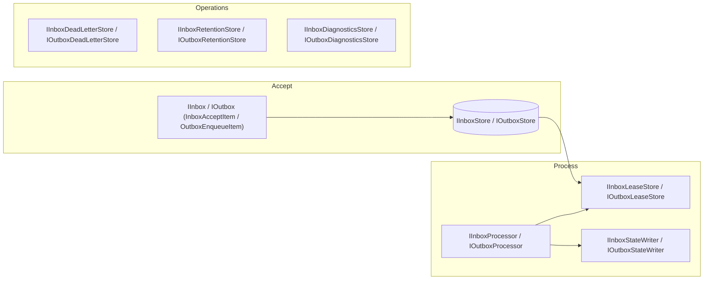
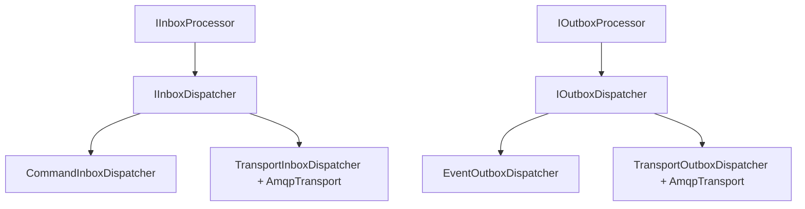
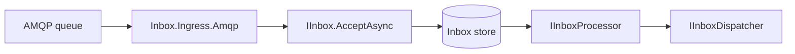

# Architecture

LiteBus provides semantic command, query, and event mediation. Durable messaging uses orthogonal **Storage**, **Dispatch**, and **Ingress** adapters; broker SDKs remain outside the mediator packages.

## Architecture Roles

| Role | Responsibility | Main packages |
| --- | --- | --- |
| Platform contracts | Container-neutral modules, dispatch scope, and transport contracts | `LiteBus.Runtime.Abstractions`, `LiteBus.Transport.Abstractions` |
| Mediation contracts | Message and semantic handler contracts | `LiteBus.Messaging.Abstractions`, command/query/event abstractions |
| Durable contracts | Durable metadata, leases, processor hooks, and axis contracts | `LiteBus.DurableMessaging.Abstractions`, inbox/outbox/saga abstractions |
| Core implementations | Module runtime, mediation, semantic mediators, and durable processors | `LiteBus.Runtime`, `LiteBus.Messaging`, `LiteBus.Commands`, `LiteBus.Queries`, `LiteBus.Events`, `LiteBus.Inbox`, `LiteBus.Outbox`, `LiteBus.Saga` |
| Technology adapters | Broker and persistence SDK ownership | `LiteBus.Transport.*`, `LiteBus.Storage.PostgreSql`, `LiteBus.Storage.EntityFrameworkCore` |
| Feature bridges | Storage, dispatch, ingress, and saga-to-inbox mapping | `LiteBus.Inbox.*`, `LiteBus.Outbox.*`, `LiteBus.Saga.InboxIntegration`, `LiteBus.Saga.Storage.*` adapters |
| Host adapters | DI, hosting, telemetry, health, and ASP.NET Core mapping | `LiteBus.Runtime.Extensions.*`, `LiteBus.*.Extensions.*`, `LiteBus.Extensions.*` |
| Consumer tooling | Analyzer and application test support | `LiteBus.Analyzers`, `LiteBus.Testing`, `LiteBus.Testing.Mediation`, `LiteBus.Testing.Transport`, `LiteBus.Testing.DurableMessaging`, `LiteBus.Testing.Hosting` |

## Startup Model

Applications call the single `AddLiteBus(Action<ILiteBusBuilder>)` entry point and configure package extensions on `ILiteBusBuilder` from `LiteBus.Runtime.Abstractions`. The builder exposes only `Modules`; normal application code uses package-owned extensions such as `AddMessaging`, `AddCommands`, `AddInbox`, and `AddOutbox`. Advanced composition uses `builder.Modules` rather than a second host-adapter overload. Each module contributes dependency descriptors, and the selected container adapter translates them into registrations.

`IModuleRegistry.BuildOrder()` resolves modules in topological order and freezes further registration. `AddLiteBus` calls `BuildOrder()` after the configuration callback returns.

Manifest startup tasks and background services are executed by a single generic-host orchestrator (`LiteBusHostOrchestrator`). Startup tasks run sequentially during `StartAsync`; background service loops start only after every startup task succeeds. A startup task failure aborts host startup and leaves background services unstarted.

Core inbox and outbox modules register writers and processors only. Storage, dispatch, and ingress are separate registrations. Processor background services fail fast when no dispatcher is registered.

Microsoft DI and Autofac each provide one `IMessageDispatchScopeFactory`. Messaging composition fails when no dispatch-scope adapter is registered. Manual hosts can select `RootMessageDispatchScopeFactory` explicitly when root-provider dispatch is acceptable.

## Mediation Pipeline

Commands, queries, and events use the messaging layer with type-specific rules.

| Message kind | Entry point | Handler rule |
| --- | --- | --- |
| Command without result | `ICommandMediator.SendAsync(ICommand)` | exactly one main handler |
| Command with result | `ICommandMediator.SendAsync(ICommand<TResult>)` | exactly one main handler |
| Query | `IQueryMediator.QueryAsync` | exactly one main handler |
| Stream query | `IQueryMediator.StreamAsync` | exactly one stream handler |
| Event | `IEventMediator.PublishAsync` | zero or more handlers |

Pre-handlers, post-handlers, and error handlers wrap the main handler path. Event handlers can be ordered by priority and executed sequentially or concurrently.

## API Model Conventions

LiteBus names public value objects and operation inputs with a fixed suffix taxonomy (`*Item`, `*Metadata`, `*Request`, `*Settings`, `*Options`, and related patterns). Durable writers accept `InboxAcceptItem` / `OutboxEnqueueItem` with per-message metadata; mediation keeps `*Settings` for per-invocation pipeline tuning.

The [API Design Reference](api-design.md) defines the suffix taxonomy, CLR shapes, package placement, writer signatures, parameter budget, and mapping boundaries used by public APIs.

The [Mediation Layer Design Rules](mediation-design.md) define the stage model, contract shapes, vocabulary, and the point at which each class of configuration error is rejected. Read it before adding a pipeline stage, a role, or an axis.

## Storage Axis

Storage adapters implement narrow store roles against one logical table or DbSet. PostgreSQL, EF Core, and InMemory implementations register one singleton instance for all roles on that store.

### Implementation Invariants

- `IsAvailable` must guard `LeaseExpiresAt is not null` when status is processing or publishing.
- `trace_context` must be wired end-to-end when present in schema (envelopes, adapter mappings, SQL, lease rows).

```text
Accept path (auto-commit)
  IInbox.AcceptAsync(InboxAcceptItem) / IOutbox.EnqueueAsync(OutboxEnqueueItem)
    -> singleton IInboxStore / IOutboxStore (commits immediately)

Accept path (participates in caller transaction)
  ITransactionalInbox.AcceptAsync(InboxAcceptItem) / ITransactionalOutbox.EnqueueAsync(OutboxEnqueueItem)
    or ITransactionalInbox<TContext> / ITransactionalOutbox<TContext> (EF)
    -> bound ITransactionalInboxStore / ITransactionalOutboxStore
    -> persisted InboxEnvelope / OutboxEnvelope when caller commits
    See [Transactional messaging writes](../reliable-messaging/transactional-writes.md).

Process path
  IInboxProcessor / IOutboxProcessor
    -> IInboxLeaseStore / IOutboxLeaseStore.LeasePendingAsync
    -> dispatch leased envelope
    -> IInboxStateWriter / IOutboxStateWriter.PersistAsync (completed, retry, dead-letter)

Operations path
  IInboxDeadLetterStore / IOutboxDeadLetterStore (manual replay)
  IInboxRetentionStore / IOutboxRetentionStore (delete aged terminal rows)
  IInboxDiagnosticsStore / IOutboxDiagnosticsStore (status counts)
```



| Capability | Inbox roles | Outbox roles |
| --- | --- | --- |
| Append accepted work | `IInboxStore` | `IOutboxStore` |
| Lease due work | `IInboxLeaseStore` | `IOutboxLeaseStore` |
| Persist processor outcomes | `IInboxStateWriter` | `IOutboxStateWriter` |
| Requeue dead-lettered rows | `IInboxDeadLetterStore` | `IOutboxDeadLetterStore` |
| Delete aged terminal rows | `IInboxRetentionStore` | `IOutboxRetentionStore` |
| Queue diagnostics | `IInboxDiagnosticsStore` | `IOutboxDiagnosticsStore` |
| Query and purge rows | `IInboxMessageQuery`, `IInboxPurgeStore` | `IOutboxMessageQuery`, `IOutboxPurgeStore` |

Fine-grained interfaces remain for callers that depend on one concern. Composite roles group the slices processors and operator tooling need:

| Composite role | Extends | Used by |
| --- | --- | --- |
| `IInboxProcessingStore` | `IInboxLeaseStore`, `IInboxStateWriter` | `PipelinedInboxProcessor` |
| `IInboxOperationsStore` | dead-letter, retention, diagnostics, query, purge roles | `IInboxManager`, retention and cleanup services |
| `IOutboxProcessingStore` | `IOutboxLeaseStore`, `IOutboxStateWriter` | `PipelinedOutboxProcessor` |
| `IOutboxOperationsStore` | dead-letter, retention, diagnostics, query, purge roles | `IOutboxManager`, retention and cleanup services |

PostgreSQL and EF Core stores implement all roles on one implementation class. InMemory stores do the same for tests.

### Retention Cutoff Semantics

Cleanup services call `IInboxRetentionStore.DeleteCompletedOlderThanAsync` and `IOutboxRetentionStore.DeletePublishedOlderThanAsync` with a cutoff timestamp. Implementations compare the cutoff against the effective terminal timestamp:

| Store | Effective timestamp | SQL expression |
| --- | --- | --- |
| Inbox | Completion time when recorded, otherwise acceptance time | `COALESCE(completed_at, created_at)` |
| Outbox | Publication time when recorded, otherwise enqueue time | `COALESCE(published_at, created_at)` |

Current inbox and outbox schemas include `completed_at`, `published_at`, and operational history columns such as `last_attempted_at` and `dead_lettered_at`. Retention deletes rows based on when work finished, not when it was first accepted. A message accepted long ago but completed recently stays until the cutoff passes its completion time.

### OpenTelemetry Metric Catalog

Instrument names are stable public constants on `LiteBusInboxTelemetry`, `LiteBusOutboxTelemetry`, `LiteBusInboxIngressTelemetry`, and `LiteBusTransportTelemetry`. Register meters with `AddLiteBusInboxMetrics()`, `AddLiteBusOutboxMetrics()`, and `AddLiteBusTransportMetrics()` from the matching `*.Extensions.OpenTelemetry` packages. Ingress counters use the same `LiteBus.Inbox` meter as inbox processor metrics, so `AddLiteBusInboxMetrics()` exports both. Transport circuit breaker gauges are recorded on the shared `LiteBus.Transport` meter with the `litebus.transport.broker` dimension identifying the active adapter (`amqp`, `kafka`, `sqs`, `azure_service_bus`, `inmemory`). `AddLiteBusAmqpMetrics()` registers the same shared meter for backward compatibility.

| Meter | Instrument | Public constant | Description |
| --- | --- | --- | --- |
| `LiteBus.Inbox` | `litebus.inbox.queue.depth` | `LiteBusInboxTelemetry.QueueDepthInstrumentName` | Observable gauge; tag `litebus.inbox.status` |
| `LiteBus.Inbox` | `litebus.inbox.processor.state` | `LiteBusInboxTelemetry.ProcessorStateInstrumentName` | `0` Running, `1` Paused, `2` Draining |
| `LiteBus.Inbox` | `litebus.inbox.processor.persist_skipped` | `LiteBusInboxTelemetry.ProcessorPersistSkippedInstrumentName` | Skipped terminal persist when lease owner no longer matches |
| `LiteBus.Inbox` | `litebus.inbox.processor.persist_failed` | `LiteBusInboxTelemetry.ProcessorPersistFailedInstrumentName` | Terminal persist threw after successful handler dispatch |
| `LiteBus.Inbox` | `litebus.inbox.diagnostics.unavailable` | `LiteBusInboxTelemetry.DiagnosticsUnavailableInstrumentName` | Queue depth probe failed against the backing store |
| `LiteBus.Inbox` | `ingress.ack_failed_after_accept` | `LiteBusInboxIngressTelemetry.AckFailedAfterAcceptInstrumentName` | Broker acknowledgement failed after a successful inbox accept |
| `LiteBus.Outbox` | `litebus.outbox.processor.persist_skipped` | `LiteBusOutboxTelemetry.ProcessorPersistSkippedInstrumentName` | Skipped terminal persist when lease owner no longer matches |
| `LiteBus.Outbox` | `litebus.outbox.processor.persist_failed` | `LiteBusOutboxTelemetry.ProcessorPersistFailedInstrumentName` | Terminal persist threw after successful broker publish |
| `LiteBus.Outbox` | `litebus.outbox.diagnostics.unavailable` | `LiteBusOutboxTelemetry.DiagnosticsUnavailableInstrumentName` | Queue depth probe failed against the backing store |
| `LiteBus.Outbox` | `litebus.outbox.queue.depth` | `LiteBusOutboxTelemetry.QueueDepthInstrumentName` | Observable gauge; tag `litebus.outbox.status` |
| `LiteBus.Outbox` | `litebus.outbox.processor.state` | `LiteBusOutboxTelemetry.ProcessorStateInstrumentName` | Same encoding as inbox processor state |
| `LiteBus.Transport` | `litebus.transport.circuit_breaker.open` | `LiteBusTransportTelemetry.CircuitBreakerOpenInstrumentName` | `1` when any publisher circuit is open or half-open; tag `litebus.transport.broker` |
| `LiteBus.Transport` | `litebus.transport.circuit_breaker.failure_count` | `LiteBusTransportTelemetry.CircuitBreakerFailureCountInstrumentName` | Current failure sum across publisher destinations; tag `litebus.transport.broker` |
| `LiteBus.Transport.AzureServiceBus` | (reserved) | | Adapter meter identity for custom instrumentation |
| `LiteBus.Transport.AwsSqs` | (reserved) | | Adapter meter identity for custom instrumentation |
| `LiteBus.Transport.Kafka` | (reserved) | | Adapter meter identity for custom instrumentation |
| `LiteBus.Transport.InMemory` | (reserved) | | Adapter meter identity for test and CI transports |

Processor pass counters below are recorded by internal processor instrumentation (`InboxProcessorTelemetry`, `OutboxProcessorTelemetry`). Names are stable for metric export but are not public constants; dashboards may reference them, yet renames are not governed by the public instrument contract until promoted to `LiteBusInboxTelemetry` or `LiteBusOutboxTelemetry`.

| Meter | Instrument | Description |
| --- | --- | --- |
| `LiteBus.Inbox` | `litebus.inbox.processor.passes` | One increment per processor pass |
| `LiteBus.Inbox` | `litebus.inbox.processor.succeeded` | Envelopes marked completed during a pass |
| `LiteBus.Inbox` | `litebus.inbox.processor.failed` | Envelopes scheduled for retry during a pass |
| `LiteBus.Inbox` | `litebus.inbox.processor.dead_lettered` | Envelopes moved to dead letter during a pass |
| `LiteBus.Inbox` | `litebus.inbox.processor.loop_errors` | Unhandled exceptions caught by the processor background loop |
| `LiteBus.Outbox` | `litebus.outbox.processor.passes` | One increment per processor pass |
| `LiteBus.Outbox` | `litebus.outbox.processor.published` | Messages marked published during a pass |
| `LiteBus.Outbox` | `litebus.outbox.processor.failed` | Messages scheduled for retry during a pass |
| `LiteBus.Outbox` | `litebus.outbox.processor.dead_lettered` | Messages moved to dead letter during a pass |
| `LiteBus.Outbox` | `litebus.outbox.processor.loop_errors` | Unhandled exceptions caught by the processor background loop |

Circuit breaker instruments use the `litebus.transport.circuit_breaker.*` names on the `LiteBus.Transport` meter with `litebus.transport.broker="amqp"`.

Framework-neutral diagnostic probes use `IDiagnosticCheck` and `LiteBusHostManifest`. Applications map probe results to health endpoints or custom sinks.

## Transport Platform

Broker clients implement `ITransportPublisher` and `IMessageConsumer` from `LiteBus.Transport.Abstractions`. Shared dispatch logic lives in `LiteBus.Inbox.Dispatch` and `LiteBus.Outbox.Dispatch`. Broker transports are root modules shared by dispatch and ingress adapters. Shared circuit breaker metrics live in `LiteBus.Transport`; transport header value parsing lives in `LiteBus.Transport.Abstractions`; envelope header mapping lives in the dispatch and ingress adapter packages.

| Package | Role | Broker | Destination mapping |
| --- | --- | --- | --- |
| `LiteBus.Transport.Amqp` | Technology adapter | RabbitMQ | Publish: `Destination` = exchange, `Route` = routing key. Consume: `Destination` = queue name, `Route` = routing key |
| `LiteBus.Transport.AzureServiceBus` | Technology adapter | Azure Service Bus | `Destination` = queue or topic; `Route` = subject |
| `LiteBus.Transport.AwsSqs` | Technology adapter | Amazon SQS | `Destination` = queue URL |
| `LiteBus.Transport.InMemory` | Technology adapter | `System.Threading.Channels` | `Destination` = logical queue name |
| `LiteBus.Transport.Kafka` | Technology adapter | Apache Kafka (Confluent) | `Destination` = topic; `Route` = record key |

Register one transport module per process. Each module registers `ITransportPublisher`, `IMessageConsumer`, and destination-scoped publisher circuit breakers exposed through the shared `LiteBus.Transport` metrics.

```csharp
services.AddLiteBus(bus =>
{
    bus.AddAmqpTransport(new AmqpConnectionOptions
    {
        Uri = new Uri(configuration["Amqp:Uri"]!)
    });
    bus.AddMessaging(_ => { });

    bus.AddInbox(inbox => inbox.UseAmqpDispatch(options =>
    {
        options.DefaultDestination = "orders.commands";
    }));

    bus.AddOutbox(outbox => outbox.UseAmqpDispatch(options =>
    {
        options.DefaultDestination = "orders.events";
    }));
});
```

### Kafka At-Least-Once Semantics

`LiteBus.Transport.Kafka` uses manual offset commit. `TransportMessage.AcceptAsync` commits the consumed offset. `ReturnToQueueAsync` seeks the consumer back to the failed offset before the next read so the record is retried in-session. `DiscardAsync` leaves the offset uncommitted until consumer restart or rebalance. Kafka has no queue-style lease equivalent. Pair Kafka ingress with inbox idempotency keys and treat handlers as idempotent.

### Transport Resilience Capability Matrix

Minimum acknowledgement and recovery behavior implemented by each adapter. Raw `IMessageConsumer` hosts use `TransportConsumerHandlerInvoker`, which returns failed deliveries to the broker and continues the consume loop. Inbox ingress applies its own poison, retry, and dead-letter policy on top of transport deliveries.

| Provider | Ack (`AcceptAsync`) | Requeue (`ReturnToQueueAsync`) | Handler throw (raw consumer) | Consumer reconnect |
| --- | --- | --- | --- | --- |
| AMQP (RabbitMQ) | `basic.ack` | `basic.nack` with requeue | Auto-nack with requeue via shared invoker | Channel shutdown signals stop; caller restarts consumer |
| InMemory | Remove from channel | Re-enqueue on channel | Re-enqueue via shared invoker | N/A (in-process) |
| Azure Service Bus | `CompleteMessage` | `AbandonMessage` | Abandon via shared invoker | Exponential backoff restart loop in `AzureServiceBusConsumer` |
| AWS SQS | `DeleteMessage` | `ChangeMessageVisibility` with backoff | Requeue via shared invoker | Poll loop continues after receive errors |
| Kafka | Offset commit | Seek to failed offset with backoff | Seek via shared invoker; offset not advanced | Consumer restart / rebalance redelivers uncommitted offsets |

### Poison Message Handling

| Host | Behavior |
| --- | --- |
| Raw `IMessageConsumer` | Handler exceptions requeue indefinitely unless the handler calls `DiscardAsync` or the broker dead-letters after its own redelivery limits. No LiteBus redelivery cap is applied at the transport layer. |
| Inbox ingress | Maps transport deliveries to inbox accept. Transient failures can requeue at the broker when `RequeueOnFailure` is enabled. Poison and contract failures are discarded or dead-lettered according to `IngressAckPolicy` and inbox processor retry limits. |
| Application guidance | Use inbox ingress when you need idempotency, store-backed retries, and dead-lettering. Use raw consumers only when the application owns retry caps, poison queues, and idempotent handlers. |

### AMQP Transport Bootstrap

`AddAmqpTransport` registers the single root `AmqpTransportModule`. `UseAmqpDispatch` and `UseAmqpIngress` only configure feature bridges. Their modules declare `IRequires<AmqpTransportModule>`, so composition rejects a missing root transport before any module builds. Kafka, AWS SQS, Azure Service Bus, and in-memory adapters use the same ownership rule.

Inbox composite child order remains storage, dispatcher, then ingress for same-level children. Static module dependencies take precedence when topological sorting requires a lower-level transport module first.

### Dispatch Tracing

Concrete publishers emit `send {destination}` producer activities. `TransportConsumerHandlerInvoker` emits `process {destination}` consumer activities. Both use the `LiteBus.Transport` activity source and the OpenTelemetry messaging attributes documented in [Transport Tracing](../catalog/transport/tracing.md). Register the source with `AddLiteBusTransportInstrumentation()`.

## Dispatch Axis

Dispatch adapters turn a leased envelope into a side effect. Core processors call `IInboxDispatcher.DispatchAsync` or `IOutboxDispatcher.DispatchAsync` and record success or failure based on thrown exceptions.

```text
Inbox processor
  -> IInboxDispatcher.DispatchAsync(InboxEnvelope)
     -> Inbox.Dispatch.InProcess: deserialize, require ICommand, ICommandMediator.SendAsync
     -> Inbox.Dispatch + *.Dispatch.Amqp / *.Dispatch.InMemory: publish via ITransportPublisher

Outbox processor
  -> IOutboxDispatcher.DispatchAsync(OutboxEnvelope)
     -> Outbox.Dispatch.InProcess: deserialize, IEventMediator.PublishAsync
     -> Outbox.Dispatch + *.Dispatch.Amqp / *.Dispatch.InMemory: publish via ITransportPublisher with contract headers
```



Register exactly one dispatcher per durable path. Processor background services validate this at startup.

## Processor Pipeline

Inbox and outbox use `PipelinedInboxProcessor` and `PipelinedOutboxProcessor` exclusively. Each pass leases a batch, fans envelopes to `DispatcherConcurrency` workers, renews leases on a heartbeat interval, and persists terminal outcomes immediately.

Each acquisition increments `lease_generation`. Renewal and terminal persistence require both the current owner and generation, so an earlier attempt cannot complete after expiry and reacquisition, even when the configured owner label is unchanged. Direct PostgreSQL and relational EF Core stores use database time for lease eligibility and expiry; in-memory stores use the supplied `TimeProvider` for deterministic tests.

### Pass Abort vs Per-Message Persistence

Dispatch failures and lease-loss outcomes are isolated per envelope: one worker records its outcome and continues with the next leased message. Terminal persistence follows the same per-message containment rule. When `PersistTerminalOutcomeAsync` throws for one envelope, `PipelinedMessageProcessor` logs the failure and continues the pass so sibling workers can finish dispatch and persistence for the remaining batch. The failed envelope keeps its active lease until expiration and becomes eligible for a later pass.

Pass-level abort still applies to leasing, channel fan-out, and cooperative shutdown. `OperationCanceledException` from the pass cancellation token stops the worker without swallowing the cancellation. Uncaught exceptions from `DispatchEnvelopeAsync` still propagate from the worker and can fault the pass when they are not the lease-loss cancellation pattern handled explicitly in `RunWorkerAsync`.

| Option | Default | Role |
| --- | --- | --- |
| `DispatcherConcurrency` | `1` | Parallel dispatch workers per processor instance |
| `LeaseHeartbeatInterval` | 15 seconds | Renews active leases during slow handlers (must be `<= LeaseDuration / 2`) |
| `HonorShutdownTokenOnPersist` | `false` | When `false`, terminal `PersistAsync` uses `CancellationToken.None`; when `true`, passes shutdown token (faster drain, duplicate-dispatch risk) |
| `HookFailurePolicy` | Dispatcher-specific | Transport outbox dispatch defaults to `CompleteDespiteHookFailure`; in-process outbox and inbox processors default to `DeadLetter`. See [Outbox](../reliable-messaging/outbox.md) and [Inbox](../reliable-messaging/inbox.md). |
| `TenantId` | `null` | Limits leasing to one tenant partition |

`IProcessorEnvelopeHook` implementations from `LiteBus.DurableMessaging.Abstractions` run around each leased envelope. Inbox and outbox map envelopes through adapters. `EnableSaga()` registers saga hooks without coupling `LiteBus.Saga` to inbox abstractions.

Set `DispatcherConcurrency` above `1` only when handlers are safe to run in parallel. Background services create a per-message DI scope so scoped handlers (for example `DbContext`) resolve correctly.

### Delivery Semantics (At-Least-Once)

Durable paths guarantee **at-least-once** execution and publication, not exactly-once side effects. Handlers, dispatchers, and downstream consumers must be idempotent or deduplicate with `IdempotencyKey` and application logic. A crash between external side effect and terminal persist can produce duplicates. Outbox processors publish through `IOutboxDispatcher` before terminal persist; a crash or skipped persist after broker ack can republish the same envelope on lease reclaim.

### Transactional EF Behavior

Idempotency keys are scoped per tenant across in-memory, EF Core, and PostgreSQL stores. The same key under different `tenant_id` values persists independently; null or whitespace tenants normalize to an empty string. On the transactional EF path, duplicate `message_id` or `(tenant_id, idempotency_key)` conflicts cause `SaveChanges` to fail and roll back the entire unit of work. Provider-specific upsert for silent idempotent inserts is not shipped; see [Roadmap](../roadmap/README.md).

### Encryption Rotation

`IPayloadEncryptor` key rotation is an application responsibility. LiteBus stores ciphertext as opaque bytes; plan re-encryption or multi-key decrypt outside the framework.

### Instrument Stability

Public `const` instrument and activity names on `LiteBusInboxTelemetry`, `LiteBusOutboxTelemetry`, `LiteBusInboxIngressTelemetry`, `LiteBusTransportTelemetry`, and adapter meter types are consumer contract. Renames or removals are breaking changes. Processor pass counters listed in the internal-only catalog above are stable implementation details until promoted to public constants on the matching telemetry type.

## Ingress Axis

Ingress adapters accept messages from external transports and write them through `IInbox.AcceptAsync`. They do not execute handlers directly.

```text
AMQP queue
  -> TransportInboxIngressConsumer (IBackgroundService)
  -> TransportInboxIngressHandler maps TransportMessage headers + body to InboxAcceptItem
    -> IInbox.AcceptAsync(InboxAcceptItem)
    -> ack/nack on store acceptance

Later (same process or fleet)
  -> IInboxProcessor
    -> IInboxDispatcher (typically InProcess)
    -> handler execution
```



Ingress depends on inbox core and a registered `IMessageConsumer` implementation. It does not reference storage implementation types directly beyond what DI provides through `IInbox`.

## End-to-End Pipeline Example

A common integration flow combines ingress, command dispatch, domain logic, outbox storage, and AMQP publication:

```text
External producer
  -> AMQP -> Ingress -> IInbox -> store
  -> InboxProcessor -> Command dispatcher -> command handler
  -> handler writes domain state + IOutbox.EnqueueAsync in same DB transaction
  -> OutboxProcessor -> Amqp dispatcher -> integration exchange
```

Handlers and dispatch targets must be idempotent. Inbox and outbox provide at-least-once behavior, not exactly-once side effects.

## Durable Messaging Glossary

| Term | Meaning |
| --- | --- |
| `InboxStatus.Pending` | Accepted and waiting for a processor lease. |
| `InboxStatus.Processing` | Leased by one worker; dispatch is in progress or the lease has not yet expired. |
| `InboxStatus.Completed` | Handler finished successfully; row is terminal until retention deletes it. |
| `InboxStatus.Failed` | Dispatch threw; eligible for retry after the visible-after timestamp. |
| `InboxStatus.DeadLettered` | Retry policy exhausted or manually moved aside; use `IInboxDeadLetterStore.RequeueAsync` to replay. |
| `OutboxStatus.Pending` | Enqueued and waiting for a publisher lease. |
| `OutboxStatus.Publishing` | Leased by one publisher; dispatch is in progress or the lease has not yet expired. |
| `OutboxStatus.Published` | Published successfully; row is terminal until retention deletes it. |
| `OutboxStatus.Failed` | Publication threw; eligible for retry after the visible-after timestamp. |
| `OutboxStatus.DeadLettered` | Retry policy exhausted or manually moved aside; use `IOutboxDeadLetterStore.RequeueAsync` to replay. |
| Lease | Temporary row ownership recorded by `IInboxLeaseStore` or `IOutboxLeaseStore`. A lease sets owner identity, expiration time, and attempt count. Other workers must not receive the same envelope while the lease is active. Expired leases become eligible again, which gives crash recovery without exactly-once guarantees. |
| At-least-once | Inbox and outbox may deliver the same logical message more than once after worker failure, lease expiry, or broker redelivery. Handlers, dispatchers, and downstream consumers must be idempotent or deduplicate with `Idempotency` on `InboxAcceptMetadata` / `OutboxEnqueueMetadata`. |

## Contracts and Serialization

Stored rows contain contract name, contract version, and serialized payload. The default registry maps concrete CLR types to names and versions. The default serializer uses `System.Text.Json` with web defaults.

Closed generic messages are supported when each closed type has a registered contract. Open generic contracts are rejected.

## Saga Orchestration

Saga integrates through `inbox.EnableSaga(...)` from `LiteBus.Saga.InboxIntegration`. `SagaModuleBuilder` owns exactly one explicit storage module. Use `UseInMemoryStorage()` for tests or select a persistence adapter; missing or duplicate storage fails composition.

| Package | Role | Responsibility |
| --- | --- | --- |
| `LiteBus.DurableMessaging.Abstractions` | Durable contracts | `IProcessorEnvelopeHook`, durable metadata, retry, and lease contracts |
| `LiteBus.Saga.Abstractions` | Durable contracts | `ISagaStore`, `ISagaContext`, saga state registry |
| `LiteBus.Saga` | Core implementation | `SagaProcessorHook`, `SagaModule`, and `SagaModuleBuilder` |
| `LiteBus.Saga.InboxIntegration` | Feature bridge | Nested `EnableSaga(...)` on `InboxModuleBuilder` |
| `LiteBus.Saga.Storage.PostgreSql` | Feature bridge | PostgreSQL saga instance persistence |

```csharp
builder.AddMessaging(_ => { });
builder.AddInbox(inbox =>
{
    inbox.Contracts.Register<AdvanceOrderSagaCommand>("orders.saga.advance", 1);
    inbox.EnableSaga(saga =>
    {
        saga.RegisterState<OrderSagaState>("orders.saga");
        saga.MapContract("orders.saga.advance", "orders.saga");
        saga.UsePostgreSqlStorage(pg => pg.UseDataSource(dataSource));
    });
});
```

Saga state is command-centric (`LiteBus.Saga.Abstractions` references command contracts). Applications own state POCOs and completion rules.

### Concurrency and Scope

`SagaExecutionContext` registers as a singleton with per-dispatch scope on the instance for the processor before/dispatch/after flow. Optimistic concurrency uses versioned saves. A dirty-state conflict propagates as `SagaConcurrencyException` because the hook cannot safely merge arbitrary handler-owned state with a concurrent update. Completion-only conflicts may reload and retry up to three attempts because completion is idempotent. Inbox terminal persistence and saga save are separate steps; handlers must tolerate at-least-once redelivery. A single transaction for inbox terminal state and saga persistence is not part of the current store contract (see the [Saga](../reliable-messaging/saga.md) durability model).

## Message Registry Lifecycle

LiteBus uses one `IMessageRegistry` per `IModuleConfiguration` instance created during `AddLiteBus`. Modules register message and handler types at compose time through `MessageModule` and semantic module builders. The registry is not process-wide: tests and hosts each get an isolated instance. Do not call `IMessageWriter.Register` at runtime in application code; register types during module `Build()` or through `RegisterFromAssembly` on module builders.

## Payload Encryption and Tenant Isolation

`IPayloadEncryptor` protects serialized payload bodies at rest. Register it through `UsePayloadEncryption()` on inbox and outbox module builders. Contract name and version remain plaintext so leasing, routing, and diagnostics continue to work.

`ITenantRoutingStrategy.ResolveRoute` optionally computes a transport publish route from tenant metadata. Processor leasing is a separate durable concern: set `TenantScope` on accept or enqueue metadata and `TenantId` on processor options to scope lease queries in PostgreSQL, EF Core, and InMemory stores.

```csharp
inbox.UsePayloadEncryption(myEncryptor);
outbox.UsePayloadEncryption(myEncryptor);

inbox.UseProcessorOptions(new InboxProcessorOptions { TenantId = "tenant-a" });
inbox.UseAmqpDispatch(options =>
{
    options.DefaultDestination = "commands";
});
```

## Composite Store Roles

Fine-grained store interfaces remain public. Processors and managers depend on composite roles that storage adapters register on the same singleton instance:

| Composite | Combines | Used by |
| --- | --- | --- |
| `IInboxProcessingStore` | lease, state writer | `IInboxProcessor` |
| `IInboxOperationsStore` | dead-letter, retention, diagnostics, query, purge | `IInboxManager` |
| `IOutboxProcessingStore` | lease, state writer | `IOutboxProcessor` |
| `IOutboxOperationsStore` | dead-letter, retention, diagnostics, query, purge | `IOutboxManager` |

## Module Composition

Parent modules use `ICompositeModule` to declare storage, dispatch, ingress, and saga children. Child membership is collected before build. `BuildOrder()` validates every `IRequires<TModule>` edge, inserts composite children, and topologically sorts the complete graph before any `Build()` call. Configuration context stores shared configuration objects only; registration markers and dependency-registry scans are not part of ordering. Duplicate registration of the same module type throws `LiteBusConfigurationException` at compose time.

Register adapters inside the parent builder:

```csharp
builder.Services.AddLiteBus(builder =>
{
    builder.AddAmqpTransport(new AmqpConnectionOptions
    {
        Uri = new Uri(configuration["Amqp:Uri"]!)
    });
    builder.AddMessaging(_ => { });
    builder.AddInbox(inbox =>
    {
        inbox.UsePostgreSqlStorage(pg => pg.UseDataSource(dataSource));
        inbox.UseAmqpDispatch(options =>
        {
            options.DefaultDestination = "commands";
        });
        inbox.EnableInboxProcessor();
    });
});
```

Do not add top-level `IModuleRegistry` shortcuts that bypass the parent builder. Storage and dispatcher registration belongs on nested `Use*` extensions.

### Planned Capabilities

The [Roadmap](../roadmap/README.md) tracks built-in idempotency consumer middleware, per-contract retry classification, SQS FIFO and broker dead-letter integration, named bus instances, schema tooling, payload compression, and validation, authorization, and caching modules. Store-side `visible_after` covers delayed processing; broker-native delayed delivery is not part of the current API.

## Boundaries

- LiteBus mediates in process. Broker clients live in `LiteBus.Transport.*` adapter packages and are consumed by dispatch/ingress transport adapters.
- Core inbox and outbox do not reference Commands, Events, Npgsql, EF, or RabbitMQ.
- DI adapters translate descriptors; mediator code does not depend on Microsoft DI or Autofac.
- `LiteBus.Analyzers` validates registration patterns at compile time without runtime coupling.

## Next

Follow package boundaries in the [Dependency Graph](dependency-graph.md). Historical upgrade steps remain in the [Migration Guide](../migration/v6.md).
