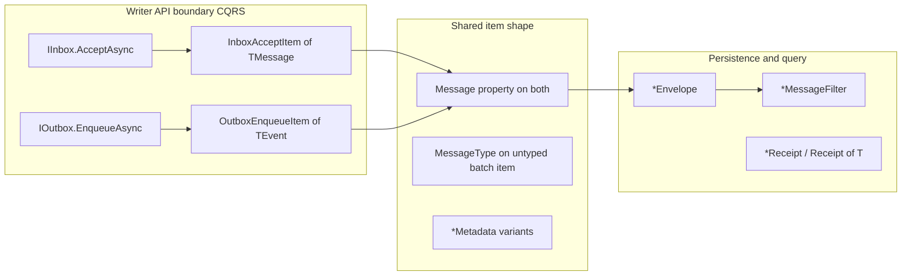

# API Design Reference

This page defines the current LiteBus public API model: named types, CLR shapes, package placement, method signatures, parameter limits, mapping boundaries, and durable-messaging examples.

## Who This Is For

- Contributors adding public types to `*.Abstractions` packages
- Reviewers checking whether a new API matches an existing pattern
- Maintainers extending existing surfaces during feature work

**Prerequisites:** [Architecture](README.md) (dependency role model), [Dependency graph](dependency-graph.md) (package inventory).

## Model Taxonomy (with Examples)

| Suffix | Responsibility | Examples |
|--------|----------------|----------|
| `*Item` | One command unit (message payload + metadata) | `InboxAcceptItem`, `OutboxEnqueueItem` |
| `*Metadata` | Per-message durable annotations on an `*Item` | `InboxAcceptMetadata`, `OutboxEnqueueMetadata` |
| `*Request` | Operation input without a message body | `InboxLeaseRequest`, `TransportPublishRequest` |
| `*Settings` | Per-invocation mediation tuning | `CommandMediationSettings`, `EventMediationSettings` |
| `*Options` | Module, host, processor, or adapter configuration | `ProcessorOptions`, `PostgreSqlInboxStoreOptions` |
| `*HostOptions` | Background-service lifecycle | `InboxProcessorHostOptions` |
| `*Filter` | Query or purge predicates | `InboxMessageFilter` |
| `*Binding` | Framework adapter input at the HTTP or host edge | `InboxQueryBinding`, `OutboxPurgeBinding` |
| (no suffix) | Small, shared value objects | `SagaCorrelation`, `MessageIdentity` |

### Mediation vs Durable Writers

- **Mediation** keeps `*Settings` (`CommandMediationSettings`, `EventMediationSettings`, `QueryMediationSettings`) for per-call pipeline tuning. Custom mediators built on `IMessageMediator` use `MessageMediationRequest<TMessage, TResult>` for strategy and resolve overrides; `CancellationToken` stays on `Mediate` only, not inside the request bag.
- **Durable writers** use `*Item` plus `*Metadata`. Scheduling and visibility belong on metadata (`MessageVisibility`), not separate scheduler interfaces.
- **Framework bindings** use `*Binding` for ASP.NET management and similar adapter input. Bindings map once at the adapter edge; they are not writer `*Item` types.

## CLR Kind Selection

Public types use a consistent CLR kind per role.

| Kind | Use in LiteBus | Do not use for |
| --- | --- | --- |
| `sealed record` | `*Item`, `*Metadata`, `*Filter`, `*Request`, `*Receipt`, `*Settings`; immutable `*Options` with `init` only; static `From` / named factories on `*Item` | Mutable host bags |
| `record` (non-sealed) | Rare bases (`ProcessorOptions`, `PostgreSqlSchemaStoreOptions`) | New public APIs unless inheritance is required |
| `sealed class` | `*HostOptions` with `get`/`set`; modules, mediators, stores; optional thin construction namespaces (`OutboxEnqueue`); exceptions | New immutable value objects |
| `readonly struct` / `readonly record struct` | Internal perf helpers and store keys only | Public contracts |
| `interface` | `*.Abstractions` contracts |: |

**`*HostOptions` stay `sealed class`:** host and processor lifecycle bags remain mutable after instantiation (`ProcessorHostOptions`, `InboxCleanupHostOptions`, and similar).

## Inbox/Outbox Naming Model

Durable writer vocabulary is **message-centric** on both axes. Do not use `Payload` as the public item body property; it collides with transport encryption wording (`IPayloadEncryptor`) and with metadata documented as outside the payload.



| API shape | Inbox | Outbox |
| --- | --- | --- |
| Typed item | `InboxAcceptItem<TMessage>` with `Message` | `OutboxEnqueueItem<TEvent>` with `Message` (renamed from `Event`) |
| Untyped batch item | `InboxAcceptItem` | `OutboxEnqueueItem` with `MessageType` (renamed from `EventType`) |
| Typed accept/enqueue return | `InboxReceipt<TMessage>` | `OutboxReceipt<TEvent>` (unchanged generic param name) |
| Batch return | `InboxReceipt` | `OutboxReceipt` |
| Receipt outcome | `InboxAcceptOutcome` | `OutboxEnqueueOutcome` |
| Store append return | `InboxAppendResult` | `OutboxAppendResult` |
| Default metadata | `InboxAcceptMetadata.Immediate` | Immediate enqueue via metadata variants |
| Item order in source | Typed first, untyped second | Typed first, untyped second (aligned in naming pass) |

CQRS method names stay asymmetric (`AcceptAsync` vs `EnqueueAsync`; `TMessage` vs `TEvent` on generic items). Only the **shared item shape** (`Message`, `MessageType`, filters, envelopes) is symmetric.

## Discriminated Value Objects (Durable Messaging)

Shared durable primitives live in `LiteBus.Messaging.Abstractions.DurableMessaging`:

| Type | Role |
| --- | --- |
| `MessageIdentity` | Stable message id and correlation handles |
| `Idempotency` | Idempotency key and deduplication scope |
| `MessageVisibility` | Delayed or scheduled availability (`visible_after`) |
| `MessageTrace` | Distributed trace context propagation |
| `TenantScope` | Tenant partition for routing and lease filters |
| `MessageContractReference` | Contract name and version for persisted envelopes |

Outbox adds `PublicationTarget` in `LiteBus.Outbox.Abstractions` for destination routing.

`*Item` types compose these value objects through `*Metadata`. Internal mappers (for example `DurableEnvelopeMetadataMapper` in `LiteBus.Messaging`) project metadata fields onto envelope columns. Receipt types (`InboxReceipt`, `OutboxReceipt`) expose `MessageContractReference`, `MessageTrace`, and `TenantScope` rather than duplicating primitive fields.

## Writer Method Shape

Writer facades use a small, predictable surface. The canonical input is always `*Item`; optional body-only sugar overloads delegate to it.

```csharp
Task<InboxReceipt<TMessage>> AcceptAsync<TMessage>(InboxAcceptItem<TMessage> item, CancellationToken cancellationToken)
    where TMessage : notnull;

Task<InboxReceipt<TMessage>> AcceptAsync<TMessage>(TMessage message, CancellationToken cancellationToken)
    where TMessage : notnull;

Task<IReadOnlyList<InboxReceipt>> AcceptBatchAsync(
    IReadOnlyList<InboxAcceptItem> items,
    CancellationToken cancellationToken);
```

Outbox mirrors the pattern with `EnqueueAsync` / `EnqueueBatchAsync` and `OutboxEnqueueItem`. Typed single-message paths return axis-specific receipts; the one canonical batch path accepts non-generic items and returns non-generic receipts. There is no separate homogeneous `EnqueueBatchAsync<TEvent>` overload.

Append stores return `InboxAppendResult` or `OutboxAppendResult`, not an envelope alone. The result preserves whether the insert succeeded or resolved an existing message ID or tenant-scoped idempotency key. Writers map that store fact to `InboxReceipt.Outcome` or `OutboxReceipt.Outcome`; they never infer it by comparing envelope values.

- The message body is the generic argument on `*Item<TMessage>` when typed; untyped batch paths use non-generic `InboxAcceptItem`.
- `CancellationToken` is always the last parameter.
- At most **one** sugar overload per writer operation family: message body only, no metadata scalars.
- Batch methods accept `IReadOnlyList<*Item>`. Callers may use collection expressions (`[item1, item2]`); do not add no-op `From(params *Item[])` helpers.
- Store, lease, and processor APIs use `*Request` for operation inputs that are not full message accepts.
- Custom append stores must return an axis-specific append result for every input slot. Batch results retain input order and mark later duplicates as `AlreadyAccepted` or `AlreadyEnqueued`.

## Writer Construction

Build `*Item` values at the call site in this order of preference:

1. **Body-only default**: sugar overload or `*Item<T>.From(message)` when metadata is `*Metadata.Immediate`.
2. **Named static on `*Item<T>`**: `OutboxEnqueueItem<T>.ScheduledAt(message, when)` when a metadata combination is common and domain-named.
3. **`with` on item and metadata**: full control without new API surface.
4. **Non-generic `*Item`**: heterogeneous batch entries via `OutboxEnqueueItem.From(message, messageType)` (static on the untyped record).
5. **Thin namespace helper**: `OutboxEnqueue` / `InboxAccept` only for glue that does not fit one record (avoid plural `*Items` names).

Do not use implicit conversions from the message body to `*Item`. Do not add writer overloads that take topic, idempotency key, visibility, or other metadata as separate parameters.

## Package Placement

| Kind | Package |
| --- | --- |
| Shared durable value objects | `LiteBus.Messaging.Abstractions` (`DurableMessaging` namespace) |
| Axis-specific items, metadata, receipts | `LiteBus.Inbox.Abstractions`, `LiteBus.Outbox.Abstractions` |
| Mediation settings | `LiteBus.Commands.Abstractions`, `LiteBus.Events.Abstractions`, `LiteBus.Queries.Abstractions` |
| Module and host options | Feature or adapter package that registers the service |
| Internal envelope projection | Core feature package (`LiteBus.Messaging`, `LiteBus.Inbox`, `LiteBus.Outbox`) as `internal` helpers |

Abstractions packages own the public value-object types. Adapters map them; they do not define alternate option bags for the same concern.

## Durable Messaging Exemplar

### Accept (Inbox)

```csharp
// Default metadata
await inbox.AcceptAsync(command, cancellationToken);

// Custom metadata
await inbox.AcceptAsync(
    InboxAcceptItem<PlaceOrderCommand>.From(
        command,
        InboxAcceptMetadata.Immediate with
        {
            Idempotency = Idempotency.Keyed("order-123"),
            Visibility = MessageVisibility.After(TimeSpan.FromMinutes(5)),
            Trace = MessageTrace.Correlated(correlationId),
            Tenant = TenantScope.Isolated(tenantId),
        }),
    cancellationToken);
```

### Enqueue (Outbox)

```csharp
// Default metadata
await outbox.EnqueueAsync(integrationEvent, cancellationToken);

// Topic and idempotency
await outbox.EnqueueAsync(
    OutboxEnqueueItem<OrderSubmittedIntegrationEvent>.WithTopic(integrationEvent, "orders.events") with
    {
        Metadata = OutboxEnqueueMetadata.Immediate with
        {
            Idempotency = Idempotency.Keyed(eventId),
        }
    },
    cancellationToken);
```

Feature guides ([Inbox](../reliable-messaging/inbox.md), [Outbox](../reliable-messaging/outbox.md), [Transactional messaging writes](../reliable-messaging/transactional-writes.md)) show end-to-end usage. Historical names and package mappings remain in the [Migration Guide](../migration/v6.md).

## Ergonomics

- Put `From` and domain-named factories on `*Item` records. Writer batch signatures stay on `IReadOnlyList<*Item>`; use collection expressions for batches.
- One body-only sugar overload per writer operation family is allowed; see [Writer construction](#writer-construction).
- Keep module-builder configuration on `*Options` types registered at compose time. Do not thread those options through accept or enqueue calls.
- When a feature needs both mediation and durable persistence, call `ICommandMediator.SendAsync` with `*Settings` separately from `ITransactionalOutbox.EnqueueAsync` with `OutboxEnqueueItem`; do not merge the two concerns into one type.

## Error Handler Context

Error handlers use `HandleErrorAsync(MessageErrorContext<TMessage, TResult>, CancellationToken)`. The typed context shares `Outcome` and `HandledResult` with the mediation pipeline, so observing a failure leaves it unhandled while recovery is an explicit state transition. Cancellation is always the token supplied to the mediation call; error handlers do not depend on ambient token lookup.

Related durable surfaces include `ILeaseRenewable.RenewLeaseAsync(LeaseRenewalRequest, ...)` on inbox and outbox lease stores; `ISagaStore.SaveAsync(SagaSaveItem<TState>, ...)`, `SagaCompleteItem`, `SagaSaveItem.From`, `SagaCorrelation.SagaDefinitionId`, and tenant-scoped saga primary keys. See [Saga](../reliable-messaging/saga.md).

Track broader roadmap items in [Roadmap](../roadmap/README.md).

## What This Does Not Cover

- Dependency role rules (see [Dependency graph](dependency-graph.md))
- Module registration and hosted-service manifest (see [Hosted services](hosted-services.md))
- Mediation pipeline behavior (see [The handler pipeline](../concepts/handler-pipeline.md))

## Next

- [Architecture](README.md): storage accept/process paths and dependency roles
- [Inbox](../reliable-messaging/inbox.md) / [Outbox](../reliable-messaging/outbox.md): feature guides for durable messaging
- [Migration Guide](../migration/v6.md): historical API and database transitions
