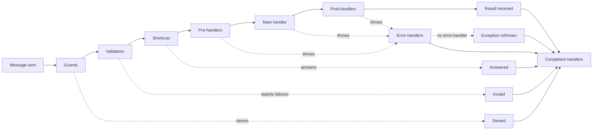

# The Handler Pipeline

Every message LiteBus mediates passes through the same pipeline: three decision stages, pre-handlers, one or more main handlers, post-handlers, error-handlers on failure, and completion handlers on every path. This page explains the exact order each stage runs in, how global and specific handlers interleave, how errors propagate, how cancellation flows, and how a guard, a validator, or a shortcut decides whether the work happens at all. It is the reference behind the per-module pages and assumes you have read at least the [Command Module](commands.md).

The pipeline is the same shape for commands, queries, and events. The difference is the main stage: a command or query has exactly one main handler, while an event has zero to many. Everything around the main stage behaves identically.

## The Stages

For a single message, mediation runs:

1. **Guards** decide whether the message is permitted to proceed. A guard refuses by returning a verdict.
2. **Validators** decide whether the message is well-formed. A validator reports failures by returning a validity.
3. **Shortcuts** decide whether the answer is already known. A shortcut answers by returning a result, so the main handler never runs.
4. **Pre-handlers** prepare a message that is going to be handled. Throwing here stops the pipeline; returning cannot.
5. **Main handler** does the work. One handler for commands and queries; all matching handlers for events.
6. **Post-handlers** react to success. They receive the message and the result.
7. **Error-handlers** run only if any earlier stage threw. They receive the message, any partial result, and the exception.
8. **Completion handlers** run on every path, exactly once, and observe how the mediation ended.



A decision from any of the three stages leaves the pipeline without touching the main handler, the post-handlers, or the error handlers, and still reaches the completion stage. That is the whole reason the completion stage exists.

Every stage before the last answers a partial question. Only the completion stage sees the whole story, which is why it exists: a post-handler never runs when a handler throws, an error-handler never runs for a refusal or a cancellation, and neither runs when no handler of that kind is registered. Anything that must know how a message actually ended, such as an audit record, a metric, or the close of a unit of work, belongs in the completion stage.

## Global, Specific, and the Execution Order

A handler can be registered against the concrete message type or against a base type or interface the message implements. LiteBus calls the first kind **direct** (specific) and the second **indirect** (global or polymorphic). Polymorphic dispatch is what makes a handler for `IEvent` or a base command run for every concrete message; see [Polymorphic Dispatch](polymorphic-dispatch.md).

The two kinds run in a deliberate order that forms an onion around the main handler:

| Stage | Order |
| --- | --- |
| Guards | Global (indirect) first, then specific (direct) |
| Validators | Global (indirect) first, then specific (direct); every validator runs |
| Shortcuts | Global (indirect) first, then specific (direct) |
| Pre-handlers | Global (indirect) first, then specific (direct) |
| Main handler | The handler(s) for the message |
| Post-handlers | Specific (direct) first, then global (indirect) |
| Error-handlers | Global (indirect) first, then specific (direct) |
| Completion handlers | Specific (direct) first, then global (indirect) |

Within each group, handlers run in ascending `[HandlerPriority]` order (default priority is `0`). The pre/post asymmetry is intentional: a global pre-handler such as authentication runs before any message-specific check, and a global post-handler such as audit logging runs after the message-specific reactions have completed. Cross-cutting concerns wrap message-specific ones on both sides.

**Priority orders handlers inside a stage; it never reorders the stages themselves.** Every guard runs before every validator, every validator before every shortcut, and every shortcut before every pre-handler, whatever priority each carries and whether it is registered globally or for one message type. That is the guarantee the split exists to provide, and the [Deciding Whether the Work Happens](#deciding-whether-the-work-happens) section explains what it buys.

This ordering is implemented in `MessageContextExtensions`: each decision stage iterates indirect then direct, post-handlers and completion handlers iterate direct then indirect, and error-handlers iterate indirect then direct. The stages themselves come from one internal table, so the order `PipelineStage` declares is the order that runs rather than something a call sequence has to keep in step with it.

A custom mediation strategy gets the same stage order through `RunAsyncPreStages`. It tracks three values as it runs, the outcome, the failure, and the reason, updating them on whichever path the mediation takes, and passes all three to `RunAsyncCompletionHandlers` in a `finally`. The stage runners own the rest, including opening the ambient scope, preserving the original stack when no error handler recovers, and reporting a post-handler's replacement result rather than the handler's own.

Each pre-handler, post-handler, and completion handler is invoked through the closed contract recorded in its descriptor at registration, so one class may implement pipeline contracts for several message types and each dispatch reaches the right one. The delegate that performs the dispatch is built while the descriptor is built, which keeps reflection in the registration path rather than in the hot path.

LiteBus also ships pipeline handlers of its own, such as the audit record writer. Those sit in a reserved priority band at or above `HandlerPriorities.ReservedFloor`, so an application handler with no explicit priority always runs first. See [Handler Priority](handler-priority.md).

## Commands and Queries: The Single-Handler Pipeline

A command or query must resolve to exactly one main handler. If more than one is registered, mediation throws `MultipleHandlerFoundException` before running anything. The flow for a result-returning message is:

```
stop = RunAsyncPreStages(message)   // guards, validators, shortcuts, pre-handlers; stops on the first decision
result = handler.HandleAsync(...)   // the one main handler
RunAsyncPostHandlers(message, result) // direct post, then indirect post
RunAsyncCompletionHandlers(context)   // direct, then indirect, always, in a finally
return result
```

A post-handler can replace the value the caller receives by setting `MessageResult` on the execution context. When a post-handler writes a non-null `MessageResult`, that value is returned instead of the handler's own result. This is how a post-handler can wrap or transform a result without the main handler knowing.

```csharp
public sealed class WrapInEnvelope : IQueryPostHandler<GetProductByIdQuery, ProductDto>
{
    public Task PostHandleAsync(GetProductByIdQuery query, ProductDto? result, CancellationToken ct = default)
    {
        AmbientExecutionContext.Current.MessageResult = new Envelope<ProductDto>(result);
        return Task.CompletedTask;
    }
}
```

## Events: The Broadcast Pipeline

An event runs the decision stages and pre-handlers, then all matching main handlers, then post-handlers, then error-handlers on failure. Main handlers are grouped by priority and executed according to the two concurrency switches on `EventMediationSettings.Execution`, covered on [Handler Priority](handler-priority.md) and the [Event Module](events.md).

If no main handler matches, event publish still runs global and message-specific pre-handlers, then returns without post-handlers. Set `EventMediationSettings.ThrowIfNoHandlerFound = true` to throw `NoHandlerFoundException` after pre-handlers complete, which is useful in tests that assert a handler exists.

## Error Propagation

When any stage throws a recoverable exception, the main flow stops and error-handlers run. Each handler receives a typed `MessageErrorContext<TMessage, TResult>` backed by the pipeline's shared outcome state, plus the caller's cancellation token.

- If no error-handler is registered, LiteBus rethrows the original exception with its stack trace preserved through `ExceptionDispatchInfo`.
- If error-handlers run but leave `context.Outcome` as `Unhandled`, LiteBus also rethrows the original exception.
- A handler recovers explicitly by setting `context.Outcome` to `Handled`. For result-returning commands and queries, it sets `context.HandledResult` to the fallback value returned to the caller.

An observing handler records the failure and leaves the default outcome unchanged:

```csharp
public sealed class AuditFailure : ICommandErrorHandler<ProcessPaymentCommand>
{
    public Task HandleErrorAsync(
        MessageErrorContext<ProcessPaymentCommand, object> context,
        CancellationToken cancellationToken = default)
    {
        // record the failure...
        return Task.CompletedTask; // the original exception still propagates
    }
}
```

## Deciding Whether the Work Happens

Three kinds of pre-stage handler can end a mediation before the main handler runs, and each answers a different question:

- A **guard** answers "may this happen". It refuses, and the refusal is security-relevant.
- A **validator** answers "is this well-formed". It reports failures, and malformed input is not a refusal.
- A **shortcut** answers "is this already done". It supplies the answer, and nothing was refused.

All three decide by returning a value rather than throwing, so the compiler requires the decision and nothing after it runs by accident.

| Decision | Returned by | Meaning | Reported outcome | Recorded by an audit trail as |
| --- | --- | --- | --- | --- |
| `Verdict.Allow` | a guard | The message may proceed | not applicable | not applicable |
| `Verdict.Deny(reason, code)` | a guard | The message is refused | `MediationOutcome.Denied` | a denial |
| `Validity.Valid` | a validator | Nothing is wrong | not applicable | not applicable |
| `Validity.Invalid(...)` | a validator | The message is malformed | `MediationOutcome.Invalid` | invalid |
| `Shortcut.None` | a shortcut | No answer; the mediation proceeds | not applicable | not applicable |
| `Shortcut.Skip(reason)` | a shortcut | The work was already applied | `MediationOutcome.Answered` | a success |
| `Shortcut<T>.Answer(result, reason)` | a shortcut | The result was already known | `MediationOutcome.Answered` | a success |

Keeping these in separate contracts does two things. It stops false entries in the one artifact a security review reads, because a cache hit refused nobody, a replayed idempotent command took effect the first time, and a malformed field is not an access decision. And it lets the framework fix the order.

### Why the Order Is Fixed

The stage order is guards, then validators, then shortcuts, then pre-handlers, and no priority can change it. That is a correctness guarantee, not a style preference. Each stage only ever sees input the previous one certified:

| Stage | Sees |
| --- | --- |
| Guard | Every message |
| Validator | Only messages the caller is allowed to send |
| Shortcut | Only well-formed messages the caller is allowed to send |
| Pre-handler | Only messages that are going to be handled |

Consider a cache registered globally for every query and an authorization check registered for one query. In a single pre-handler stage the global handler runs first, because indirect handlers precede direct ones, so the cache would answer a caller the authorization check would have refused. Writing priorities to fix that only works if every author remembers, and it cannot fix the indirect-before-direct rule at all. ASP.NET Core documents the same hazard for its own stack: `UseOutputCache` must come after `UseAuthorization`, or cached content reaches unauthorized users. Because LiteBus owns its stages, it can make the mistake unrepresentable instead of documenting it.

Validation sits between the two for the same class of reason. A malformed message must not claim an idempotency key or collect a cached answer, and an unauthorized caller should not learn from a validation message whether a resource exists.

Shortcuts run before pre-handlers for a different reason: a message that is about to be skipped should not pay for the enrichment it is about to skip. A shortcut that needs prepared state resolves it from the container.

### Guard Contracts

| Contract | For |
| --- | --- |
| `ICommandGuard<TCommand>` | Any command, whether or not it produces a result |
| `IQueryGuard<TQuery>` | Any query, including a stream query |
| `IEventGuard<TEvent>` | An event |

One contract covers every message, because a refusal does not owe the caller the value the handler would have produced. Where the application hands back a failed result object instead of raising, that mapping lives in a [refusal mapper](#refusal-mappers) rather than in each guard.

```csharp
public sealed class RejectSelfApproval : ICommandGuard<ApproveRefundCommand>
{
    public Task<Verdict> DecideAsync(
        ApproveRefundCommand command,
        CancellationToken cancellationToken = default)
    {
        return Task.FromResult(command.ApproverId == command.RequesterId
            ? Verdict.Deny("the approver is the requester", code: "SELF_APPROVAL")
            : Verdict.Allow);
    }
}
```

A refusal always carries a reason and may carry a code, which a refusal mapper can switch on without parsing prose. The stage stops at the first refusal, because one reason is enough for a caller who is not allowed to proceed.

`LiteBusMessageDeniedException` does **not** reach error handlers. An error handler exists to recover from faults, and letting it see a refusal would let it undo one. The mediation still reports `Denied`, so the completion stage records it.

### Validator Contracts

| Contract | For |
| --- | --- |
| `ICommandValidator<TCommand>` | Any command |
| `IQueryValidator<TQuery>` | Any query, including a stream query |
| `IEventValidator<TEvent>` | An event |

```csharp
public sealed class TransferValidator : ICommandValidator<TransferCommand>
{
    public Task<Validity> ValidateAsync(
        TransferCommand command,
        CancellationToken cancellationToken = default)
    {
        var failures = new List<ValidationFailure>();

        if (command.Amount <= 0)
        {
            failures.Add(new ValidationFailure(
                "the amount must be positive",
                nameof(command.Amount),
                "AMOUNT_NOT_POSITIVE"));
        }

        if (string.IsNullOrWhiteSpace(command.Reference))
        {
            failures.Add(new ValidationFailure(
                "the reference must be supplied",
                nameof(command.Reference)));
        }

        return Task.FromResult(Validity.Invalid(failures));
    }
}
```

`Validity.Invalid(failures)` with an empty sequence is `Validity.Valid`, so a validator that finds nothing wrong needs no branch.

**This is the one stage that does not stop at the first decision.** Every validator runs, global and specific, and the stage gathers their failures into one result. A caller fixing a malformed message should not have to discover its problems one round trip at a time. Guards stop at the first refusal for the opposite reason: one reason is enough, and listing the rest would tell an unauthorized caller more than they should learn.

The failures reach the caller on `LiteBusMessageInvalidException.Failures`, and the mediation reports `MediationOutcome.Invalid`. Like a denial, an invalid message is a decision rather than a fault, so error handlers do not see it. It is kept apart from `Denied` so malformed input stays out of the list a security review reads.

### Shortcut Contracts

| Contract | For |
| --- | --- |
| `ICommandShortcut<TCommand>` | A command that produces no result |
| `ICommandShortcut<TCommand, TCommandResult>` | A command that produces a result |
| `IQueryShortcut<TQuery, TQueryResult>` | A query |
| `IStreamQueryShortcut<TQuery, TQueryResult>` | A stream query |
| `IEventShortcut<TEvent>` | An event |

A shortcut over a message that produces a result returns `Shortcut<TResult>`, so the compiler checks the value it supplies. Answering means the main handler never runs, so the shortcut owes the caller a result, and the type system is the right place to enforce it.

```csharp
public sealed class ServeProductFromCache : IQueryShortcut<GetProductQuery, ProductView>
{
    public async Task<Shortcut<ProductView>> TryAnswerAsync(
        GetProductQuery query,
        CancellationToken cancellationToken = default)
    {
        var cached = await _cache.TryGetAsync(query.ProductId, cancellationToken);

        return cached is null
            ? Shortcut<ProductView>.None
            : Shortcut<ProductView>.Answer(cached, "served from cache");
    }
}
```

For a stream query the answer is typed over `IAsyncEnumerable<TResult>`, so answering yields that stream instead of the handler's. A shortcut that means the caller enumerates nothing answers with an empty sequence, which says so outright:

```csharp
return Shortcut<IAsyncEnumerable<Product>>.Answer(AsyncEnumerable.Empty<Product>(), "nothing to stream");
```

### Refusal Mappers

By default a refusal reaches the caller as `LiteBusMessageDeniedException` or `LiteBusMessageInvalidException`, because a method that must return a value has nothing to return. Applications that model failure as a value register a mapper instead:

```csharp
public sealed class ResultRefusalMapper : ICommandRefusalMapper<ICommand, Result>
{
    public Result Map(ICommand command, Refusal refusal) => refusal.Outcome switch
    {
        MediationOutcome.Denied  => Result.Forbidden(refusal.Code, refusal.Reason),
        MediationOutcome.Invalid => Result.Invalid(refusal.Reason),
        _                      => Result.Failure(refusal.Reason)
    };
}
```

One registration against `ICommand` covers every command producing that result type. The mapping lives in one place rather than in each guard, which is why a guard supplies only the reason and the code it knows. A mapper registered against a concrete message wins over one registered against a base type; two mappers at the same level are reported as a configuration error rather than resolved by assembly scanning order.

Mapping is synchronous and must stay pure. It runs on the refusal path, where reaching for a database is exactly what the decision was trying to avoid.

### The Rules

- Everything after the stage that stopped the pipeline **does not run**: later decision stages, every pre-handler, the main handler, and every post-handler.
- The reason reaches completion handlers as `MessageCompletionContext.Reason`, and an audit trail as the reason on the record. Without a reason, an answered mediation leaves no explanation anywhere, because it reaches neither post-handlers nor error handlers. A denial always has one.
- For a message with a result type, a shortcut must supply a result. Using the untyped shortcut contract there throws `LiteBusConfigurationException` naming the typed contract to use instead. Because `ICommand<TResult>` derives from `ICommand`, the untyped contract compiles, so analyzer rule `LB1019` reports the declaration at build time. Guards and validators have no equivalent trap, because neither owes the caller a result.
- Error handlers do not run. Stopping is a decision, not a failure.
- A message that produces no result, and any event, has nothing a refusal mapper could return, so a refusal there always raises.

Deciding is a **capability**, which is why it lives in its own contracts. A plain `ICommandPreHandler<TCommand>` cannot stop the pipeline, so a pre-handler cannot skip the work by accident.

An event guard is worth a word of caution. An event is a fact that already happened, so refusing one is rarely meaningful. The useful case is `IEventShortcut<TEvent>`, which skips the reactions to an event this process has already handled; to select handlers rather than stop the broadcast, use [Handler Filtering](handler-filtering.md).

## Suppressing Post-Handlers

A shortcut skips the work. Once the work has happened there is nothing left to skip, but a handler may still want to stop the reactions to it. An idempotent command that detects it already ran should return the existing result without firing the post-handler that publishes its domain events:

```csharp
public Task HandleAsync(ProcessPaymentCommand message, CancellationToken cancellationToken = default)
{
    if (_ledger.AlreadyProcessed(message.PaymentId))
    {
        AmbientExecutionContext.Current.SuppressPostHandlers();
        return Task.CompletedTask;
    }

    // ...
}
```

Suppression differs from a pre-stage decision in three ways that matter:

- It does **not** stop the calling handler. Everything after the call still runs, so there is no hidden control flow.
- It can be called from the main handler or from a post-handler, in which case the remaining post-handlers are skipped.
- The mediation still reports `MediationOutcome.Succeeded`, because the main handler ran.

That last point is the invariant to remember: **`Answered`, `Denied`, and `Invalid` mean the main handler never ran.** Reporting any of them for a suppressed post-handler chain would tell an audit trail that a command was refused when it actually took effect.

## Cancellation

Each handler method receives a `CancellationToken`. The token the caller passes to `SendAsync`, `QueryAsync`, or `PublishAsync` is the same token exposed on the execution context as `AmbientExecutionContext.Current.CancellationToken`, so a handler that does not take the token as a parameter can still observe it. Honor the token in any I/O or loop; LiteBus does not forcibly interrupt a running handler.

The token is a signal from the caller and the environment flowing inward: the client disconnected, a timeout elapsed, the host is draining. It is not how a handler refuses a message. A refusal is a decision the pipeline makes and flows outward, which is why it belongs to a guard and reports `Denied`. Keeping the two apart is what lets an audit trail separate "the actor was not permitted" from "the client hung up", and it is why the completion stage is not cancellable.

## Sharing State Across Stages

Handlers in one mediation share an execution context. Use `AmbientExecutionContext.Current.Items` to pass data from a pre-handler to the main handler or a post-handler, for example a timer started in a pre-handler and stopped in a post-handler. The context is covered in full on [Execution Context](execution-context.md).

## Completion: Observing How Mediation Ended

A completion handler runs in a `finally`, inside the ambient execution scope, after post-handlers on the success path and after error-handlers on the failure path. It runs exactly once per mediation, whatever happened.

```csharp
public sealed class RecordCommandOutcome : ICommandCompletionHandler
{
    public Task HandleCompletionAsync(
        MessageCompletionContext<ICommand> context,
        CancellationToken cancellationToken)
    {
        // context.Outcome is Succeeded, Answered, Denied, Invalid, Failed, or Canceled.
        // context.Exception, context.Reason, context.Duration, and context.MessageResult carry the detail.
        return Task.CompletedTask;
    }
}
```

`MediationOutcome` distinguishes six endings, each naming a state the message ended in:

| Outcome | When |
| --- | --- |
| `Succeeded` | The main handler and every post-handler ran without throwing |
| `Answered` | A shortcut answered without the handler, because the result was already known |
| `Denied` | A guard refused the message, carrying a reason |
| `Invalid` | A validator reported the message malformed, carrying its failures |
| `Failed` | The pipeline raised an exception other than cancellation or a refusal |
| `Canceled` | The mediation cancellation token was observed |

`Faulted` is a shorthand for `Failed` or `Canceled`. A refusal is not a fault even when it reaches the caller as `LiteBusMessageDeniedException` or `LiteBusMessageInvalidException`, because it is a decision.

Three rules matter when writing one:

- **A completion handler observes; it cannot change the outcome.** The context is read-only, and the value the caller receives is already decided.
- **The stage is not cancellable.** Handlers receive `CancellationToken.None`, because the ending has already happened and handing the stage the token that just fired would stop it recording exactly the cancellations it exists to record. Apply your own deadline if a handler needs one.
- **A completion handler that throws while an exception is already ending the mediation cannot replace it.** The fault is attached to the original exception under `MediationExceptionData.SuppressedCompletionFaults`, as an `IReadOnlyList<Exception>`, so nothing is lost. When no exception is ending the mediation, the fault propagates normally.

Register a handler for one message type with `ICommandCompletionHandler<TCommand>`, `IQueryCompletionHandler<TQuery>`, or `IEventCompletionHandler<TEvent>`; for a message that produces a result, the two-parameter form such as `ICommandCompletionHandler<TCommand, TCommandResult>` hands the result over typed. Register for every message on an axis with the non-generic `ICommandCompletionHandler`, `IQueryCompletionHandler`, or `IEventCompletionHandler`.

For streams, completion fires when the enumerator is disposed. A consumer who calls a stream query and never enumerates the result produces no completion record. That is inherent to iterators, and worth knowing if you audit reads.

## Next

Read [Validation](validation.md) for the validator stage in full, including how to move a validator that used to throw. Read [Execution Context](execution-context.md) to share state and override results, then [Handler Priority](handler-priority.md) to order handlers within a stage. To declare metadata that pipeline stages read, see [Message Definitions](message-definitions.md), and for the audit trail built on the completion stage, see [Auditing](auditing.md).
