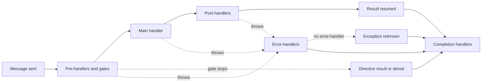

# The Handler Pipeline

Every message LiteBus mediates passes through the same five-stage pipeline: pre-handlers, one or more main handlers, post-handlers, error-handlers on failure, and completion handlers on every path. This page explains the exact order each stage runs in, how global and specific handlers interleave, how errors propagate, how cancellation flows, and how a gate decides whether the work happens at all. It is the reference behind the per-module pages and assumes you have read at least the [Command Module](commands.md).

The pipeline is the same shape for commands, queries, and events. The difference is the main stage: a command or query has exactly one main handler, while an event has zero to many. Everything around the main stage behaves identically.

## The Five Stages

For a single message, mediation runs:

1. **Pre-handlers** validate, authorize, or prepare. Throwing here stops the pipeline before the main handler runs, and a gate can stop it cleanly by returning a directive.
2. **Main handler** does the work. One handler for commands and queries; all matching handlers for events.
3. **Post-handlers** react to success. They receive the message and the result.
4. **Error-handlers** run only if any earlier stage threw. They receive the message, any partial result, and the exception.
5. **Completion handlers** run on every path, exactly once, and observe how the mediation ended.



A gate decision leaves the pipeline without touching the main handler, the post-handlers, or the error handlers, and still reaches the completion stage. That is the whole reason the completion stage exists.

The first four stages each answer a partial question. Only the fifth sees the whole story, which is why it exists: a post-handler never runs when a handler throws, an error-handler never runs for a refusal or a cancellation, and neither runs when no handler of that kind is registered. Anything that must know how a message actually ended, such as an audit record, a metric, or the close of a unit of work, belongs in the completion stage.

## Global, Specific, and the Execution Order

A handler can be registered against the concrete message type or against a base type or interface the message implements. LiteBus calls the first kind **direct** (specific) and the second **indirect** (global or polymorphic). Polymorphic dispatch is what makes a handler for `IEvent` or a base command run for every concrete message; see [Polymorphic Dispatch](polymorphic-dispatch.md).

The two kinds run in a deliberate order that forms an onion around the main handler:

| Stage | Order |
| --- | --- |
| Pre-handlers | Global (indirect) first, then specific (direct) |
| Main handler | The handler(s) for the message |
| Post-handlers | Specific (direct) first, then global (indirect) |
| Error-handlers | Global (indirect) first, then specific (direct) |
| Completion handlers | Specific (direct) first, then global (indirect) |

Within each group, handlers run in ascending `[HandlerPriority]` order (default priority is `0`). The pre/post asymmetry is intentional: a global pre-handler such as authentication runs before any message-specific check, and a global post-handler such as audit logging runs after the message-specific reactions have completed. Cross-cutting concerns wrap message-specific ones on both sides.

This ordering is implemented in `MessageContextExtensions`: pre-handlers iterate indirect then direct, post-handlers and completion handlers iterate direct then indirect, and error-handlers iterate indirect then direct.

Each pre-handler, post-handler, and completion handler is invoked through the closed contract recorded in its descriptor at registration, so one class may implement pipeline contracts for several message types and each dispatch reaches the right one. The delegate that performs the dispatch is built while the descriptor is built, which keeps reflection in the registration path rather than in the hot path.

LiteBus also ships pipeline handlers of its own, such as the audit record writer. Those sit in a reserved priority band at or above `HandlerPriorities.ReservedFloor`, so an application handler with no explicit priority always runs first. See [Handler Priority](handler-priority.md).

## Commands and Queries: The Single-Handler Pipeline

A command or query must resolve to exactly one main handler. If more than one is registered, mediation throws `MultipleHandlerFoundException` before running anything. The flow for a result-returning message is:

```
directive = RunAsyncPreHandlers(message)  // indirect pre, then direct pre; stops when a gate says so
result = handler.HandleAsync(...)   // the one main handler
RunAsyncPostHandlers(message, result) // direct post, then indirect post
RunAsyncCompletionHandlers(context)   // direct, then indirect, always, in a finally
return result
```

A post-handler can replace the value the caller receives by setting `MessageResult` on the execution context. When a post-handler writes a non-null `MessageResult`, that value is returned instead of the handler's own result. This is how a post-handler can wrap or transform a result without the main handler knowing.

```csharp
public sealed class WrapInEnvelope : IQueryPostHandler<GetProductByIdQuery, ProductDto>
{
    public Task PostHandleAsync(GetProductByIdQuery query, ProductDto? result, CancellationToken ct = default)
    {
        AmbientExecutionContext.Current.MessageResult = new Envelope<ProductDto>(result);
        return Task.CompletedTask;
    }
}
```

## Events: The Broadcast Pipeline

An event runs pre-handlers, then all matching main handlers, then post-handlers, then error-handlers on failure. Main handlers are grouped by priority and executed according to the two concurrency switches on `EventMediationSettings.Execution`, covered on [Handler Priority](handler-priority.md) and the [Event Module](events.md).

If no main handler matches, event publish still runs global and message-specific pre-handlers, then returns without post-handlers. Set `EventMediationSettings.ThrowIfNoHandlerFound = true` to throw `NoHandlerFoundException` after pre-handlers complete, which is useful in tests that assert a handler exists.

## Error Propagation

When any stage throws a recoverable exception, the main flow stops and error-handlers run. Each handler receives a typed `MessageErrorContext<TMessage, TResult>` backed by the pipeline's shared outcome state, plus the caller's cancellation token.

- If no error-handler is registered, LiteBus rethrows the original exception with its stack trace preserved through `ExceptionDispatchInfo`.
- If error-handlers run but leave `context.Outcome` as `Unhandled`, LiteBus also rethrows the original exception.
- A handler recovers explicitly by setting `context.Outcome` to `Handled`. For result-returning commands and queries, it sets `context.HandledResult` to the fallback value returned to the caller.

An observing handler records the failure and leaves the default outcome unchanged:

```csharp
public sealed class AuditFailure : ICommandErrorHandler<ProcessPaymentCommand>
{
    public Task HandleErrorAsync(
        MessageErrorContext<ProcessPaymentCommand, object> context,
        CancellationToken cancellationToken = default)
    {
        // record the failure...
        return Task.CompletedTask; // the original exception still propagates
    }
}
```

## Gates: Deciding Whether the Work Happens

A pre-handler that can stop the pipeline is called a **gate**. The decision is a return value rather than an exception, so the compiler requires it and nothing after the decision runs by accident.

A gate can stop for two different reasons, and LiteBus keeps them apart because a review asks a different question of each:

| Directive | Meaning | Reported outcome | Recorded by an audit trail as |
| --- | --- | --- | --- |
| `PipelineDirective.Continue` | Proceed to the main handler | not applicable | not applicable |
| `ShortCircuit` | The result was already known, so running the handler would add nothing | `MessageOutcome.ShortCircuited` | a success |
| `Deny` | The message is refused | `MessageOutcome.Denied` | a denial |

Collapsing the two would put false entries in the one artifact a security review reads. A cache hit refused nobody, and a replayed idempotent command took effect the first time.

### Gate Contracts

| Contract | For |
| --- | --- |
| `ICommandGate<TCommand>` | A command that produces no result |
| `ICommandGate<TCommand, TCommandResult>` | A command that produces a result |
| `IQueryGate<TQuery, TQueryResult>` | A query |
| `IStreamQueryGate<TQuery, TQueryResult>` | A stream query |
| `IEventGate<TEvent>` | An event |

A gate over a message that produces a result returns `PipelineDirective<TResult>`, so the compiler checks the value it supplies. That is the point of the split: stopping the pipeline means the main handler never runs, so the gate owes the caller a result, and the type system is the right place to enforce it.

```csharp
public sealed class ServeProductFromCache : IQueryGate<GetProductQuery, ProductView>
{
    public async Task<PipelineDirective<ProductView>> DecideAsync(
        GetProductQuery query,
        CancellationToken cancellationToken = default)
    {
        var cached = await _cache.TryGetAsync(query.ProductId, cancellationToken);

        return cached is null
            ? PipelineDirective<ProductView>.Continue
            : PipelineDirective<ProductView>.ShortCircuit(cached, "served from cache");
    }
}
```

### Refusing a Message

A refusal always carries a reason, and has two shapes. `Deny(reason, result)` hands the caller a refusal value, which suits an application whose handlers return a result object. `Deny(reason)` supplies nothing, so the mediation raises `LiteBusMessageDeniedException` because a method that must return a value has nothing to return.

```csharp
public sealed class RejectSelfApproval : ICommandGate<ApproveRefundCommand>
{
    public Task<PipelineDirective> DecideAsync(
        ApproveRefundCommand command,
        CancellationToken cancellationToken = default)
    {
        return Task.FromResult(command.ApproverId == command.RequesterId
            ? PipelineDirective.Deny("the approver is the requester")
            : PipelineDirective.Continue);
    }
}
```

`LiteBusMessageDeniedException` does **not** reach error handlers. An error handler exists to recover from faults, and letting it see a refusal would let it undo one. The mediation still reports `Denied`, so the completion stage records it.

### The Rules

- Pre-handlers after the gate that stopped the pipeline **do not run**. Neither does the main handler, nor any post-handler.
- The reason reaches completion handlers as `MessageCompletionContext.Reason`, and an audit trail as the reason on the record. Without a reason, a short-circuited mediation leaves no explanation anywhere, because it reaches neither post-handlers nor error handlers. A denial always has one.
- For a message with a result type, a stopping directive must supply a result. Using the untyped contract for such a message throws `LiteBusConfigurationException` naming the typed contract to use instead.
- Error handlers do not run. Stopping is a decision, not a failure.

Deciding is a **capability**, which is why it lives in its own contract. A plain `ICommandPreHandler<TCommand>` cannot stop the pipeline, so a validator cannot skip the work by accident.

For a stream query, the directive is typed over `IAsyncEnumerable<TResult>`: supplying a stream yields that stream instead of the handler's, and supplying none yields nothing.

An event gate is worth a word of caution. An event is a fact that already happened, so refusing one is rarely meaningful. The useful case is a short-circuit that skips the reactions to an event this process has already handled; to select handlers rather than stop the broadcast, use [Handler Filtering](handler-filtering.md).

## Suppressing Post-Handlers

A gate skips the work. Once the work has happened there is nothing left to skip, but a handler may still want to stop the reactions to it. An idempotent command that detects it already ran should return the existing result without firing the post-handler that publishes its domain events:

```csharp
public Task HandleAsync(ProcessPaymentCommand message, CancellationToken cancellationToken = default)
{
    if (_ledger.AlreadyProcessed(message.PaymentId))
    {
        AmbientExecutionContext.Current.SuppressPostHandlers();
        return Task.CompletedTask;
    }

    // ...
}
```

Suppression differs from a gate decision in three ways that matter:

- It does **not** stop the calling handler. Everything after the call still runs, so there is no hidden control flow.
- It can be called from the main handler or from a post-handler, in which case the remaining post-handlers are skipped.
- The mediation still reports `MessageOutcome.Succeeded`, because the main handler ran.

That last point is the invariant to remember: **`ShortCircuited` and `Denied` mean the main handler never ran.** Reporting either for a suppressed post-handler chain would tell an audit trail that a command was refused when it actually took effect.

## Cancellation

Each handler method receives a `CancellationToken`. The token the caller passes to `SendAsync`, `QueryAsync`, or `PublishAsync` is the same token exposed on the execution context as `AmbientExecutionContext.Current.CancellationToken`, so a handler that does not take the token as a parameter can still observe it. Honor the token in any I/O or loop; LiteBus does not forcibly interrupt a running handler.

The token is a signal from the caller and the environment flowing inward: the client disconnected, a timeout elapsed, the host is draining. It is not how a handler refuses a message. A refusal is a decision the pipeline makes and flows outward, which is why it belongs to a gate and reports `Denied`. Keeping the two apart is what lets an audit trail separate "the actor was not permitted" from "the client hung up", and it is why the completion stage is not cancellable.

## Sharing State Across Stages

Handlers in one mediation share an execution context. Use `AmbientExecutionContext.Current.Items` to pass data from a pre-handler to the main handler or a post-handler, for example a timer started in a pre-handler and stopped in a post-handler. The context is covered in full on [Execution Context](execution-context.md).

## Completion: Observing How Mediation Ended

A completion handler runs in a `finally`, inside the ambient execution scope, after post-handlers on the success path and after error-handlers on the failure path. It runs exactly once per mediation, whatever happened.

```csharp
public sealed class RecordCommandOutcome : ICommandCompletionHandler
{
    public Task HandleCompletionAsync(
        MessageCompletionContext<ICommand> context,
        CancellationToken cancellationToken)
    {
        // context.Outcome is Succeeded, ShortCircuited, Denied, Failed, or Canceled.
        // context.Exception, context.Reason, context.Duration, and context.MessageResult carry the detail.
        return Task.CompletedTask;
    }
}
```

`MessageOutcome` distinguishes five endings:

| Outcome | When |
| --- | --- |
| `Succeeded` | The main handler and every post-handler ran without throwing |
| `ShortCircuited` | A gate answered without the handler, because the result was already known |
| `Denied` | A gate refused the message, carrying a reason |
| `Failed` | The pipeline raised an exception other than cancellation or denial |
| `Canceled` | The mediation cancellation token was observed |

`Faulted` is a shorthand for `Failed` or `Canceled`. A denial is not a fault even when it reaches the caller as `LiteBusMessageDeniedException`, because it is a decision.

Three rules matter when writing one:

- **A completion handler observes; it cannot change the outcome.** The context is read-only, and the value the caller receives is already decided.
- **The stage is not cancellable.** Handlers receive `CancellationToken.None`, because the ending has already happened and handing the stage the token that just fired would stop it recording exactly the cancellations it exists to record. Apply your own deadline if a handler needs one.
- **A completion handler that throws while an exception is already ending the mediation cannot replace it.** The fault is attached to the original exception under `MediationExceptionData.SuppressedCompletionFaults`, as an `IReadOnlyList<Exception>`, so nothing is lost. When no exception is ending the mediation, the fault propagates normally.

Register a handler for one message type with `ICommandCompletionHandler<TCommand>`, `IQueryCompletionHandler<TQuery>`, or `IEventCompletionHandler<TEvent>`; for a message that produces a result, the two-parameter form such as `ICommandCompletionHandler<TCommand, TCommandResult>` hands the result over typed. Register for every message on an axis with the non-generic `ICommandCompletionHandler`, `IQueryCompletionHandler`, or `IEventCompletionHandler`.

For streams, completion fires when the enumerator is disposed. A consumer who calls a stream query and never enumerates the result produces no completion record. That is inherent to iterators, and worth knowing if you audit reads.

## Next

Read [Execution Context](execution-context.md) to share state and override results, then [Handler Priority](handler-priority.md) to order handlers within a stage. To declare metadata that pipeline stages read, see [Message Definitions](message-definitions.md), and for the audit trail built on the completion stage, see [Auditing](auditing.md).
