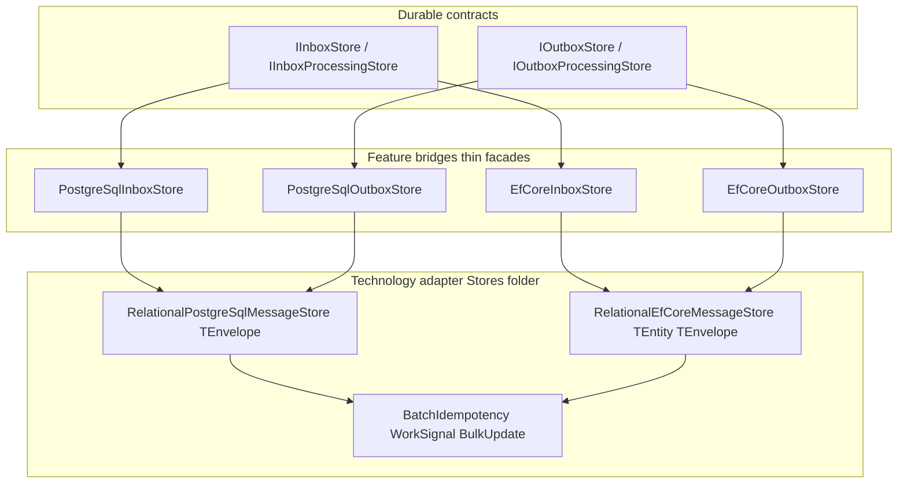

# Roadmap: Deep Storage Dedup (`RelationalMessageStore<T>`)

**Priority:** High (maintainability)
**Production tier:** Not shipped: internal refactor only; no consumer-facing API change when done correctly
**Status:** Planned (post v6.0 Core GA)

## Summary

v6 introduced **folder-level** shared storage helpers under `src/LiteBus.Storage.EntityFrameworkCore/Stores/` and `src/LiteBus.Storage.PostgreSql/Stores/`. Inbox and outbox adapters still carry large, parallel implementations (`PostgreSqlInboxStore`, `PostgreSqlOutboxStore`, `EfCoreInboxStore`, `EfCoreOutboxStore`).

This roadmap item tracks a **deep dedup**: collapse the shared lease, persist, batch idempotency, and query paths into generic relational store cores, while axis-specific packages remain thin typed facades and public store interfaces stay unchanged.

## Problem

| Symptom | Impact |
| --- | --- |
| ~85% duplicated SQL/EF logic between inbox and outbox stores | Bug fixes and correctness changes (for example atomic `PersistAsync`) must land twice |
| Partial helper extraction only | `PostgreSqlBatchIdempotencyLookup` and `EfCoreBulkUpdateCapabilities` reduce duplication but do not unify the store orchestration |
| Initial storage helper phase (>=50% line reduction in EF+PG stores) not fully met | Technical debt remains; reviewers cannot trust "fix once" for storage semantics |
| Contract tests pass per adapter | Correctness is proven, but implementation drift risk grows with each broker or provider addition |

Deep dedup mirrors what v6 already did for processors in `LiteBus.Messaging/Processing/`: **one engine, two thin shells**.

## Goal

Introduce internal generic store cores (working names below) inside existing layer-3 packages: **no new NuGet package IDs**:

```text
LiteBus.Storage.PostgreSql/Stores/
  RelationalPostgreSqlMessageStore<TEnvelope, TRowMapper>
  (existing helpers: WorkSignal, batch idempotency, UUID parameters)

LiteBus.Storage.EntityFrameworkCore/Stores/
  RelationalEfCoreMessageStore<TEntity, TEnvelope, TMapper>
  (existing helpers: bulk update capabilities, provider-specific lease SQL)

LiteBus.Inbox.Storage.PostgreSql/   to thin PostgreSqlInboxStore facade
LiteBus.Outbox.Storage.PostgreSql/  to thin PostgreSqlOutboxStore facade
LiteBus.Inbox.Storage.EntityFrameworkCore/  to thin EfCoreInboxStore facade
LiteBus.Outbox.Storage.EntityFrameworkCore/ to thin EfCoreOutboxStore facade
```

Public surfaces (`IInboxStore`, `IOutboxStore`, `IInboxProcessingStore`, `IOutboxProcessingStore`, module builders, options types) **must not break**. Consumers continue to install the same adapter packages.

## Non-Goals

- Merging inbox and outbox into one package or one table
- A `LiteBus.Storage.Core` meta-package (forbidden by v6 packaging policy)
- Changing persisted envelope field semantics or schema version
- InMemory store dedup beyond small shared helpers (InMemory stores are already small)
- SQL Server-specific storage adapters (separate roadmap item in [Roadmap](README.md))

## Design Constraints

Follow [Dependency graph](../architecture/dependency-graph.md) dependency role rules:

| Rule | Application |
| --- | --- |
| Technology adapters | Generic cores live in `LiteBus.Storage.PostgreSql` and `LiteBus.Storage.EntityFrameworkCore` only |
| Feature bridges | Inbox/outbox storage packages reference the matching technology adapter; they supply axis-specific mappers and table options |
| Abstractions stay abstract | Store interfaces remain in `*.Abstractions`; mappers implement internal ports, not broker SDK types on public API |
| Tests prove behavior | `LiteBus.Storage.Testing` contract bases must pass unchanged; add concurrent persist and batch idempotency regressions if cores move |

## Proposed Architecture



### Port Interfaces (Internal)

Define small internal ports in the technology adapter, implemented by axis mappers in feature bridges:

| Port | Responsibility |
| --- | --- |
| `IRelationalEnvelopeMapper<TEnvelope, TRead>` | Map row/entity to and from envelope; status enum mapping |
| `IRelationalLeasePolicy` | Status names for in-flight, terminal transitions, lease column names |
| `IRelationalStoreOptions` | Table name, schema, tenant filter hooks |

PostgreSQL and EF paths share **orchestration** (lease batch, persist with owner guard, requeue, retention queries); they do not share SQL text or EF entity types.

## Phased Delivery

### Phase 1: PostgreSQL Core (Highest Duplication)

1. Extract `RelationalPostgreSqlMessageStore<TEnvelope>` with lease, persist, add batch, requeue, diagnostics count.
2. Reduce `PostgreSqlInboxStore` and `PostgreSqlOutboxStore` to mapper + options wiring.
3. Run full `InboxStoreContractTests` and `OutboxStoreContractTests` on PostgreSQL adapters.
4. Target **>=50% line reduction** in the two PG store files (deferred from v6 integration).

**Estimate:** one focused PR; Docker PostgreSQL integration required in CI.

### Phase 2: EF Core Core

1. Extract `RelationalEfCoreMessageStore<TEntity, TEnvelope>` using existing `EfCoreBulkUpdateCapabilities` and lease SQL components.
2. Thin `EfCoreInboxStore` / `EfCoreOutboxStore`.
3. Extend concurrent persist contract tests to both axes after refactor.
4. Add the **MySQL Pomelo concurrent lease contract** recorded in [Integration Tests](../testing/integration-tests.md) if the Pomelo test container is available.

**Estimate:** one PR; depends on Phase 1 patterns.

### Phase 3: Documentation and Graph

1. Update [Dependency graph](../architecture/dependency-graph.md) with `Stores/` layout (deferred from v6 integration).
2. Cross-link from [Custom stores and dispatchers](../extending/custom-stores-and-dispatchers.md) for adapter authors.
3. Record the completed refactor and its validation commands in [Changelog](https://github.com/litenova/LiteBus/blob/main/Changelog.md).

## Acceptance Criteria

| Criterion | Measure |
| --- | --- |
| No public API breaks | Same NuGet IDs, interfaces, and module builder methods |
| Line reduction | >=50% fewer lines in inbox+outbox PG store files; >=40% in EF store files |
| Contract parity | All storage contract tests pass for InMemory, PostgreSQL, EF (PostgreSQL + SQL Server where applicable) |
| Correctness preserved | Atomic terminal persist (`lease_owner` + in-flight guard), batch idempotency, NOTIFY work signal unchanged |
| Single fix path | One change in relational core fixes both axes (demonstrate with a controlled bugfix or shared metric) |
| Role compliance | No technology adapter references a feature bridge; generic parameters and internal mapper contracts point in the allowed direction |

## Risks and Mitigations

| Risk | Mitigation |
| --- | --- |
| Generic abstraction leaks axis semantics | Keep status/terminal mapping in axis mappers; core only orchestrates |
| EF provider differences (SQL Server, MySQL, SQLite) | Keep provider-specific lease SQL in existing `Leasing/` folder; core delegates |
| Large PR hard to review | Ship Phase 1 (PG) and Phase 2 (EF) separately; no behavior change commits mixed with moves |
| Test flakiness during move | Run contract tests after each extraction step; avoid renaming public test hooks |

## Relationship to Other Work

| Item | Relationship |
| --- | --- |
| [Messaging/Processing dedup](../architecture/README.md) | Completed; same "folder not package" pattern |
| [Storage integration suites](../testing/integration-tests.md) | Behavioral foundation for this roadmap; not a substitute for shared implementation |
| SQL Server storage adapters | Future packages; should consume relational EF core once it exists |

## When to Schedule

Schedule after **v6.0 Core GA** tag. Do not block GA on this refactor: runtime behavior and contract tests already satisfy Core GA. Prioritize when:

- A second storage correctness fix would require duplicate edits in inbox and outbox stores, or
- A new storage provider (for example SQL Server) would copy a third large facade.

## Tracking

| Field | Value |
| --- | --- |
| Roadmap ID | `RM-STORAGE-DEDUP-01` |
| Priority | High |
| Owner | Platform / storage maintainers |
| Target release | v6.1 or v6.2 (TBD) |
| Matrix impact | Consolidates the duplicate relational store paths covered by [Integration Tests](../testing/integration-tests.md) |

## See Also

- [Roadmap](README.md): future work index
- [Custom stores and dispatchers](../extending/custom-stores-and-dispatchers.md): adapter author guide
- [PostgreSQL schema management](../integrations/postgresql-schema-management.md): current schema invariants
- [Integration Tests](../testing/integration-tests.md): storage regression suites
